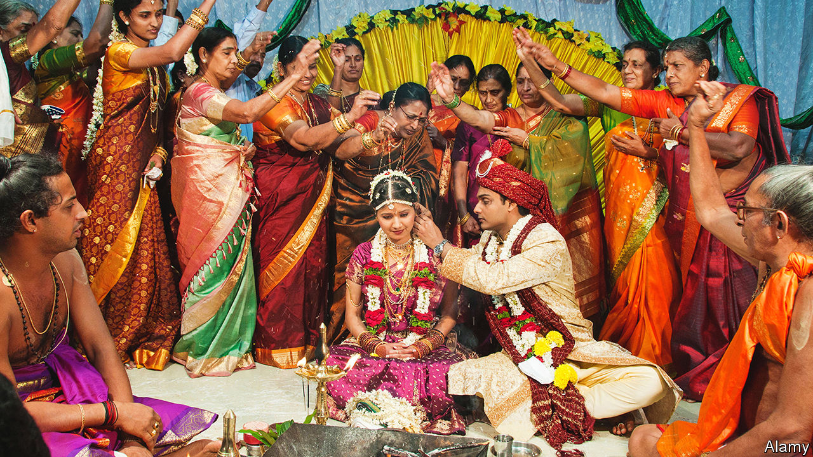

###### The nuptials-industrial complex

# Matrimony is one of India’s biggest businesses 

##### The wedding industry is a marriage of everything 

 

> Sep 29th 2022 

Vishal punjabi sounds groggy over the phone. “You know when you can’t remember where you are when you wake up,” he says. “I’m in Cannes, before that Barcelona and before that Dubai, London, Udaipur, Delhi, Chennai and Bangalore. Now off to Charlotte, North Carolina and then the Napa Valley.” This globetrotting lifestyle would be familiar to high-powered ceos, venture capitalists or investment bankers. Mr Punjabi is none of these. Instead, he produces intricate wedding videos for Indian nuptials: 65 in the past year, two-thirds of them for Indian couples who wed outside India. His expanding workforce includes set designers, sound and light engineers, composers, video editors, even script writers. 

Indians take knot-tying seriously. Consequently, Indian matrimony is serious business. The amount of money which changes hands in relation to it can be staggering. Mr Punjabi charges between $5,000 and $50,000 a day, and some productions stretch to a few weeks. India’s regions have different traditions, each demanding specific services. The festivities often last for days, requiring constant attention from one business or other. Annual spending on these—from matchmakers and caterers to film and construction crews—may exceed $130bn, reckons Praveen Khandelwal, secretary-general of the Confederation of All India Traders, which represents small and medium-sized enterprises. If he is right, that would make marriage the country’s fourth-largest industry, behind energy, banking and insurance but ahead of cars, steel and technology. 

And India’s Matrimony Inc is getting bigger. In the short term, weddings are booming as couples who postponed the festivities because of covid-19 rush to the altar. Mr Khandelwal expects 2.5m weddings in November and December in India, on top of 4m events in the spring wedding season from April to July, and not counting those footloose brides and grooms. In the longer run, the ceremonies are getting bigger and more lavish as Indians grow richer. Businesses across this vast nuptials-industrial complex are adapting accordingly—and themselves growing.

In India the business of weddings typically begins before the two people theoretically at its centre have ever laid eyes on one another. Matchmakers operate everywhere in India, from rural huts to urban high-rises. Classified adverts (often placed by parents hoping to get their children hitched) still appear in Sunday newspapers, often written in shorthand inscrutable to the uninitiated. Indian cyberspace teems with “matrimonial” sites; the biggest publicly listed one, Matrimony.com, has a market value of around $160m, and last year reported annual revenues of $57m, 850,000 subscribers and 100,000 successful matches. For the globetrotters and the diaspora, a new breed of cross-border specialists charge an upfront fee of as much as $15,000, plus other commissions. 

An inviting enterprise

Once the match is made, the preparations for the ceremony begin. Specialisms have emerged to cater to every aspect of the event. One road in Mumbai is lined with more than 70 businesses devoted to invitations, from calligraphers to printers. A Kolkata-based invitation guru travels around Asia in search of items that would make his custom products stand out. Invitees to the wedding in 2018 of the daughter of Mukesh Ambani, one of India’s richest tycoons, received a box that included an album and four smaller boxes filled with jewels and treats; one unpacking video on YouTube has been viewed 9m times. Some invitation businesses seize export markets. Shantilal &amp; Sons, a Mumbai firm founded in 1943, has just dispatched a shipment to an Indian couple in Australia; another is destined for Oklahoma. 

Not far from invitation lane is Zaveri Bazaar, the old jewellery district, with perhaps 7,000 shops offering everything from “American diamonds” (the polite name for fakes) to precious gems. Weddings account for more than 70% of sales, estimates Siddharth Sawant of Tribhovandas Bhimji Zaveri, a chain founded in 1864. Other jewellers say much the same. Weddings are a big reason why India is the world’s largest gold importer, buying $46bn-worth of the yellow metal in the past year. 

Parents and other kin begin buying wedding baubles in the first two weeks after a girl’s birth, says Devaunshi Mehta, owner of the DiA shop at the posh Taj Mahal Palace Hotel in Mumbai. By the time the newborn sits at the altar, she is bejewelled head to toe (sometimes literally) with what still serves as portable dowry. To be a bit less outshone, some grooms have begun to sport bling, too. 

Besides jewels, the soon-to-be-newly-weds and their retinues need clothes. Given Indian weddings’ multi-day run time, the bride and her bridesmaids may need at least half a dozen formal outfits, plus customised t-shirts to throw on between matrimonial setpieces and even pyjamas. Intricate handcrafted saris from top designers such as Tarun Tahiliani and Sabyasachi can fetch tens of thousands of dollars. A town in the state of Gujarat is said to have 4,000 people employed in stringing beads and crystals, both directly by the fashion houses and by subcontractors. Rendering the bride fit for Instagram has led to a boom in professional sari drapers.

The wedding venue, too, is beautified—by architects, set designers, florists and, evanescently, fireworks artists. Hoteliers do a brisk trade hosting the festivities and housing all the guests. Tata’s Indian Hotels, the country’s largest chain, estimates weddings account for 20% of its business. Even a modest village affair involves extraordinary amounts of food and countless cooks. All marriages involve a lot of music and dancing: some Bollywood choreographers run side gigs teaching clutzy family members to dance with a modicum of grace. Big weddings often enlist professional backup dancers. The biggest bring in A-listers, and not just from India (Beyoncé graced the Ambani festivities). 

Managing all this is not for the faint-hearted—or for amateurs. When family members are assigned organisational roles, which used to be the norm, the result can be chaos. Ever more lavish and complex celebrations have therefore led to the rise of the wedding planner. Vandana Mohan, a Delhi-based planner behind some of the country’s largest and poshest nuptials, begins by walking clients through a list of 712 distinct components, from the humdrum (how many colour schemes to use) to the extravagant (how many hotels to rent in their entirety). 

Many Indian metropolises now have dozens of such advisory firms. Around 25 offer services nationally and a few, internationally. A big part of their job is to obtain official permits for assorted aspects of the event (such as live music, road closures, beach bookings, pyrotechnics, booze, power generators and vehicles, including elephants). At least this is becoming easier, reports Vikram Mehta, a high-end planner, both in India and abroad. Local authorities have become more welcoming to nuptials, he says, as they have twigged just how big a fillip even a single event can give the local economy. ■


