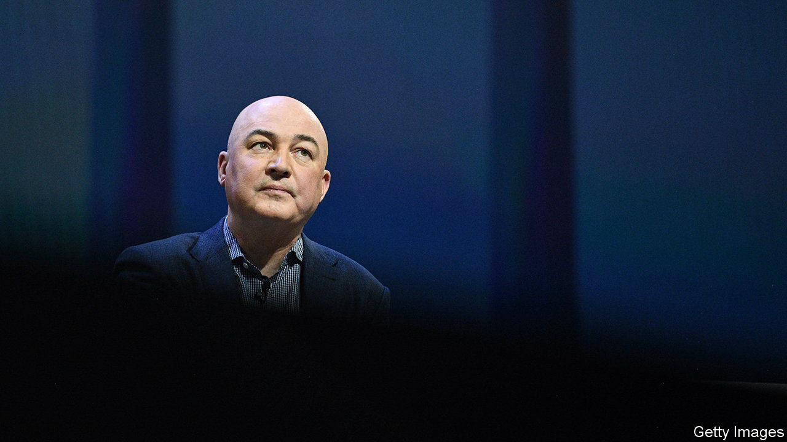

###### Hope after Jope

# Unilever’s problems will not go away with its boss 

##### The consumer-goods giant needs refreshing 

 

> Sep 29th 2022 

Every incoming chief executive wants to see their employer’s share price pop on the news of their appointment. No outgoing boss wants to witness the same thing happen when they announce their departure—especially if a market-wowing successor has yet to be named. That was the fate that befell Alan Jope after he declared on September 26th that he would retire next year. The market value of the consumer-goods giant popped by as much as 3.5%, ending the day 1.8% higher. 

Both Unilever and Mr Jope present the move as his decision. The fact that he has been in the job since only 2019, is a stripling 59 years old and apparently in good nick strongly suggests he had help making it. So does Unilever’s lacklustre stockmarket performance, especially compared with its main rivals, Nestlé and Procter &amp; Gamble (see chart). Whether his exit will be enough to revive the 130-year-old soap-to-soup conglomerate is another matter.

 


When Mr Jope first took the reins less than four years ago investors had high hopes for him. He had experience in China, an important growth market, and had run Unilever’s personal-care division, seen by many as key to the company’s future. He also seemed like a welcome pragmatic antidote to his moralistic predecessor, Paul Polman, an early champion of corporate social responsibility and of environmental, social and governance (esg) considerations in business. Though in many ways laudable, Mr Polman sometimes seemed to view shareholders as an annoying afterthought. 

Mr Jope can point to some successes. On his watch Unilever finally ditched its convoluted dual structure, with headquarters in Rotterdam and London, and consolidated its corporate home in Britain. He finalised the protracted sale of the firm’s tea business. His strategy of prioritising health and hygiene businesses over sluggish food operations was seen by the market as the correct course. And he steered the firm through the early pandemic panic, mostly from his study in Edinburgh.

A sensible strategy and able crisis management weren’t enough to make up for Mr Jope’s missteps. He clung on to Mr Polman’s target of 20% for operating margins even if it meant sacrificing revenue growth. Investors’ confidence was then eroded as expectations for sales and profits sagged. Woolly talk of sustainability made a comeback, leading one big shareholder, Terry Smith, a fund manager, to grumble that a firm “which feels it has to define the purpose of Hellmann’s mayonnaise has …clearly lost the plot”. The final straw was Mr Jope’s bid in January to acquire the consumer-health unit of GlaxoSmithKline, a drugmaker, for £50bn ($68bn at the time). Investors saw the deal as a reckless gamble and it ultimately fell through—but not before becoming a “lightning rod for [their] frustration”, as Martin Deboo of Jefferies, an investment bank, puts it. 

Mr Jope’s successor will not have an easy task. He or she may well be taking over after recession strikes but before inflation subsides. The future chief executive will also face renewed calls from investors to break the company up into food and home-and-personal-care businesses, and will have to contend with Nelson Peltz, a bolshie hedge-fund manager who joined Unilever’s board two months ago. And the conflicting pressures to  on the one hand, as many consumers and politicians demand, and to increase sales and margins on the other, to placate investors, are only getting more acute. Voluntary or not, retirement doesn’t look like such a bad idea. ■


