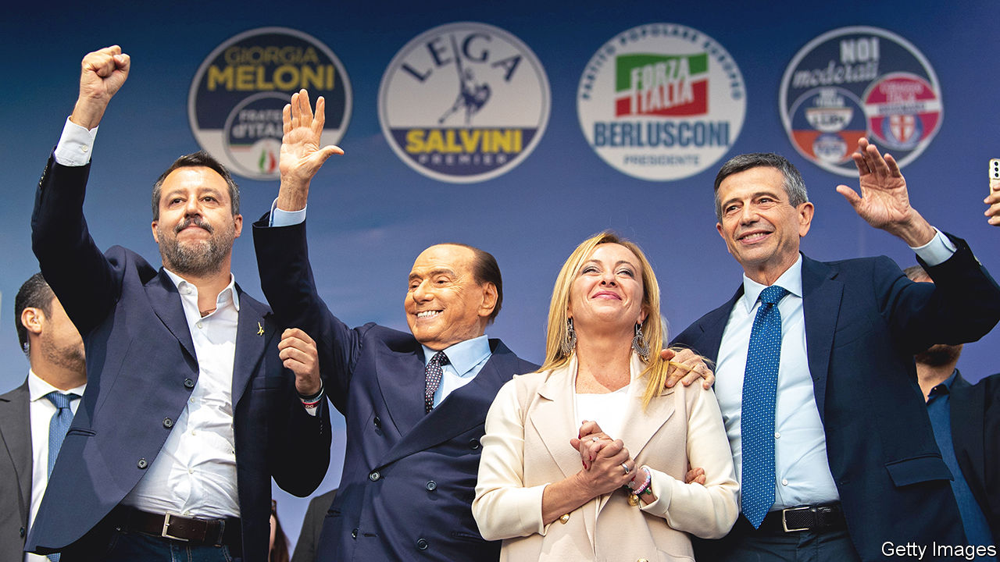

###### Giorgia on their mind

# What Italian business makes of Giorgia Meloni 

##### Bosses are gearing up to work with the right-wing government 

 

> Sep 29th 2022 

Like business leaders in other countries, Italian captains of industry have a history of striving for cordial relations with whomever is in power. That includes dealing with questionable characters like Silvio Berlusconi, a media tycoon who has been tried more than a dozen times for fraud, false accounting and bribery, and outright villains like Benito Mussolini, the second-world-war-era fascist dictator. 

The latest controversial right-winger Italian business must get to know is Giorgia Meloni, a 45-year-old firebrand who ten years ago co-founded the Brothers of Italy party, which traces its origins to Italian neo-fascists. After her triumph at the general election on September 25th, she will head a three-way coalition composed of the Brothers, Mr Berlusconi’s Forza Italia and a third like-minded outfit, the League, led by Matteo Salvini. 

In the run-up to polling day Italia spa scrambled to work out how worried it should be about a Eurosceptic nationalist with scant experience in business, a taste for statist rhetoric and irresponsible pledges to both lower taxes and raise public pensions. Ms Meloni has also frightened corporate and market types by calling for the renationalisation of Telecom Italia, a giant telecoms operator, and by opposing the proposed takeover of ita, Italy’s biggest airline, by Certares, an American private-equity firm. 

In early September Ms Meloni was invited to the Villa d’Este in Cernobbio on the shores of Lake Como to the Ambrosetti Forum, an annual gathering of the great and the good in Italian business. The attendees welcomed her cordially and she vowed not to make “promises that we cannot keep” or rock Italy’s wobbly public finances (after Greece, Italy has the highest ratio of debt to gdp in the European Union). 

Although markets did not panic the morning after Ms Meloni’s victory, they betrayed signs of anxiety a day later. The spread between Italian and German ten-year government bonds, an indication of economic risk, widened. Whether they widen further will depend on who gets the finance and economy portfolios, says Zeynep Ozturk-Unlu of Deutsche Bank. Businesses and investors will be reassured if Ms Meloni picks an internationally respected figure such as Domenico Siniscalco, a Morgan Stanley investment banker, or Luigi Buttiglione, a liberal economist—or even if she just hangs on to Daniele Franco, the outgoing finance minister. 

The carrot-and-stick strategy of the eu to promote reform should help keep the new government on the straight and narrow. “Meloni wants to avoid following Hungary or Poland,” says Andrea De Petris of Centro Politiche Europee, a think-tank in Rome. Both of those countries risked losing billions of euros in eu funds over their tussles with Brussels for flouting the norms of liberal democracies. On September 27th the European Commission approved the second €21bn ($20bn) tranche of Italy’s pandemic-recovery funds. Mario Draghi, the departing technocratic prime minister, secured the cheque by achieving 45 conditions demanded by the eu in areas such as reform of public administration. Ms Meloni is expected to continue his course and try to implement another 54 conditions required to receive the third tranche by the end of the year. That would be great news for Italian companies, especially those eyeing government contracts that the eu cash will help bankroll.

Draghing in the new crew

In the run-up to the election Ms Meloni talked regularly to Mr Draghi, who is said to be eyeing a big eu job. He is leaving Ms Meloni and the team she is trying to assemble a draft budget that is due in Brussels on October 15th. That should reassure those business leaders worried about the departure of Mr Draghi, a former head of the European Central Bank who in economic terms at least has a plausible claim to being Italy’s safest pair of hands.

Ms Meloni has a few things going for her. Italian bosses want to like her. Similarly to their counterparts in other countries, business folk tend to favour the right over the left. And like the rest of the Italian electorate, bosses are partial to the latest rising political star. Some of those stars, such as Beppe Grillo of the Five Star movement, flame out fast. Many owners of smaller companies in the north which used to vote for Mr Salvini and the League have switched to the Brothers, says Veronica De Romanis, professor of economics at luiss, a university in Rome. Ms Meloni’s first step in avoiding the same fate is not to mismanage the Italian economy. ■


