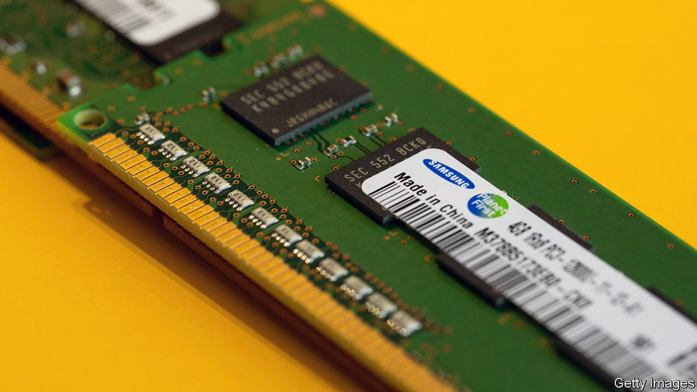
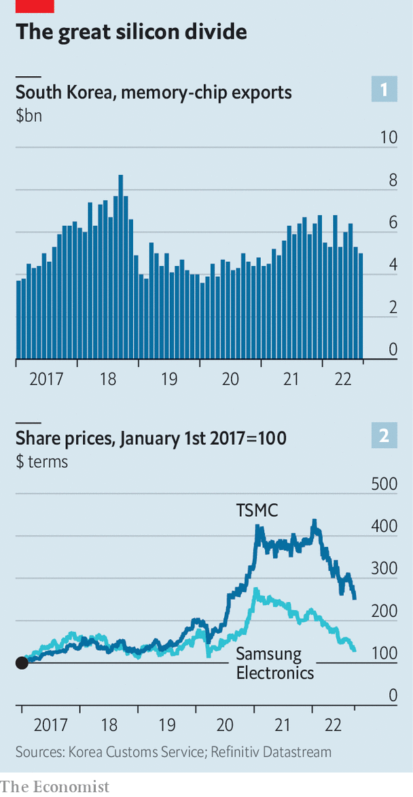

###### Painful memory

# Why some chipmakers are hurting much more than others 

##### TSMC and Samsung illustrate the industry’s diverging fortunes 

 

> Sep 29th 2022 

To most consumers, computer chips are all the same: magical artefacts that permit smartphones to perform miraculous feats. Expert technologists instead see a diverse range of highly specialised products of human ingenuity, each with their own unique characteristics and function. Until recently investors in semiconductor companies behaved more like the uninitiated consumers, piling into virtually all chipmakers with the expectation of conjuring up preternatural returns. As the pandemic-era chip boom turns to bust, they are increasingly coming to resemble the discerning nerds.

In particular, investors are distinguishing between firms whose fortunes are tied to “logic” chips, which process information, and the manufacturers of “memory” chips, which store it. Although demand for all types of semiconductors has cooled this year, the memory market is feeling considerably frostier than the one for logic. That in turn has opened up a geographical divide between the world’s silicon superpowers, South Korea and Taiwan—and between their respective semiconductor champions, Samsung and tsmc.

 


South Korea, home of the world’s largest producers of memory chips, exported just $5bn-worth of such devices in August, a decrease of 23% compared with a year ago (see chart 1). Across the East China Sea, in contrast, the Taiwanese foundries churning out logic chips are humming away. tsmc’s August sales soared by 59% year on year, to a monthly record of $7bn or so. As a result, reckons ic Insights, a research firm, the company looks likely to go from a relatively distant third in the ranking of global semiconductor sales to number one, dislodging Samsung from the top spot and overtaking Intel, America’s chip champion, at one fell swoop. 

The share prices of most chipmakers worldwide are down since their peaks in the pandemic, which boosted demand for all sorts of digital devices by stranding shoppers, workers and funseekers on their sofas. Now Samsung’s market capitalisation looks as though that covid-19 surge never happened. That of its closest rival in memory chips, sk Hynix, also of South Korea, is likewise back below its pre-pandemic level. tsmc’s market value, by contrast, remains comfortably higher, this year’s slide notwithstanding (see chart 2). 

One reason for tsmc’s outperformance is that the semiconductor shortages of the past two years have been concentrated in logic processors rather than in memory silicon. That backlog, combined with tsmc’s commanding position in the market for cutting-edge logic chips, allows it to control capacity and set prices for its products, explains Vincent Tsui of Gavekal Research, a firm of analysts. 

The South Korean firms’ wares are too commoditised and their market too fragmented to enable them to do the same. They have been pouring money into expanding their logic businesses; last year Samsung said it would be mass-producing state-of-the-art logic microprocessors with transistors measuring two nanometres (billionths of a metre) from 2025. But as the cycle turned in the first half of this year it scaled back its capital-spending plans. (Despite chiefly making logic chips, Intel has struggled, too, as a result of strategic and technological missteps.)

The boom and bust in memory chips is a relatively predictable phenomenon: demand rises, pushing up prices; chipmakers respond by investing in capacity; new production lines arrive a year or two later, just as demand cools; prices crash and chipmakers rein in investments. So far logic chips have avoided as deep a slump as memory thanks in part to the acuteness of the shortages over the past couple of years. Still, observes David Wong of Nomura, an investment bank, over time the logic downturn “may go on longer and be deeper than expected; we may well see a sort of second leg”.■


