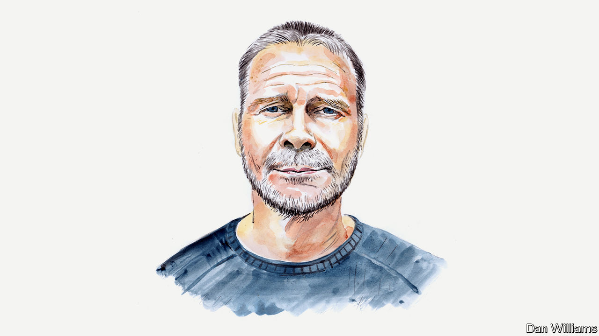

###### Britain’s economy

# The stupidity of Kwasi Kwarteng’s policies means markets expect their reversal, says Tony Yates 

##### The former strategist at the Bank of England explains why the package will not stimulate growth 

 

> Sep 28th 2022 

IN RECENT DAYS Liz Truss, Britain’s prime minister, and Kwasi Kwarteng, her chancellor, have introduced  that will eventually amount to £45bn per year or about 1.5% of GDP. They will help even those with high incomes, without any cuts yet announced to government spending to match them.

The government’s hope is that, alongside these slashed taxes, a  will stimulate growth. The bundle includes reforms to land use and to environmental regulation. But only a tiny minority of economists—presumably those advising the prime minister—believe the package will raise net revenues. There is no reliable correlation (at least at the moderate tax rates of most Western economies) between the size of the state in general, or corporate- and income-tax rates in particular, and long-run growth, or even just the level of GDP per head.

Financial markets seemed to agree on September 26th, with the  against the dollar to be worth $1.035. It has since recovered somewhat. But investors still expect the Bank of England’s Monetary Policy Committee to raise interest rates to about 6% by March next year. 

The combination of falling sterling and rising rates is particularly damning. Normally a country embarking on a monetary-policy contraction to combat an inflationary surge—imparted by a fiscal loosening—might be expected to see a rise in its exchange rate. But the government’s move has shaken markets’ faith in its fiscal competence and its grasp of macroeconomic realities. That loss of confidence produced the exchange-rate fall.

Mr Kwarteng’s delusions will come to an end. The worst return to reality would see Britain slide into a full-blown financial crisis. In this regard the fall in sterling is less important than the rise in the cost of government finances. That is partly because investors are demanding a premium: they expect to compensate themselves for the upheavals of recent days and the uncertainty they have introduced. (The economists Paul Krugman and Dario Perkins have called this a “moron risk premium”.) In a doomsday scenario this premium generates a self-fulfilling vicious cycle. It raises spending (on interest payments on existing government debt) and lowers revenues (a dearth of confidence will lead to less economic activity). This will raise the “moron premium” further, worsening the funding gap. And so on.

Part of the reason this cycle is not already causing spiralling panic is that markets can see that there is a fair chance that events will force a change of course. A recent poll by YouGov suggests that most people believe the budget measures are unfair. The government’s opponents in the Labour Party are benefitting from the fallout; the party’s leader, Sir Keir Starmer, looks unassailable. If Labour wins the next election, it would very probably bring this dash for growth to an end. That may be calming markets: two years of excess borrowing at about 1% of GDP per year is survivable.

Ironically the fiscal plans of a prospective left-wing government are providing the confidence anchor for the right-wing government it is expected to defeat in the next election. And the more this is expected to happen, and the sterner and clearer Labour’s plans become, the less awful the crisis will be in the meantime. The stupidity of Mr Kwarteng’s policy and its unpopularity are helping to limit the damage done by it. Markets believe that things won’t carry on as they are indefinitely.

In the meantime, Brits will suffer. Homeowners with mortgages, for example, will face rising costs. The harm to Britain’s reputation for institutional stability and competence will be hard to repair. The decision not to get the Office for Budget Responsibility (OBR) to forecast the impact of the “mini-budget” (as is usual when a government announces new economic plans) was a mistake. Obviously those in charge did not want the OBR pointing out that their supply-side reforms will largely fail. But that judgment was made anyway by the markets.

There is a way to enact supply-side reform without trashing Britain’s reputation. First, lower taxes that you think stimulate activity and incentives, and balance the books by raising other taxes to compensate. Second, pass planning and regulatory reforms, and consult neutral analysis of their effects on revenues 18 months down the line by the OBR (or another body). If they are shown to work, cut taxes then to offset the revenues. Commit to all this in advance to show your commitment to reform. That the government did not go down this route shows its contempt for evidence and analysis—a contempt everyone else is now having to pay for.■


