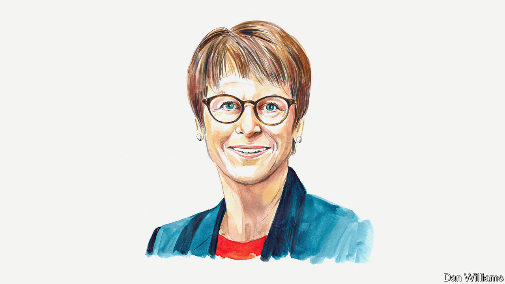

###### Europe’s energy crisis

# To protect Germany’s green transition, accept coal and nuclear power, says Veronika Grimm 

##### The quicker the crisis is over, the sooner the country can decarbonise, argues the German economist 

 

> Sep 22nd 2022 

RUSSIA’S ATTACK on Ukraine has forced Germany to rethink its energy policy. Until February, the plan was to ambitiously expand the use of renewables while phasing out nuclear energy by the end of 2022, and then coal-fired power by 2038. Natural gas was to be used as a bridging technology—both in industry and in the power sector, so that gas-fired power plants could complement intermittent renewables. In the short term, that is now difficult to imagine. But in the medium term there is no alternative.

Gas prices, which used to be on a ten-year-average €20 ($20) per megawatt hour before the crisis, leapt to more than €200 in March, and are not projected to fall below €100 until 2025, according to Ember, an energy think-tank. (Other forecasts, such as a recent one from Goldman Sachs, see prices dipping under €100 next year.) Gas prices tend to drive power prices in Europe–especially now that nuclear-power capacity has been lost to maintenance (France) and closure (Germany), and a continent-wide drought has reduced hydropower. Gas plants can fill gaps in electricity generation most flexibly. But when they have to run, as they do a lot of the time now, that means electricity is expensive. Moreover, the threat of gas scarcity in the next few months means their hours of operation will have to be reduced as much as possible. 

As a consequence, coal-fired power plants that had already been shut down are being reopened. But even that is proving difficult: the low water levels of rivers as a result of drought have slowed the shipment of coal to the plants. And extending the life of Germany’s three remaining nuclear-power plants beyond the end of the year is highly controversial in a country where the anti-nuclear consensus remains strong. 

But Germany must not lose sight of its decarbonisation plans. Reactivating coal plants to avoid running gas-fired ones may increase emissions by about 30m tonnes of carbon dioxide per year. If gas prices remain high, active and reactivated coal-fired power plants can also be expected to substitute gas-fired power plants on the market in the medium term. And overall demand is set to rise. Even with measures to help efficiency, Germany is expected to need 30% more electricity by 2030 to power transport, heating and industry. That means coal will not be phased out by the market by 2030. 

To tackle both climate change and the energy crisis, German policymakers should focus on three issues in particular. First, the existing nuclear plants should continue to run until the acute energy crisis is over. Their power will help lower prices and cut gas usage at home and in Europe. It would also reduce the need to burn coal, and therefore help keep emissions lower than they would otherwise have been. And Germany’s negotiating position with other European countries in this crisis might be weakened if it refuses to extend the lives of these plants. 

Second, every effort should be made to preserve the European emissions-trading system, as its design encourages investments in climate-friendly power plants and enforces compliance with emission-reduction targets. Increasing emissions from coal plants could drive the carbon price to unprecedented heights. Other emitters in Europe would have to cut back to compensate, because the total amount of permissible emissions in industry and the electricity sector is fixed. This situation is politically explosive and could inspire some to weaken emissions trading in Europe. We have seen the first signs of waning commitment already for the national carbon price: the German government has postponed a planned €5 increase to it in heating and mobility due to take effect at the start of 2023. 

Third, politicians should resist the temptation to tinker with the design of electricity markets. Attempts to fill state coffers with windfall taxes on energy firms’ profits will only harm the European system by increasing uncertainty about the returns it offers investors. And investment is urgently needed to overcome the current crisis. 

Finally, the wider energy transition must remain a key priority. There is no lack of financial incentives to expand renewables as quickly as possible. But slow planning and approval procedures stand in the way, as do bottlenecks in the supply of materials, and in sourcing skilled labour. Similar difficulties impede the implementation of energy-efficiency measures—though high energy prices should at least encourage some progress. The green transformation will succeed only if difficult action is taken now without losing sight of the importance of medium-term investments.■

_______________


