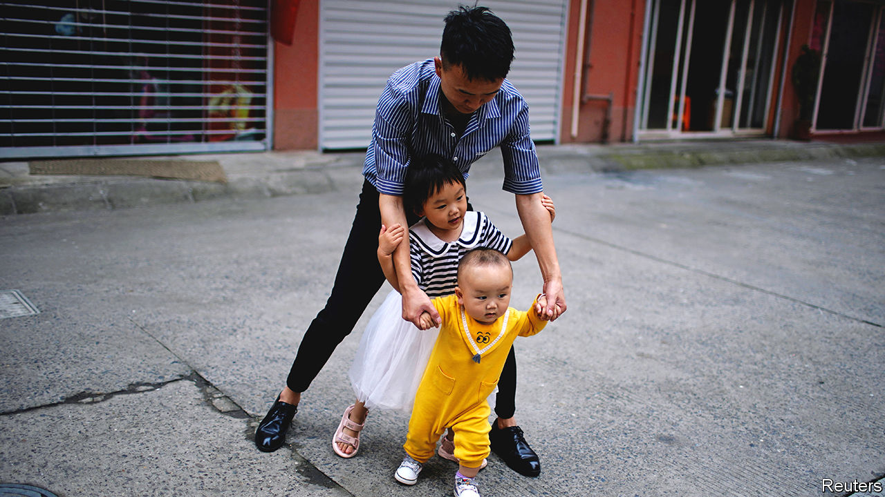

###### Procreative differences

# China is trying to get people to have more babies 

##### Its efforts are probably in vain 

 

> Sep 29th 2022 

Give officials in Hebei province points for originality. To encourage locals to have more babies, they recently enlisted a troupe of women to shout at them. While banging pots and a drum they yelled out slogans such as, “Giving birth is an important part of life!” and “The three-child policy is good!” The latter refers to an official scheme which encourages women to have up to three children.

The family-planning office behind the performance is of the sort that used to enforce the “one-child policy”, which was adopted in the 1980s and relaxed in 2015. Back then families were fined for having too many children. Some women were subjected to forced abortions or sterilisation. Such horrors sprang from two beliefs: that China was becoming too crowded, and that individuals had no right to control their own fertility. 

Today China’s leaders are worried that the country is producing too few people. After this year the population will probably start shrinking. Just 10.6m people were born in China last year, slightly more than the number of deaths. With the number of old people swelling, the workforce has been shrinking for years. That acts as a drag on economic growth and creates a huge burden of care, which China’s social-security system is ill equipped to handle. 

The three-child policy was announced last year (it had been a two-child policy since 2015). But most young people seem uninterested in having big families. In 2020 the average number of births per woman fell to 1.3, well below the 2.1 needed to keep the population growing.

Most pro-natalist policies in China try to ease the financial strain on parents. Some cities offer cash. One in Gansu province promised to give parents 10,000 yuan ($1,397) a year for three years if they had a third child (and half that for a second). Other cities have pledged to build more cheap nurseries. (As it is, most families rely on grandparents or costly nannies to look after their tots.) State-owned firms in one province were asked to cut rent by 15% for families with three children.

The population of Jilin province is shrinking quickly. So it has given single women access to in-vitro fertilisation, which is available only to married women in much of China. Beijing and Shanghai have extended maternity leave by 30 days, to just over five months. The central government says firms must not discriminate against mothers. Officials are also urging fathers to help with child care and telling companies to extend paternity leave.

The tactics are sometimes different in the countryside. A proposal dubbed “Operation Bed Warming” in a county in Hunan province aimed to dissuade women from leaving for better opportunities in cities. Women should stay and marry local men, said the plan. Marriage is not a matter of personal freedom, a supporter told a local paper. “For the advancement of society, future generations are needed,” he said. 

So far there is little sign that any of this is working. One problem is that the policies are not generous enough. It costs, on average, nearly half a million yuan to bring up a child in China, according to a recent report. In big cities it costs more. Perhaps a subsidy of 10,000 yuan per month would be adequate, says Amanda, a Chinese woman who recently got married. For now, she’s not planning to have children.

It may be that nothing China does can arrest the fall in births, says Wang Feng of the University of California, Irvine. As populations grow more urban and educated, women have fewer babies, in China as in other countries. South Korea and Japan, which have similarly low fertility rates, have been trying to prod citizens to reproduce more for decades, with little success.

China’s efforts are also hampered by the legacy of the one-child policy, which was ultimately self-defeating and left indelible scars. Procreation is now a highly sensitive subject. Many bristle when the government tries to get involved. Last year a competition to come up with new slogans for the three-child policy appears to have been abandoned after a flurry of angry suggestions. “Have more kids to look after you when you’re old,” went one. “The government won’t do it.” ■


