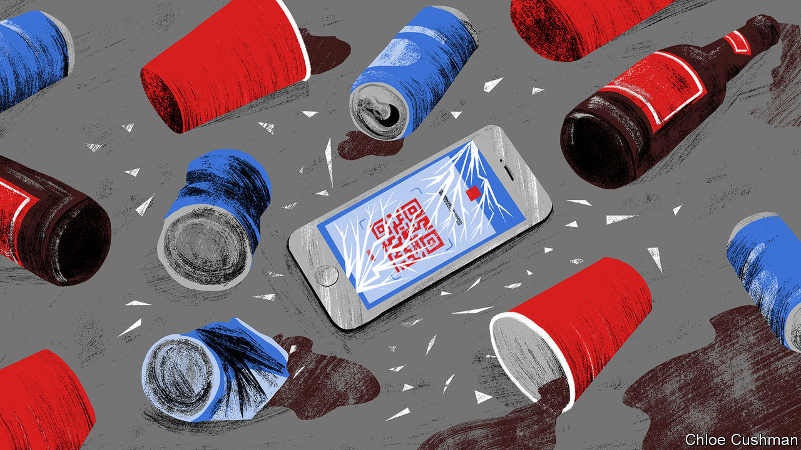

###### Chaguan

# How China’s covid policy is like Prohibition in America 

##### Many ordinary Chinese see no shame in breaking the law 

 

> Sep 29th 2022 

As China enters its 33rd month of draconian pandemic controls, a growing number of citizens are discovering what life is like outside the law. Some of these lessons are grim. Local police departments and officials have responded to public weariness with “zero-covid” policies by emphasising the punishments that await rule-breakers. Almost every day a propaganda notice goes viral, for instance announcing someone’s detention for selling fake test certificates to long-distance lorry drivers, or for bypassing a checkpoint to go to work. A man from Shandong province is in custody after dodging quarantine to attend his own wedding.

Some lessons about outlaw life border on the comic. Just ask the hipsters drawn to Beijing’s burgeoning underground club scene. They are learning that “ruins parties”—secret dance-nights held in empty office blocks or disused commercial sites—may be more romantic in the telling than in reality. Many of the capital’s nightclubs have been banned for months from holding events, especially after a mini-outbreak centred on a bar district in June. In response, dance-starved Beijingers, including university students and young professionals, organise ruins parties far from the gaze of pandemic workers and of “big whites”, the guards who enforce covid rules while swaddled in white protective overalls.

Inspected by your columnist several days after it hosted a pop-up club, a venue in northern Beijing is more gritty than glamorous. It is reached by climbing over railings into a weed-choked, abandoned entertainment complex. Arrows and graffiti tags are spray-painted on walls within, marking a route past dining tables still decorated with plastic flowers and thick layers of dust, then down marble stairs into a dark, cavernous basement. The floor is littered with mouldering tiles fallen from the ceiling and beer cans, next to fresh graffiti reading “Life is a Festival”. The authorities never discovered that party, though another event later in September ended with trouble after a police car was thumped.

Yet, revealingly, ruins parties are not seen primarily as acts of thrill-seeking rebellion. A college graduate who attends such parties says that she and her friends would rather go to regular nightclubs, but are prevented by pandemic rules that they consider “stupid”. The young woman describes how she accepted controls early in the pandemic, frightened by reports of deaths and of overwhelmed hospitals. But her trust faded, especially after a harsh, bungled lockdown that saw 24m people strictly quarantined for two months this year in Shanghai, China’s most prosperous city. Calling the Omicron variant “not that serious”, she is more frightened by rules that require Beijingers to scan qr codes with a movement-tracking smartphone app each time they enter a shop or public building or catch a taxi. That app generates green health codes needed to enter any public place. Such tracking systems, which exist all over China in various forms, create a constant risk of being ordered into quarantine for visiting the same place as a suspected case, even hours later. Her parents accept such controls, the graduate says, suggesting that older Chinese were rendered “obedient” by long-ago hardships. But like a striking number of her peers, she works hard to keep her own movements hidden.

Until recently, scofflaws tricked guards and taxi drivers by showing old screenshots of green health codes, avoiding the need to scan qr codes afresh. To stop this, the latest Beijing health codes boast an animated border and a synthesised voice. Rule-breakers now record short videos of a scan generating a health code, and show them. Others boast of maintaining two health codes, one registered with their Chinese identity card and one with a passport. This lessens travellers’ risks of getting stuck, should a health code be compromised by visiting a risky town or city, a disaster which could trigger a ban on entering Beijing and even orders to quarantine. That dodge is also against the rules. If reports of prosecutions are any guide, covid law-breaking is on the rise. Beijing police recently arrested drivers who helped people enter the city from areas with cases of infection. Authorities in the southern province of Guangdong charged software firms with selling apps that generate fake health codes. Videos of scuffles with big whites are increasingly common on social media.

When rule-breaking loses its stigma

Affluent Beijingers need not climb fences to attend secret parties. Though Chaguan’s own tastes run to jazz more than hip-hop, in the name of research he headed out late at night to a bar in a city-centre skyscraper. He dropped the promoter’s name to join what was ostensibly a private party, in the style of a speakeasy during America’s alcohol-free Prohibition era. Two young men in clubbing gear, both employed by technology firms, resisted the suggestion that they were breaking rules (though they were), arguing that they had scanned a qr code to enter. “We have to protect the old people,” one said, in defence of pandemic controls. But they admitted that China is “tired”, especially now that other countries are living with covid. “It’s too much. We are the last place that is like this,” he said, expressing the frequently heard hope that policies may ease after a Communist Party congress in October.

In truth, if leaders decide to live with covid, it would take many months to change course, not least to fully vaccinate tens of millions of old people. That decision may be a while off. President Xi Jinping continues to call zero-covid proof of the superiority of Communist Party rule, next to decadent Western democracies. Covid’s economic impact makes many headlines. But the party should worry about echoes of Prohibition, too. In 1931, shortly before America ended its experiment with temperance, a national commission noted that many respectable citizens saw no wrong in drinking, concluding: “No law can be effectively enforced except with the assistance and co-operation of the law-abiding element.” China is not at a point of revolt. But the flouting of covid rules is no longer as shameful as before. Something has to give.■


