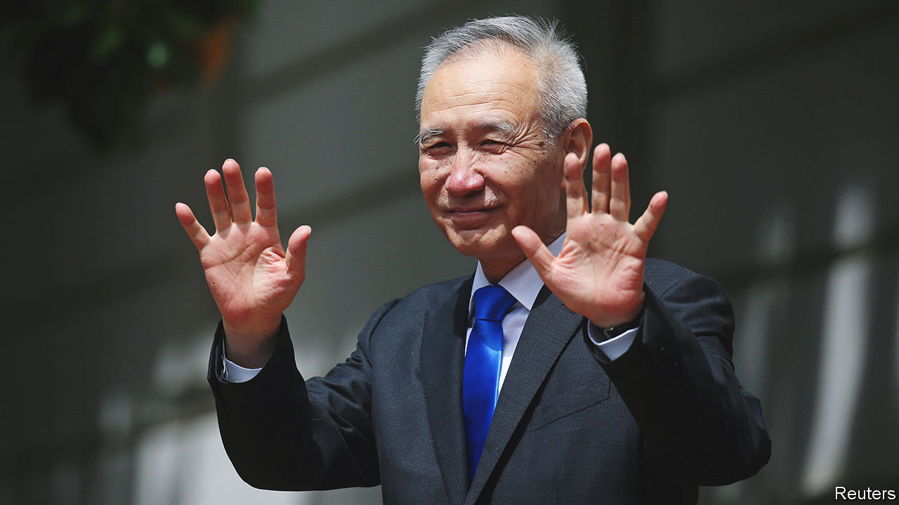

###### After Liu He

# Who will be China’s next economic tsar? 

##### As one of Xi Jinping’s most important advisers leaves the scene, we consider possible successors 

 

> Sep 29th 2022 

IN APRIL 2019 the Americans thought they were close to ending their trade war with China. They had a draft agreement that would oblige China to strengthen its intellectual property rights and buy more American crops, among other things. And they had confidence in their negotiating partner, Liu He, China’s “special envoy” (pictured). Fluent in English, educated at Harvard and committed to reform, he was “frankly, one of the most respected men anywhere in the world”, according to Donald Trump, then America’s president. 

But the Americans overestimated Mr Liu’s influence, according to the book “Superpower Showdown” by Bob Davis and Lingling Wei. “Simply because Liu hadn’t said no to US proposals didn’t mean Beijing had said yes.” When the Politburo Standing Committee, the Communist Party’s top decision-making body, rejected the draft deal, the Americans were surprised.

The episode illustrates the strengths and limits of Mr Liu, China’s economic “tsar”, who is likely to retire from his position on the Politburo at the party congress in October. One of China’s four deputy prime ministers, he also plays a leading role in two bodies set up by Xi Jinping, China’s ruler, to strengthen his grip on economic policymaking: the Central Commission for Comprehensively Deepening Reforms and the Central Financial and Economic Affairs Commission (CFEAC).

Mr Liu is respected by economists, enjoyed a “trusted relationship” with his American counterparts, and has reportedly known Mr Xi since childhood. (They both grew up in Beijing as the privileged sons of party officials.) It is hard to imagine any economic policymaker in China having a better combination of credentials. His departure is therefore a pity.

Who could be his successor? If he himself could choose, he might pick Han Wenxiu, who assists him in the CFEAC. Mr Han has a doctorate in finance and spent a year at Oxford University. He has tried to allay fears about Mr Xi’s pursuit of “common prosperity” (it does not entail “killing the rich to help the poor”) and technological self-reliance (which is not “a return to traditional self-sufficiency”). 

In 2014 he wrote a thought-provoking article distinguishing between the flow of production in China and the accumulated stock of wealth. If a bridge is built, demolished, then rebuilt, it contributes three times to the flow of GDP, he noted, but only once to the country’s wealth. “This phenomenon is not uncommon in our country.” He mentioned the Rainbow Bridge in Qijiang, which collapsed after three years. China has 5,000 years of history, he wrote, but few buildings over 50 years old. 

Mr Han once wrote a book with Guo Shuqing, a more plausible contender for the role of economic chief. After working in the countryside during the Cultural Revolution, Mr Guo completed his doctorate at the Chinese Academy of Social Sciences and also spent a year at Oxford University. He has written over 300 research papers and essays. Many were reviewed by China’s original economic tsar, Zhu Rongji, who became deputy prime minister in charge of economic affairs in 1991. 

In 2004 Mr Guo complained that “direct governmental intervention” was harming China’s economy. Investment decisions were “divorced from market realities”, costs posed no constraints, “risk is not borne by anyone and cannot be attributed to anyone.” Many of those concerns have stayed with him in his later roles as a financial regulator. Last year he warned that property was a “grey rhino”, a big, obvious, but neglected risk. He was right.

Unlike other candidates, Mr Guo is a doer and a thinker. He was governor of Shandong province and chairman of China Construction Bank, a state-owned giant, where he tried to instil a more “customer-centred approach”. 

The most likely successor to Mr Liu, however, is He Lifeng, known for his Xi-centred approach. The head of China’s planning agency, Mr He was educated at Xiamen University in Fujian province, where Mr Xi spent over 17 years of his career. He took the future president out for drinks in Xiamen and showed him the town, according to the . He also attended Mr Xi’s second wedding. As a local official in the province, Mr He was known for demolishing buildings, contributing to GDP if not to wealth. 

Mr He helps oversee Mr Xi’s Belt and Road Initiative, an effort to build infrastructure and trade routes across the globe. Before that, in 2002, he co-edited a book about China’s entry into the World Trade Organisation. It warned that anti-socialist forces would use the WTO and the internet to spread Western values and spiritual “opium” to China. WTO membership would also open the door to multinational firms resistant to the party’s influence. Mr He’s fears separate him from more cosmopolitan economists. But Mr Xi is also prone to thinking that Westerners press reforms on China not to strengthen its economy but to weaken the party’s control. 

Whoever becomes the next economic “tsar” will struggle to live up to the title. He will only be as powerful as Mr Xi wants him to be. Even the formidable Mr Zhu disliked the term. Decisions are made collectively, he told a reporter in 1994. If his views on the economy had weight, it was because he had devoted most of his energy to economic work and had not “made any major mistakes”. Today there is only one tsar. And nothing, certainly not economics, falls outside his purview. ■


