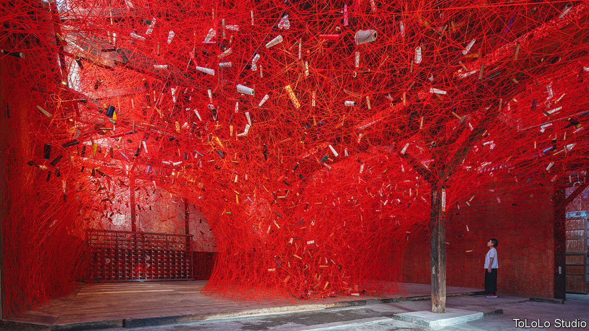

###### Art and politics in Japan

# An art festival reflects the threat to free expression in Japan 

##### This year’s Aichi Triennale is quieter than its predecessor. But it is still alive and kicking 

 

> Sep 29th 2022 

“I AM STILL ALIVE”, read a series of telegrams that Kawara On, a Japanese conceptual artist, sent to friends and acquaintances around the world between 1970 and 2000. At the Aichi Triennale, a big art festival in Kawara’s home region, scores of the messages lie on tables and hang on walls. Together they form a chorus at once defiant and desperate. The effect is haunting.

And slyly self-referential. “Still Alive” is also the title of this year’s triennale. It refers most obviously to life and the world after the pandemic. Yet it hints, too, at the event’s own brush with death at the hands of intolerant reactionaries. “‘Still Alive’ is also a question for the Aichi Triennale itself,” says Kataoka Mami, this year’s artistic director. The answer has profound implications for artistic freedom in Japan. 

The triennale was launched in Aichi, a manufacturing hub between Tokyo and Osaka, in 2010, part of a recent trend for Japanese art festivals outside Tokyo. The previous edition, in 2019, was held during a global populist wave, from Brexit in Britain to Donald Trump in America. The organisers wanted the show to respond to the turbulent moment. “The idea was that contemporary art has to deal with these events,” says Tsuda Daisuke, a journalist and critic who was artistic director that time. This was a somewhat radical choice in Japan, where contemporary art tends to eschew fiery political commentary. 

That year’s exhibition included a section called “After ‘Freedom of Expression’?” It gathered pieces that had recently been censored or barred, among them a video showing the burning of Emperor Hirohito’s photograph, and a statue by a pair of Korean artists depicting a Korean “comfort woman”, the euphemistic label given to Koreans and others forced into brothels for Japanese soldiers during the second world war. Right-wingers in Japan pounced. 

Kawamura Takashi, the populist mayor of Nagoya, declared that the statue “trampled on the feelings of the Japanese people” and demanded its removal. Armies of online activists from the , Japan’s equivalent of the alt-right, organised campaigns of harassment: more than 10,000 complaints were filed in the course of a month. “The calls just wouldn’t stop, from morning to night, very intense threats,” Mr Tsuda recalls. Some promised outright violence. Local police were ill-prepared for such a barrage and slow to act. Officials were on edge, as just weeks earlier a disturbed man had burned down an animation studio in Kyoto, killing 36 people. The festival was closed, ostensibly for safety reasons.

For many Japanese liberals, the incident only reinforced the exhibition’s message: that the country has a subtle but sinister problem with censorship. “It’s like we’re in lukewarm water”, says Okamoto Yuka, which is “slowly heating up.” The situation is not as severe as in, say, China, but “by the time we notice, we might be boiling.” Ms Okamoto organised a series of exhibits that displayed the controversial pieces in smaller venues, often amid hounding by nationalist protesters.

Discussion of the past is particularly fraught. “Freedom of expression in Japan hinges on perceptions of history,” Ms Okamoto argues. As prime minister from 2012 to 2020, , a historical revisionist, battled to change textbooks and downplay the atrocities of the imperial era. His rhetoric, critics allege, empowered forces further to the right and chilled the atmosphere of political debate. Japan fell precipitously in press-freedom rankings on his watch. The Abe administration did little to denounce the attacks on the Aichi exhibition; instead, its cultural agency temporarily withdrew its funding for the triennale.

The lives of others

This year’s edition, which sprawls over four sites in the prefecture, has avoided historical flashpoints and generated relatively little controversy. It is again reliant on government funding. At first glance, the milder content suggests the furore of 2019 has cast a long shadow. Big institutions “wouldn’t dare to produce an event like that again”, says Ozaki Tatsuya, an art critic. Alongside the work of Japanese artists such as Shiota Chiharu (see picture), the show includes that of many others from around the world; but, intentionally or otherwise, there are no Koreans. “In Japan there’s an air that forces self-censorship,” Mr Tsuda says. “There was a box and I opened it—I was confronting things people didn’t want to see.”

Yet it would be wrong to judge this year’s exhibition by the standards of its provocative predecessor. “We can talk about politics in many different ways,” says Iida Shihoko, the chief curator of both. They instead represent different visions of art’s role in society. Whereas in 2019 the show used art to confront difficult realities, this year’s sees it as a means to imagine new possibilities. The artistic director, Ms Kataoka, a native of Aichi who is currently the boss of the Mori Art Museum in Tokyo, found the edition of 2019 “brave” when she saw it. But she prefers a more “indirect” method. “If you’re punched in the face, where do you go from there?” 

The more ruminative approach is encapsulated in one of the first things visitors see at the main exhibit in Nagoya: a piece by the late Belgian conceptualist Marcel Broodthaers, in which he takes a standard “political map of the world” and replaces the word “world” with “utopia” in the title. Art, he suggests, has the power to transform how viewers see things with the stroke of a pen. 

The triennale’s most striking projects conjure links between Japan and disparate places and ideas. It is a vision that Japan’s nationalists, who make a fetish of their own uniqueness, would abhor—if they grasped the message. Thierry Oussou, a Beninese artist, dyes Japanese cotton as part of an installation reflecting on the material’s tortured history in west Africa. Theaster Gates, an American artist, melds Afrofuturism and the Japanese folk-art philosophy of  at a house in Tokoname, a ceramics hub in southern Aichi. At first the pairing seems improbable, but black soul music turns out to be an ideal soundtrack for pondering Japanese pottery. 

A video project by Hoda Afshar, an Iranian artist, depicts migrants trapped on Manus Island after being refused entry to Australia. In Aichi the piece can be seen as a reference to the death of a Sri Lankan migrant worker in a detention centre in Nagoya last year. “We use other peoples’ stories to help illuminate our own,” Ms Kataoka says. The Aichi Triennale may be speaking softly, but it is still very much alive. ■

