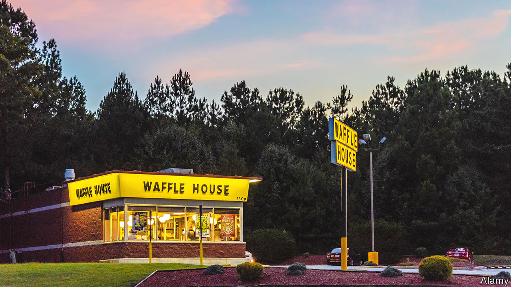

###### World in a dish

# On the curious and enduring appeal of Waffle House 

##### The diners rarely close. For many in the South, they feel like home 

 

> Sep 29th 2022 

Pull off an interstate before dawn in the American South and, outside city centres, you enter a shuttered, ghostly world: darkened businesses, petrol stations devoid of cars, traffic lights flashing red and yellow over empty junctions. But if you are lucky, you may spot a beacon: “WAFFLE HOUSE” spelled out on giant yellow tiles that tower above the restaurant of that name. It will be warmly lit and, more important, open.

The first Waffle House opened just outside Atlanta in 1955. Today there are around 2,000 of them in America, mostly in the South. They are so averse to closing that the former head of the federal emergency-response agency came up with a “Waffle House Index”: if he arrived in an area that had been hit by a storm and found the local outlet shut, he knew he was dealing with a severe natural disaster. This perpetual welcome is only one reason for the affection that Waffle House—on its face, an unremarkable chain of cheap diners—inspires in devotees.

Waffle House may be the only chain restaurant to be name-checked in both hip-hop tracks (“After the party it’s the Waffle House,” raps Jermaine Dupri) and country songs: “Meet me at the Waffle House/Bring me my gun,” croons Colt Ford in a ditty about a man pondering whether to kill his cheating wife. Donald Glover featured a late-night visit to one in his television series “Atlanta” (no city has more of them). The chain has a bespoke jukebox full of Waffle House-themed songs. In the pre-dawn hours, clubbers eating a late meal before bed sit alongside early-shift workers having breakfast. On Sundays church-goers filter in after the morning service.

In part, they come for the food. For Americans, breakfast food is comfort food, and Waffle House does it well. The coffee is hot, the waffles reliable, the eggs well-cooked and the hash browns unrivalled. They are crisp yet soft, and endlessly customisable, ideally using the restaurant’s private lingo. “Scattered, smothered, chunked, capped and peppered”, for instance, means spread out on the griddle for extra crispness, with onions, ham, mushrooms and jalapeños.

That semi-secret argot hints at another plus: Waffle Houses are widespread enough to be familiar, yet not ubiquitous like McDonald’s or other behemoths. They feel like the South’s own special restaurant, much as Whataburger does for Texans or In-N-Out Burger for Angelenos. Diners do not feel in-the-know when ordering a Big Mac; they do when asking for their breakfast to be scattered and smothered.

In contrast to fast-food chains, they can also see their breakfast being cooked in open kitchens. If business is slow, those seated at the counter may chat with the cook working the grill, who will probably hand them their food directly. Fast-food chains offer efficiency and anonymity, which have their place; sometimes you want to order from a standard menu, quickly and wordlessly. But sometimes it’s nice to order hash browns and eggs the way you like them, and hear a waitress say, “I got you, baby.” It feels like home. ■

