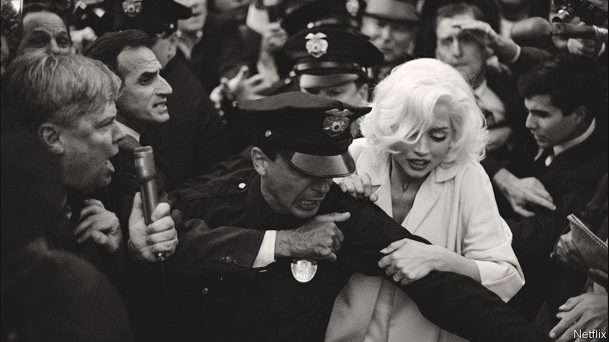

###### Back Story

# Will anyone ever again be as famous as Marilyn and Elvis? 

##### After “Elvis” comes “Blonde”. This leap to immortality may no longer be possible 

 

> Sep 28th 2022 

NEITHER NEEDS a surname. Neither really needs a name at all: poses and disembodied features are enough to evoke their legends. Red lips and that beauty spot mean Marilyn, as does the dress billowing above the subway grate that is the opening image in “Blonde”, a punishing vision of her story out on Netflix on September 28th. The quiff and swivelling hips stand for Elvis, celebrated by Baz Luhrmann in his latest film.

Wildly different in tone, these movies are alike in their gimmicky ambition. “” is all shook up by split-screen antics and a flashback narration by Colonel Tom Parker, the King’s mountebank manager, played by Tom Hanks. “Blonde” includes shots from the point of view of Marilyn’s cervix. But the standout fact about both is that they were made—almost 70 years after Marilyn sang “Diamonds Are a Girl’s Best Friend” and Elvis recorded his first track. Will any of today’s stars (Beyoncé, say, or Harry Styles) be so cherished 70 years from now? Will anyone, in fact, ever be as famous as Elvis and Marilyn again?

In “Blonde” (based on a novel by Joyce Carol Oates), the lights that illuminate the iconic dress scene bombard Marilyn like artillery. Men—directors, lovers, husbands, a president—patronise, exploit, hound, abuse and rape her. “Marilyn” is a role she reluctantly performs, as the icy sequences filmed in golden-era black and white convey. Elvis (Austin Butler) is manipulated by Colonel Tom and doped by unscrupulous doctors. In both cases celebrity is a cult that destroys those it venerates, fame a heartbreak hotel with only one exit.

Yet their tragic early deaths have helped them live for ever. Elvis is the biggest-selling solo artist in history. People still make a living impersonating him. Marilyn’s style runs through Madonna to Lady Gaga and beyond. Ana de Armas (pictured), who in “Blonde” gets the girlish voice just right, is the latest of umpteen on-screen imitators. This mega-fame was the result of an alchemical equation: X-factor talent plus personal drama plus marketing and, indispensably, timing. 

Seismic changes that could only happen once, happened as Elvis and Marilyn arrived in the 1950s. Rock’n’roll was born. In the person of Elvis, African-American music beguiled many white listeners for the first time (the film has him, in childhood, toggling between the juke joint and the revival tent). Youth culture became the dominant culture. Then there was sex.

In “Elvis”, female fans writhe at his gyrations, as if sex were altogether news to them. And for many in the mid-1950s, it was, at least in such a public incarnation. The Hays code that regulated Hollywood morality was fraying but in force. In 1959 “Some Like It Hot” was made without the censors’ blessing: a fiesta of cross-dressing, in which Marilyn cooed “I Wanna be Loved by You” in a see-through dress, it was eventually approved and became a smash-hit. “Sexual intercourse began/In nineteen sixty-three,” Philip Larkin wrote. He was out by a few years. 

And technology brought these firsts to a mass audience that couldn’t look away. Cinema attendance was already on the slide, but in the late 1950s around a third of Americans still went every week. Besides the movies, they had radio and a handful of television channels; Elvis bestrode the lot. Older viewers might have recoiled from his pelvis, but millions of them saw it on tv.

These days oldies might well disapprove of the teen idols of YouTube and TikTok—if they knew who they were. In theory 21st-century celebrities can reach everywhere at once, but as outlets and platforms proliferate, and audiences fragment, none do. The internet has made countless people famous for 15 minutes, but staying famous for longer has grown harder, let alone long enough to define an era, or gather the momentum to transcend it. As for the pictures, with the dawn of streaming, they finally got small. Compared with their big-screen heyday, the stars have dimmed. 

Elvis left the building in 1977. Marilyn died in 1962. Like the Beatles, they made a leap to immortality that may no longer be possible. Does that matter? A little.

As David Haven Blake of the College of New Jersey puts it, the likes of Elvis and Marilyn are modern equivalents of Greek gods, their work reinterpreted and their stories endlessly retold to fit new times and values. In a fractious world, they are a kind of gossamer glue that stretches across generations and borders. Find them online and, in her wounded allure and his soulful swagger, you still see what all the fuss is about. Even the most bravura imitations seem thin. 

