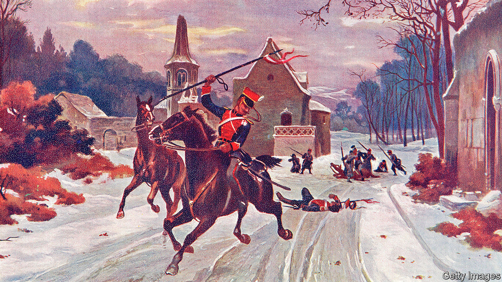

###### The German way of war

# “Iron and Blood” questions the story of German militarism 

##### History could have been different, argues Peter Wilson 

 

> Sep 29th 2022 

 By Peter Wilson. 

According to a remark attributed to Voltaire, in the late 18th century Prussia was an army with a state rather than a state with an army. Its standing force of 200,000 men was vast for its relatively small population. A century or so later, the belief that Prussia and subsequently imperial Germany were uniquely militarised European powers was reinforced by Otto von Bismarck’s famous address to the Prussian Diet in 1862. “Not through speeches and majority decisions will the great questions of the day be decided,” he declared, “but by iron and blood.”

Peter Wilson, a military historian at Oxford, does not dispute how integral militarism has been to Germany’s past. But by providing centuries of context, he sets out to show that its history could have been different, and sometimes was.

Because of a focus on the two world wars, with perhaps a glance back to the Franco-Prussian war of 1871, a myth has evolved of a specifically German way of war, the author argues. In this telling, Germany’s position in the heart of Europe, encircled by hostile neighbours, meant it needed a first-strike capability that could only be achieved by a “power state”, an authoritarian system able to mobilise the necessary resources. This in turn has led to a further myth: of a unique German genius for war based on superior technology, skill and martial spirit. Even today, Hitler’s Wehrmacht is admired by many military types, especially in America. For Blitzkrieg, read “shock and awe”.

Much of the book is taken up with conflicts within or involving that strange entity, the Holy Roman Empire, the collection of mostly German-speaking states dominated by Habsburg Austria that, as Voltaire also quipped, was neither holy, Roman, nor an empire. At least until the middle of the 18th century, this alone made the German way of war quite different from those of unitary states such as England or France. The quasi-autonomy of the component parts, which nearly all maintained their own armies, required a decentralised and collaborative approach—the antithesis of the authoritarian model that emerged later with such awful consequences.

Despite the horrors of the Thirty Years War (1618-48), which was largely fought within the empire’s borders, and the fearsome reputation of its pike and musket formations, it was not much more prone to violence than other parts of Europe, and enjoyed long periods of relative peace. Even after the empire’s collapse following defeat to Napoleon at Jena in 1806, and its metamorphosis into the German Confederation in 1815, peace held until the revolutionary uprisings of 1848 and the war with Denmark that began in the same year. But in 1864 a second war with the Danes forged the template for future conflicts.

The chief of the general staff, Helmuth von Moltke, was charged by Bismarck with achieving a quick, decisive victory before other powers could intervene. He did so, but more by luck than good judgment. The army had triumphed, in its view, because of its freedom from political supervision, an inference that led Prussia’s rulers to place their faith ever more blindly in the top brass. That faith appeared to be vindicated when Prussia routed France in 1871, thanks to efficient mobilisation, brutally effective tactics and French mistakes. But, as Mr Wilson observes, these and other successes embedded “flaws ever deeper into the country’s institutions, only to be repeated with ever more disastrous results in the subsequent two world wars”. 

Doomed to repetition

Before 1914, the unquestioned assumption of the general staff (under the leadership of Moltke the Younger, nephew of the original) was that, since a major war in Europe was inevitable, it should prepare for one. The possibility that politics or diplomacy might be more productive was barely considered. Thus the constant reworking of the notorious Schlieffen plan, which required the encirclement of French forces by racing to the coast via Belgium.

This was, says Mr Wilson, an “opening gambit rather than a strategic plan”. Everything rested on a successful first strike, with little thought for the consequences if it failed—as it did. Not only was Germany unprepared for a war of attrition against foes with advantages such as greater resources and the Royal Navy’s blockade power; it did not even start with clear and achievable aims.

Many of the same mistakes were repeated in the next war. If the Germans had a unique genius for war, it was at the battlefield tactical level, although Mr Wilson questions even that. When it came to strategy, the militarised power state again proved to be catastrophically lacking.

“Iron and Blood” delves into politics, economics, technology and social developments. Its long view of Germany’s military history, magisterial detail and acute analysis provide a new understanding of what was once Europe’s warring heart. Modern Germany has been very different. Before the invasion of Ukraine, it believed in “change through trade” with Russia and China, benefiting from the rules-based international order without contributing much to its defence. It is now being forced into another drastic shift. ■

