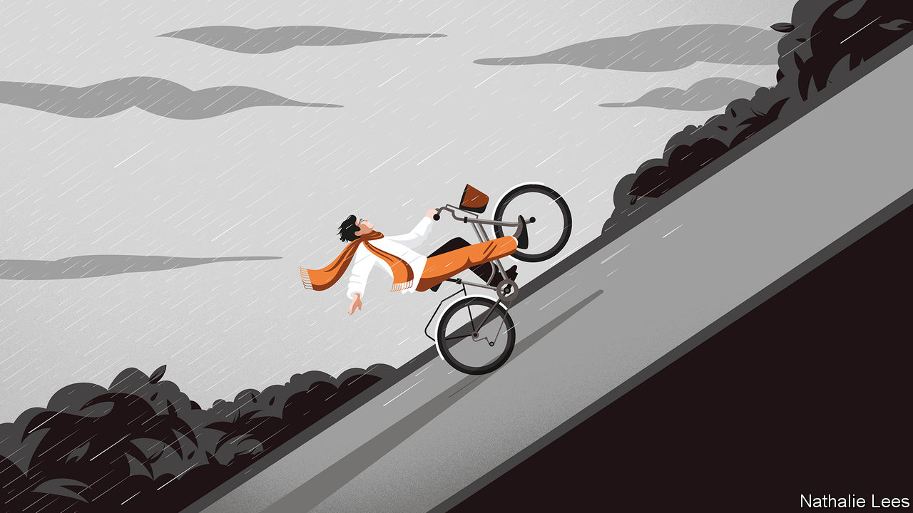

###### No other way but through

# “Life is Hard” is a consoling guide to this vale of tears 

##### Woe is inevitable, argues Kieran Setiya’s humane book. But clear thinking can help 

 

> Sep 29th 2022 

 By Kieran Setiya. 

For many years, Kieran Setiya has suffered from chronic pain. Aristotle and many philosophers since have judged that such an affliction, like other major harms, must diminish or spoil a good life. Mr Setiya, a well-regarded professor of philosophy at the Massachusetts Institute of Technology, disagrees. “Life is Hard” is his wry and ever-thoughtful explanation of why. 

Its short, engagingly written chapters examine six banes of life in turn: infirmity (including pain), loneliness, grief, failure, injustice and “absurdity”, or a sense of life’s futility. Everyone faces some of them at one time or another. Many people face several all the time. If suffering is in practice unavoidable, how is a good life possible? 

A good question, but Mr Setiya aims to show how living well and hardship can go together. There is no single good life for everyone, he argues at the beginning. Such lives can include—but do not require—feeling happy. They involve the well-being of others, not just your own, a point reprised in the chapter on injustice. A good life also need not require you to define, let alone pursue, an ideal one: “The best is often out of reach.” 

As for life’s banes, saying that people “should not turn away from hardship” is not to call for self-mortification out of religious guilt. Nor is Mr Setiya claiming, in Stoic or Buddhist fashion, that people can make pain, loneliness and the rest go away by persuading themselves not to care about their effects. Hardships are bad and best avoided. They should be minimised where possible but, where not, better understood and better described. To that main task “Life is Hard” then turns, with a mix of personal anecdote, analytical bite and refreshing distrust, based on factual evidence, of much received wisdom. 

The chapter on “Infirmity” cites evidence that the handicapped can live as well as the non-handicapped. Pain, especially chronic pain, is different. Mr Setiya pores over the different ways pain is understood and talked about. He rejects the once-standard picture of pain as a grim but thoughtless feeling. “Pain”, he counters, “is not lost for words.” 

“Loneliness” rejects a suspect picture of modern society as peopled by the lonely and disconnected. Instead, it focuses on particular harms, notably the widespread use of solitary confinement in American prisons. In analytical mode, it probes why love and friendship matter and what harm their absence causes. Most readers will think the answers are obvious until they try to put them into words. Again, Mr Setiya’s distinctions come to their aid. 

As for grief, Epicurus was wrong: it is not unreasonable. Death matters. It harms survivors (through loss of the dead) and the dead themselves (who are deprived of more life). Yet there comes a time for the bereaved to slow up or stop: “The tempering of grief is not betrayal.” The chapter on “Failure” is less strong, but before false reassurance can take hold, Mr Setiya turns to justice. A good life, he presses, involves resisting injustice, for the well-being of any one person depends on that of others. Rather than guilty payment for past wrongs, he contends, pursuing justice should mean attending to social inequities now and planetary ruin to come. 

It also gives life a purpose, so answering glum thoughts of its futility. And it offers grounds for hope, the topic of Mr Setiya’s final chapter, in which he makes more nice distinctions and quietly reminds readers that he knows what he is talking about from personal experience. 

“Life is Hard” will disappoint those looking for glibly reassuring self-help. It ambles and chats, citing a delightful range of writers and thinkers (and the occasional luminary of baseball); then a lot of compressed thought and sketched argument goes by in a few brisk paragraphs. It may unsettle academic philosophers with fixed notions of industry standards. Those features, however, are part of its strength. Attentive readers of this humane, intelligent book will come away with a firmer grasp and better descriptions of whatever it is that ails them or those they cherish. ■

