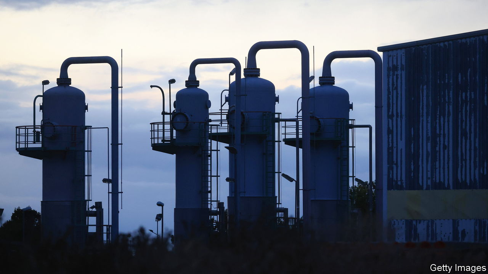
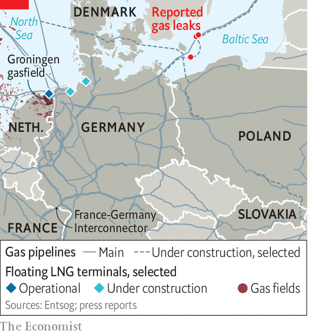

###### Shiver for longer

# Europe’s next energy crunch 

##### The winter of 2023 could be worse than 2022 

 

> Sep 29th 2022 

The Dutch province of Groningen sits on Europe’s biggest proven gasfield. Decades of extraction have caused small earthquakes that have left thousands of houses unstable, leading the government to reduce gas flows to a minimum and promise to shut the field by 2024. Gas prices are now so high that if it allowed regular pumping, the government could make every owner of a wobbly home a millionaire. But that is politically impossible. Even in the midst of an energy crisis, which could get worse in 2023, support for boosting energy production is shaky. 

Most businesses and households are understandably focusing on staying warm (and solvent) through this winter, not the next one. Policymakers are scrambling to help them with billions of euros. In early September, the German government coalition agreed on a new package of measures worth €65bn ($62.5bn), and then added another €200bn at the end of the month. Italy’s incoming government will come under immediate pressure to raise the country’s aid packages, already worth 3% of GDP. 

 


Here is the bad news, though. Europe’s crisis will not end come spring. Goldman Sachs, a bank, recently projected gas prices in summer next year to be around €235 per MWh, higher than they are today (the pre-pandemic price was around €20). German electricity futures for the fourth quarter of 2023 are more expensive than for the fourth quarter of this year. Even in France, where policymakers hope that the many nuclear reactors currently shut for maintenance and repairs will return in 2023, the real worry is next winter, not this one, according to one energy boss.

There are several reasons why prices are likely to remain high. If the winter is particularly cold, Europe’s gas storage facilities could be virtually empty by March. In 2022 Russian gas helped fill them, until Russia cut supplies over the summer in response to sanctions. Unless these resume in 2023, gas to replenish European stores will have to come from elsewhere. But little additional supply is expected to hit global markets before 2024, say analysts. This week’s sabotage of undersea pipelines, possibly by Russia, is another reason to worry that supply may be constrained next year, as are overdue closures for maintenance of facilities in Norway. 

The Netherlands’ Groningen gasfield is the only potential game-changer in Europe, say experts. It pumped out 42bn cubic metres in 2014, and could still produce 20-25bn, around 5% of Europe’s gas needs, according to the firms that own the concession to exploit the field. But the politics is fraught. The government has been slow to reinforce houses and compensate owners. Now it is putting their safety first.

Happily, the capacity to handle imports is improving. A floating LNG terminal in Eemshaven on the Dutch coast has just come online, and Germany is on course to add two more this year. A long-awaited pipeline connecting Norway to Poland via Denmark will begin operations in October, pumping up to 10bn cubic metres per year in the future. A new pipeline of about half that capacity from Poland to Slovakia will also start pumping, and the French-German interconnector is being retrofitted to allow eastward flows soon. 

But competition between European countries for these supplies will be fierce. Poland has not secured supplies beyond the current heating season to fill its share of the new pipeline in full, according to its national gas company PGNiG. Germany is struggling to sign so-called solidarity agreements with some of its neighbours to secure supplies in case of shortages this winter. In the meantime, Berlin is unwilling to sign longer-term LNG contracts to secure supplies from abroad, and instead seems to trust its spending power to redirect LNG shipments to its shores as needed, at the expense of poorer countries. The EU’s platform to facilitate joint gas purchases to help those countries secure better prices has yet to come online.

High gas prices are also a major reason why electricity in Europe will continue to be expensive. Getting French nuclear power back to full capacity is crucial, as France is typically an exporter of electricity, but on current government projections that will take time. Germany is only reluctantly planning to extend the life of two of its three remaining nuclear power plants, and only until mid-April, despite its own analysis showing that it would save some gas. Poland has already restricted electricity exports to Germany, to lower its own electricity prices and to avoid burning too much coal, though officially it says it is to ensure security of power supply. The Swedish government is under pressure to do the same. 

The longer the crisis drags on, the more difficult the political conflicts within and between countries will become. Home owners in Groningen, nuclear-power opponents in Germany and politicians across Europe shielding consumers from high prices all have their reasons to do so. But the collective result will be limited energy supply, excess demand and high prices all round in 2023. ■

