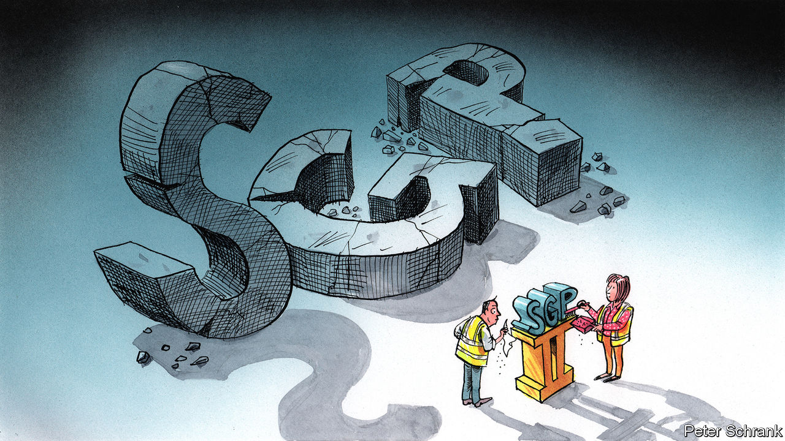

###### Charlemagne

# Europe’s plans for laxer spending rules shows German influence is waning 

##### Auf Wiedersehen, stability and growth pact 

 

> Sep 29th 2022 

There is no dog in hot dog, a koala bear ain’t no bear, and let us not speak of urinal cakes. What of the EU’s “Stability and Growth Pact” (SGP)? The agreement limiting how much debt national governments can run up has achieved neither of its stated objectives: Europe endured a prolonged currency crisis and decades of economic torpor. Thus few bemoaned the pact’s suspension in 2020 as Europe splurged its way through the pandemic and now scrambles to offset soaring energy bills. Germany is now pushing for the old straitjacket to be reintroduced, but only a much looser arrangement looks likely. That hawks in Berlin are likely to be defied shows how much German influence has waned.

No fault line in the EU is as deep as that separating the frugal northerners from their supposedly spendthrift southern neighbours. The SGP was an attempt to bridge the divide. Devised in the run-up to the introduction of the euro in 1999, it capped annual budget deficits at 3% and overall debt at 60% of GDP. Italy and Greece would share a currency with Germany and the Netherlands, but only if they also shared their sober approach to public finances. It was never really thus: the pact was soon broken willy-nilly, even by Germany, in its first few years. Many countries ended up with debts over 100% of GDP as the global financial crisis unfolded. By the 2010s the bail-outs the pact was designed to avoid became unavoidable.

Despite its failure, the SGP still matters. It has nudged governments to ensure spending somewhat matches revenues, at least in good times. The principles behind it guided the response to the euro-zone crisis of 2009 onwards, which southerners still feel imposed a pointless fiscal drag on their recovery. If that was a mistake, it was not repeated two years ago: as the pandemic struck, all sides agreed the old rules had to be shelved. The European Commission, the bloc’s executive arm, will in October unveil its ideas for a refreshed version as the SGP comes back into force by 2024. 

Brussels has been bracing for a rerun of familiar rows pitting countries with Mediterranean coastlines against those with colder beaches. In fact early discussions between finance ministers seem to point to nearly everyone wanting to bin the old approach. Germany stands essentially alone in pushing for a return to the way things were. There is still much late-night haggling to be done. But as things stand it looks unlikely to get its way.

The key word to the commission’s proposed new approach is “flexibility” in the application of the SGP. The 3% deficit and 60% debt rule will remain: those figures are enshrined in EU treaties and tweaking them is basically impossible. The focus is thus on enforcing them in an altogether gentler fashion. Gone will be the year-after-year nagging by Eurocrats of countries with “excessive deficits”. Instead, national finance ministries will propose ideas of how to balance their books over many years. Pledging reforms viewed as sensible in Brussels—spending on renewable energy, say, or pushing back the retirement age—will result in a country being allowed, in effect, to ignore those pesky budget limits. 

This is music to the ears of southern Europeans; most imagine that “flexibility” will mean a kinder hearing from Eurocrats. France also likes this approach, as one might expect of a country now in its 48th year without a balanced budget. But Germany would in the past have been able to derail a push towards such potential profligacy. How has it ended up so isolated? 

For one thing, the position of its own government is unclear. Christian Lindner, Germany’s finance minister, has made hawkish sounds about the need for fiscal prudence both at home and in Europe. But his is the third-biggest party in a three-party coalition, which also includes Greens who favour big spending to decarbonise the economy. Olaf Scholz, the chancellor, has other priorities: he pledged €100bn ($97bn) for the armed forces in response to the war in Ukraine. The bonanza will not be included in German national accounts, the kind of sleight-of-hand Berlin would once have frowned upon. When Germans wobble, others feel less obligation to tighten their own corsets.

Germany is also short of allies these days. Many traditional penny-pinchers in northern Europe wonder if strict budget rules are compatible with ambitious carbon-cutting plans. Few want to discuss divisive budget rules when eu unity is at a premium. Many eastern Europeans have low debt, but want to spend lots more on defence—if only to replace kit they have sent to Ukraine. They blame Germany for having mollycoddled Russia for years and becoming hooked on cheap gas; they think it could do more to help Ukraine now. Few are in the mood for lessons from Berlin. 

Fiscal rules, ok? 

Germany’s insistence on budgetary rectitude still carries heft. Most wonks think a reform of budget rules should include a central fiscal capacity, along the lines of the temporary €750bn fund set up during the pandemic. That is not on the cards, thanks to German and Dutch resistance. Even absent nagging from Brussels, many countries with wobbly public finances are enacting reforms. Emmanuel Macron in France is pushing for a higher retirement age. Giorgia Meloni, the incoming Italian prime minister, has made reassuring sounds about public finances.

And if the commission does not impose balanced budgets, others might. Markets are capable of swiftly turning against governments they deem profligate, as Britain discovered this week. On the continent the bond vigilantes are held at bay by the European Central Bank, which is buying up the bonds of Italy and others; it has promised to do more if needed. Its president, Christine Lagarde, has warned finance ministers that loose public finances could drive up inflation, forcing the bank to raise rates quickly. Few will doubt she is serious. If Germany can no longer be Europe’s budgetary bad cop, at least someone else is ready to take up the baton. ■


