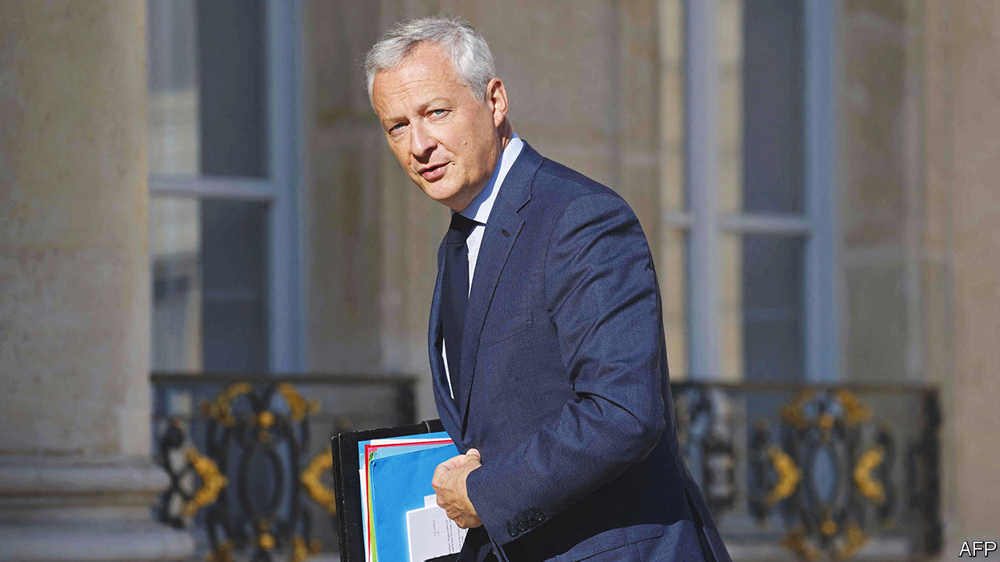

###### Steady on

# France unveils a stable budget for 2023 

##### But the government has yet to get a grip on public spending 

 

> Sep 29th 2022 

AMID market turmoil in Britain and political uncertainty in Italy, France looks like an oasis of relative stability. On September 26th Bruno Le Maire, the finance minister, unveiled the government’s budget for 2023, which was broadly in line with previous ones. It was his sixth; indeed Mr Le Maire now holds the record for the longest consecutive period in office for a finance minister under the French Fifth Republic. Such consistency, however, will not spare France a difficult autumn, nor close scrutiny of its public finances.

The budget focuses on protecting the French from soaring energy prices. France will spend €45bn ($43bn) next year on state subsidies to keep energy costs down. Already this year the government has frozen gas prices and capped the rise in electricity prices to 4%. In 2023 this cap will rise by an additional 15% for both gas and electricity bills. Direct subsidies for petrol at the pump will end, as aid becomes more targeted at those who need it. There will be extra help for those on low incomes, as well as tax tweaks costing €6.2bn that are designed to help poorer households.

Mr Le Maire has not done everything he had on his list. Mindful of the deficit, he has postponed inheritance-tax cuts. A small cut in business taxes has been spread over two years. The budget, as he pointed out, still does “a little too much” to support the use of fossil fuel. But it also, he argued, marks the end of the philosophy of spending  (whatever it costs), which characterised public spending during the pandemic. 

Not everyone agrees. French public finances will remain stretched. Next year sees no drop in the expected budget deficit, which will remain at 5% of GDP, or €159bn, the same level as in 2022. Public debt will remain at an alarmingly high 111% of GDP. MEDEF, a business lobby, criticised the budget for a “lack of ambition” on public spending. Mr Le Maire has promised to curb the deficit to 3%, in line with euro-zone rules, but not until 2027. The current deficit level puts France closer to Spain than to Germany. 

Whether the government manages to achieve its own objective next year is uncertain. Public spending may turn out to be underestimated, warned the official public-finances watchdog this week. The government’s growth forecast for 2023 of 1% could also prove optimistic. So far the French economy has proved robust. Yet inflationary pressures on firms and slower growth elsewhere will dampen it. The Bank of France expects growth in 2023 to reach 0.8% at best.

Ultimately, says Mujtaba Rahman of Eurasia Group, a political-risk consultancy, deficit reduction “cannot be achieved without pension reform”. France spends about 14% of GDP on public pensions, compared with an OECD average of 8%. The European Commission, which has suspended its fiscal rules for now, is looking closely for signs that France is serious about getting a grip on public spending. During his re-election campaign, President Emmanuel Macron promised to raise the pension age from 62 years to 64 or 65. He then lost his parliamentary majority, so that pledge looks hard to fulfil. If he tries to force it through, the opposition and unions will take to the streets. If he delays the plan for yet more talks, he risks losing his credibility as a reformer. ■

