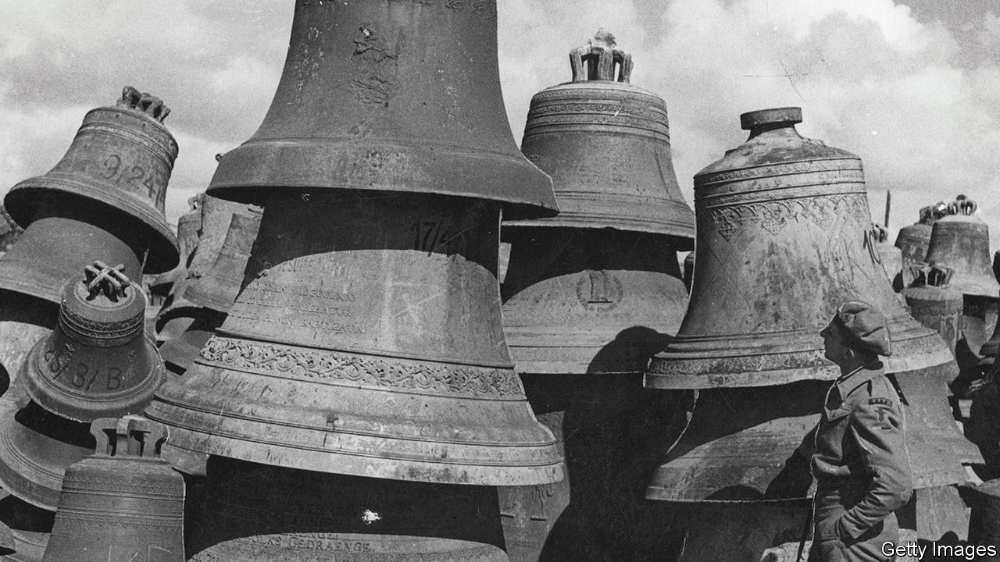

###### For whom the bell is sold

# Going for a bong: the global trade in church bells 

##### Germany once looted church bells. Now it sends them overseas 

 

> Sep 29th 2022 

Grzegorz sonnek, the pastor in Radoszowy, a small town in south-western Poland, was surprised to get a letter from a German parish offering to send him a bronze bell. The church’s oldest parishioners still recall the day Nazi troops stole the town’s 400-year-old clanger. Now Mr Sonnek says he is planning a special mass, in October, to celebrate its homecoming. 

Eighty years after German troops stripped church towers across Europe, parishes are trying to give some back. Perhaps 150,000 were melted down during the second world war, to make guns and bullets. Some 25,000 survived; they found their way to vast “bell cemeteries”, from which German churches took their pick. Last year a bell that was decorating the courtyard of a big church in Munster went home to the Polish village of Slawiecice. The diocese of Rottenburg-Stuttgart has a project to return 54 bells.

Yet in recent years it is not just stolen bells but indigenous ones that have started flowing out of Germany. Local churches are closing as flocks dwindle. Glockenbörse, an online marketplace, can help. Matthias Braun, a co-founder, says that since 2015 his company has brokered the sale of more than 66 tonnes of mostly German bells. The keenest buyers are in places where Christianity is growing, such as India and Africa. Churches there like the sound of a bargain. Brand new bells usually cost €30-40 per kilogram (and can weigh anything from 5kg to several tonnes). Second-hand ones go for a quarter of that. 

The trade has “exploded” since the pandemic, says Mr Braun. Clergy all around the world had to learn how to preach remotely. Now that they are online, businesses selling all kinds of religious products find them easier to reach. Mr Braun likes the thought of Bavarian bells, perhaps engraved with the likeness of Martin Luther, ending up in distant churches. A country that once hoarded bells now sends them all over the world.

