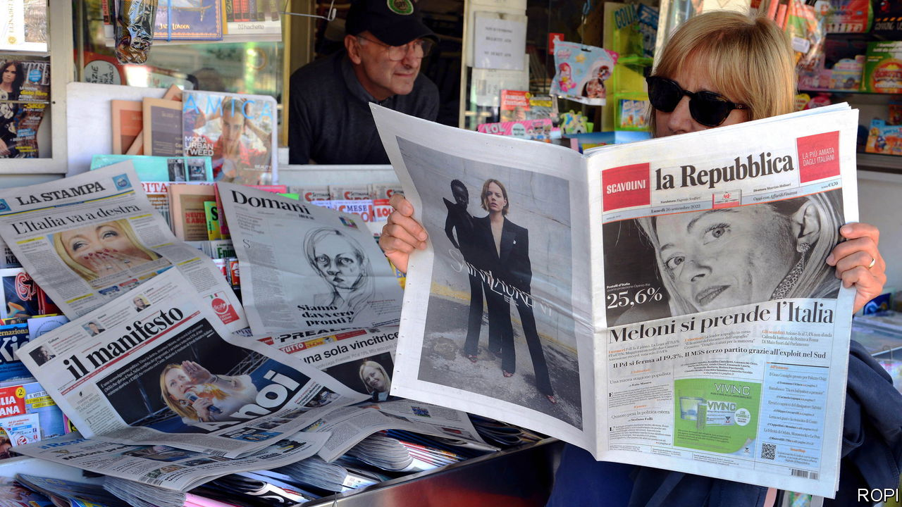
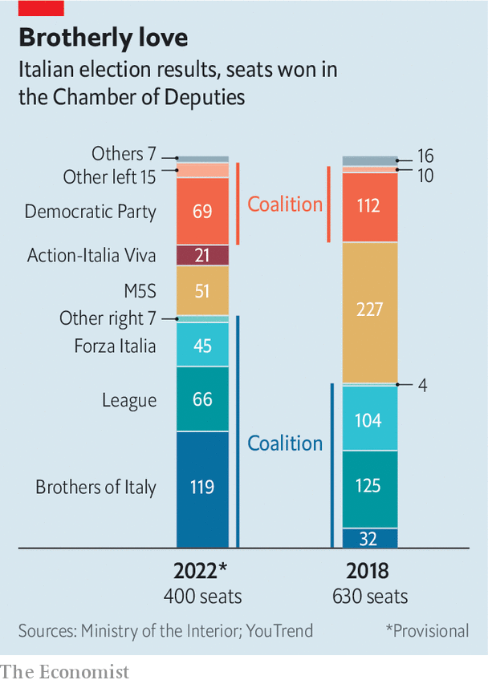

###### The F-word

# Italy chooses a party with a neo-fascist legacy 

##### But Giorgia Meloni’s win is less decisive than it seems 

 

> Sep 25th 2022 

Beside a road winding into the Apuan Alps sits the village of Sant’Anna di Stazzema. In 1944 ss troops and Fascist paramilitaries massacred several hundred people here, including children, to deter collaboration with the resistance. In Italy’s general election on September 25th, Stazzema, the municipality that includes Sant’Anna, helped elect a senator from the  (fdi), a party descended from a post-war neo-fascist group. The fdi’s candidate took 49.6% of the votes.

, the local daily, was outraged. Stazzema and the surrounding region of Tuscany had “shelved [their] memory”, it thundered. The historical significance of fascism had been lost in “a sea of indifference and populism”. Of the 36 lawmakers elected in Tuscany, once part of Italy’s communist “red belt”, 19 were from the nationally victorious right-wing alliance. Six belong to the fdi, led by Giorgia Meloni, Italy’s probable next prime minister. But do the results of Italy’s election truly mean it has re-embraced its fascist past? 

 


The distribution of seats in the country’s parliament might suggest so. The right is expected to have 237 of the 400 places in the Chamber of Deputies and 115 of the 200 in the Senate. Significantly, in both houses, the Brothers will outnumber all of their allies combined (see chart).

But the right owes its victory not so much to popularity as to canny adaptation to the electoral system. In Italy 37% of the seats are allocated on a first-past-the-post basis, which generously rewards alliances. And while Italy’s conservatives hung together, their adversaries split.

The leader of the centre-left Democratic Party (pd), Enrico Letta, ruled out a link with the left-leaning Five Star Movement (m5s) because of its part in toppling the outgoing government of Mario Draghi. Carlo Calenda, founder of a small centrist party called Action, then scrapped a deal with the pd and joined with another small party, Italia Viva. The pd thus ended up campaigning in a bloc with a smattering of political minnows. Their alliance won only 26% of the national ballot to the right’s 44%. But together the centre-left, centre and Five Stars notched up 49%, which might have been enough to win, had they been united.

Instead they committed electoral suicide. The effects were starkest in the winner-takes-all constituencies. With fewer than half the votes, the right took more than three-quarters of the first-past-the-post seats. Mr Letta took the rap. The day after the election, he announced a pd congress at which, he said, he would not stand for re-election. Front-runners to succeed him include Stefano Bonaccini, governor of Emilia-Romagna, and Dario Nardella, mayor of Florence. There is also an intriguing outsider: Swiss-born Elly Schlein, Mr Bonaccini’s deputy, who left the pd seven years ago and is now with the Greens. 

The right’s vote was a big advance on its 37% at the previous election in 2018. But the more important trend is one that has persisted for at least 10 years: the mounting appetite of Italian conservatives for ever-more radical offerings. In the past five years support for the Brothers has leapt from 4% to 26%. Only some of those voters came from the similarly populist Northern League. Its share dwindled from 17% to 9%, an even lower figure than polls had foreseen. Some have hinted that the party’s leader, Matteo Salvini, should step down—including Roberto Maroni, a League grandee. But Mr Salvini appears deaf to suggestions he might follow Mr Letta’s example.

The vote for the populist right—the tally of the League plus the Brothers—has soared in five years from 21% to 35%. Ms Meloni’s challenge will be to appease her constituents without dragging Italy into a , or a debt crisis. Markets have so far given Italy’s probable new prime minister a friendlier welcome than Britain’s new leader, but that is no reason for her to be complacent. ■

