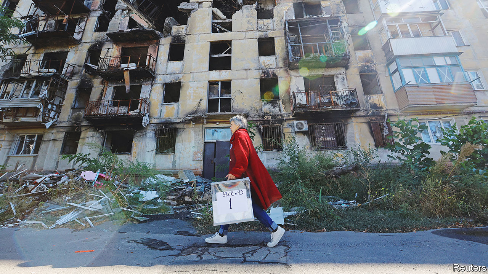
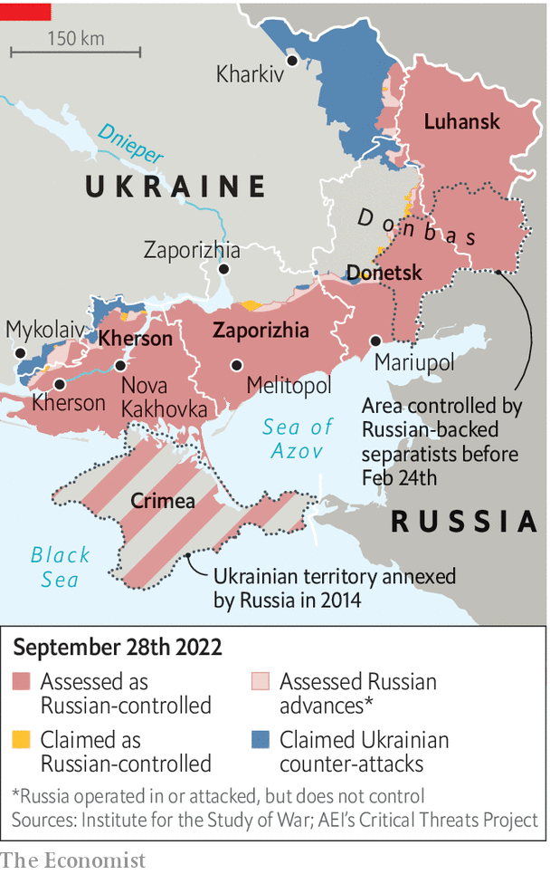

###### Nothing to celebrate

# Vladimir Putin stages four fake referendums in occupied Ukraine 

##### The aim is to annex large swathes of territory 

 

> Sep 27th 2022 

It was supposed to be a moment of victory and celebration, a repeat of the annexation of Crimea but on a far larger scale. The “referendums” held in the Russian-speaking south and eastern parts of Ukraine were meant to mark the success of Vladimir Putin’s “special military operation”. In the newly conquered territories locals were supposed to be shedding tears of gratitude for their liberation from Ukrainian “fascists” and throwing flowers. At home in Russia, Mr Putin’s subjects were supposed to be cheering the tsar, thanking him for gathering in Russia’s historic lands and making them feel proud—as many genuinely did in 2014 when he brought Crimea back into the fold. 

By now Ukraine’s army was supposed to have disintegrated, its government to have collapsed and its president to be in exile. Europe, dependent on Russian energy, was supposed to have bowed to the inevitable, as it had done several times during his 22-year long presidency. All this in time for Mr Putin’s 70th birthday on October 7th.

Instead, Mr Putin’s army is being slaughtered, Ukrainians are cursing him, and Russians are fleeing for fear of being sent to the front. Mr Putin’s threat to freeze Europe has been exacerbated by two mysterious explosions that knocked out the Nord Stream gas pipelines, built under the Baltic Sea at a cost of some $18bn, possibly for good. But the West is more determined than ever to help Ukraine. America is sending more of the rocket systems that are devastating Russia’s armies. 

From September 23rd-27th Russia held sham “referendums” in the occupied Ukrainian provinces of Kherson, Zaporizhia, Donetsk and Luhansk, asking locals whether they wanted their land to be annexed by the invading power. It was a hastily arranged farce: “votes” were collected on park benches, in shops and even in police stations. In Zaporizhia armed guards were on hand to ensure that voters marked the box for annexation. 

Then, it appears, the authorities decided to make their task easier by encouraging potential naysayers to flee. On September 26th the occupiers opened their checkpoints and allowed Ukrainians to leave. counted hundreds of vehicles crossing from Russian-controlled territory. Two days later the Russian–installed occupation governments announced “results” that ranged from an 87% “yes” vote in Zaporizhia to 99% in Donetsk.

At one level the referendums are meaningless. But they are a sign of the panic that has gripped the Kremlin since its spectacular losses in early September, when Ukrainian forces liberated more of their own territory in a few days than Russia had taken in the previous five months. As Russian pundits lamented the losses and nationalist hardliners demanded revenge, Mr Putin decided to escalate. He called for the annexation of territory, announced the “partial mobilisation” of reservists, and issued yet more . On September 29th, the Kremlin said that Mr Putin would sign decrees annexing the four provinces the following day.

The mobilisation had two goals: to reinforce the mangled Russian army, which is struggling to hold a 1,000km-long front, and to bolster patriotic sentiment by moving Russia to a war footing. The annexation was a warning to Ukraine to halt its advance and to its Western allies to stop helping it. So far, none of this has worked. 

The draft has badly undermined Russians’ (largely passive) support for Mr Putin’s “special military operation” by making plain that it is a big, hard war that will cost many more Russian lives. It has also exposed some of his lies and failures. On September 21st Mr Putin promised that only people with previous military experience would be called up. Yet within hours, draft notices were being handed to anyone the state’s goons could grab—IT specialists, teachers, doctors, chronically sick people. The authorities have sent draft quotas to private firms and local authorities in remote villages. Some new conscripts were told to buy their own first-aid kits. 

As a result, it is no longer just Ukrainians who are trying to escape from Mr Putin’s invasion, but ordinary Russians too. At least 260,000 people have fled Russia since September 21st. Queues at the borders with Kazakhstan and Georgia have stretched for several kilometres. “Traitors,” said Vyacheslav Volodin, the speaker of the Duma (the lower house of parliament). “Maybe it is best that they go.” At the same time the authorities moved to stem the exodus and trap draft-dodgers by setting up mobile enlistment offices at the borders with Georgia and Finland. North Ossetia, Russia’s region bordering Georgia, banned entry from other parts of the country.

 


Those who cannot leave are sabotaging Mr Putin’s plans. Some 20 enlistment offices have been set ablaze. In Dagestan, a restive Muslim republic in the Caucasus, people have been clashing with the police. Nine thousand kilometres to the north-east, in Yakutia, a resource-rich ethnically Turkic region which has been hit hard by the draft, people have demonstrated under slogans such as “No to mobilisation” and “No to genocide”. In Moscow itself, the government and its propagandists are desperately trying to contain panic. Sergei Sobyanin, the mayor, said the capital’s military enlistment organisation will conduct a review and will recall what he said were wrongly issued draft notices.

Russian state propagandists are fast changing their tune. Gone are their bravado and glee. They are now complaining about the inept military officials who are damaging Mr Putin’s reputation. One of the chief war-mongers, Margarita Simonyan of the state broadcaster Russia Today, recently talked about the risk of mutiny. Vladimir Solovyov, another war zealot, has been griping publicly about how ill-prepared the Russian army has been.

Instead of strengthening his hand, Mr Putin has revealed his weakness. He has few good options. But by annexing territories that Russia does not even fully control, he risks undermining Russia’s own territorial integrity. Russia could become a country with fluid and internationally unrecognised borders. If he declares the annexation of the entire Donbas region, he will in effect be saying that parts of Russia are occupied by Ukrainian troops—and he will look feeble if he cannot drive them out, which he probably cannot. If he were to annex only the Ukrainian territory he held before the invasion on February 24th, that would be an admission that his huge, bloody war has achieved nothing. Mr Putin had hoped to make Russia greater. Instead he has made it much grimmer. It will not be much of a 70th birthday. ■


