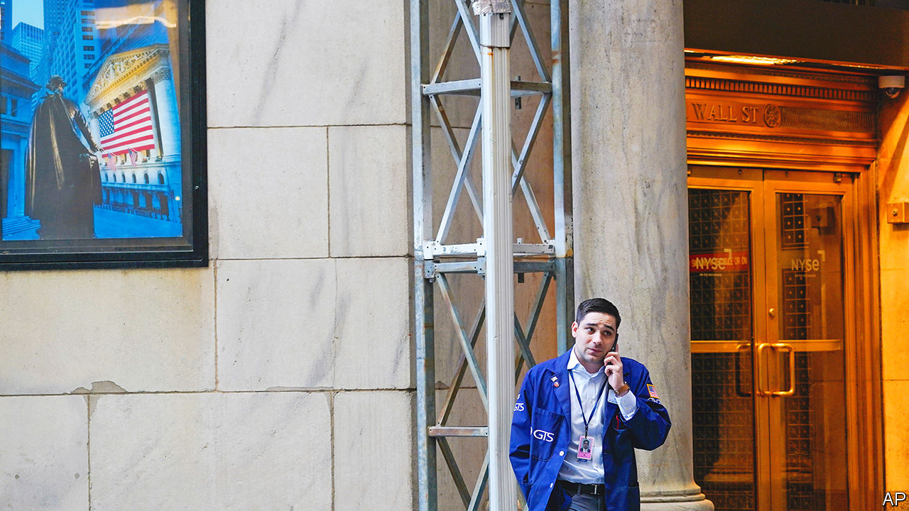
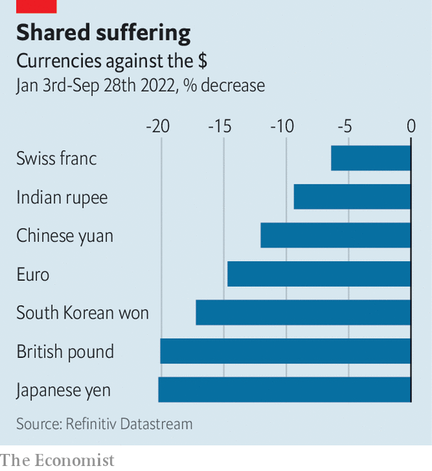

###### The chill spreads

# Financial markets are in chaos. What next for the real economy? 

##### Everyone is watching America 

 

> Sep 29th 2022 

The federal reserve began raising interest rates to battle inflation in America a full six months ago. But its determination to crush surging prices, whatever the cost to the economy, is only now starting to sink in. The central bank’s latest policy meeting, which ended on September 21st, has been followed by dramatic moves in financial markets across the world. The economic consequences will be a little slower in coming, but no weaker for it. 

After the meeting, Jerome Powell, the Fed’s chairman, said the central bank was “strongly resolved” to bring down inflation, currently at 8.3%, to its target of 2%. That resolve sent government-bond yields surging and stockmarkets tumbling. Yields on ten-year Treasuries rose by nearly half a percentage point. On September 28th they spiked above 4% for the first time since just after the global financial crisis, before falling a little. Higher rates in America have turbocharged the dollar. The dxy, an index of the greenback against half a dozen major currencies, has risen by nearly 18% this year, and is now at its highest in more than two decades. 

The flip side of dollar strength has been drama elsewhere. In Britain sterling took a breathtaking dive, aided by the government’s decision to unveil the country’s largest  since the 1970s. Short-term interest rates rose just as spectacularly. Meanwhile, the euro reached its lowest point against the greenback in two decades on September 26th. Expectations of rate rises by the European Central Bank, as it fights the resulting increase in imported inflation, sent bond yields in the euro area rising, too. In heavily indebted Italy yields on ten-year sovereign bonds are not far off a worrying 5%. 

 


Jolting currency movements have led to a spate of interventions. In Japan, where the central bank is fighting an increasingly lonely battle to keep interest rates low, the government intervened to  for the first time since the Asian financial crisis in 1998; India’s central bank has also intervened to support the rupee (see Free exchange). China’s central bank is requiring banks to post reserves when selling foreign-exchange derivatives contracts, making it harder to bet against the yuan. 

The great unknown is the impact of these ructions on a financial system that has changed significantly since the crisis of 2007-09. Financiers and policymakers alike agree that banks are far safer. But weird dysfunctions in less-scrutinised corners of the system cannot be ruled out. One illustration of this came soon after Britain’s gilt markets were battered by the “mini-budget”. Pension funds that had used derivatives to protect themselves against interest-rate risk found themselves pressed to raise cash to meet collateral requirements. They raised that money by fire-selling long-dated gilts, setting off a vicious cycle of sales and higher yields. On September 28th the Bank of England stepped in, saying it would purchase long-dated gilts to restore order. 

Another worry stems from the roughly $24trn in private-market assets, which have ballooned over the past decade. So far this year these have been marked down by only 11%, reckon analysts at JPMorgan Chase, a bank, far less than the 20% or so decline in listed stocks and bonds. Should markdowns catch up with the public markets, the owners of these assets will take bigger losses. It is unclear precisely who is on the hook. 

The impact on the world economy, by contrast, is clearer—and it is not good news. Thanks to a natural-gas crisis in Europe and a housing slowdown in China, its prospects were already looking dicey. In forecasts published on September 26th the oecd, a club of mostly rich countries, said that global gdp would rise by just 3% this year, down from the 4.5% it had expected in December. Commodity prices, a barometer of the state of the global economy, have fallen in recent months. The price of a barrel of Brent crude is now in the region of $83-88, levels not seen since Russia invaded Ukraine. The prices of copper and other industrial metals are also down.

The latest market volatility will add to the pain. Rising government-bond yields are translating into higher borrowing costs for households and companies. In America the interest rate on a 30-year fixed-rate mortgage has risen to 6.9%, the highest since the financial crisis. In Britain lenders briefly paused some new mortgage lending, owing to volatile interest rates. Yields on riskier high-yield, or “junk”,  have more than doubled in America and the euro area, to 9.4% and 7.8% respectively.

Europe seems set to suffer the most. The energy crisis has already cast a long pall, with economists pencilling in two to three quarters of negative gdp growth in the euro zone. Annual inflation is already above 9%, and a weaker euro will further push up the cost of imported goods. The European Central Bank, eager to shore up its inflation-fighting credibility, has signalled that it intends to raise rates twice this year in order to keep inflation expectations in check. Doing so will only deepen the recession on the continent. 

As for America? The world’s largest economy has experienced an enviable boom in recent years, buoyed by fiscal largesse during the covid-19 pandemic. Rising rates are making a dent in the property market, the most interest-sensitive part of the economy. According to the latest Case-Shiller index, published on September 27th, house prices fell by 0.3% in July compared with the previous month, the biggest such decline in a decade.

For now, though, there is little sign of a wider slowdown in America. Underlying inflation, at an annual rate of 6.3%, is still considerably higher than the Fed would like. In contrast to the housing market, inflation tends takes a while to react to higher interest rates. And until it comes down, there will be no relief from rate rises. Mr Powell has said he will be looking for “compelling evidence that inflation is moving down”. The rest of the world will be watching just as anxiously. ■


