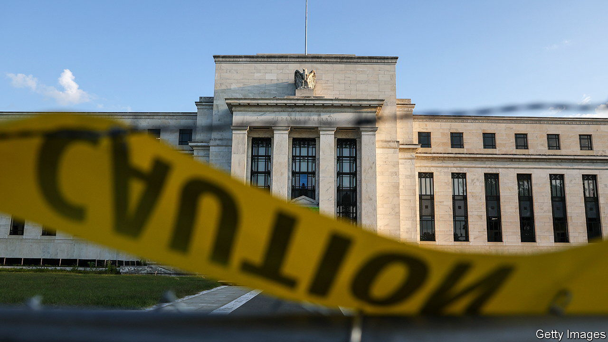
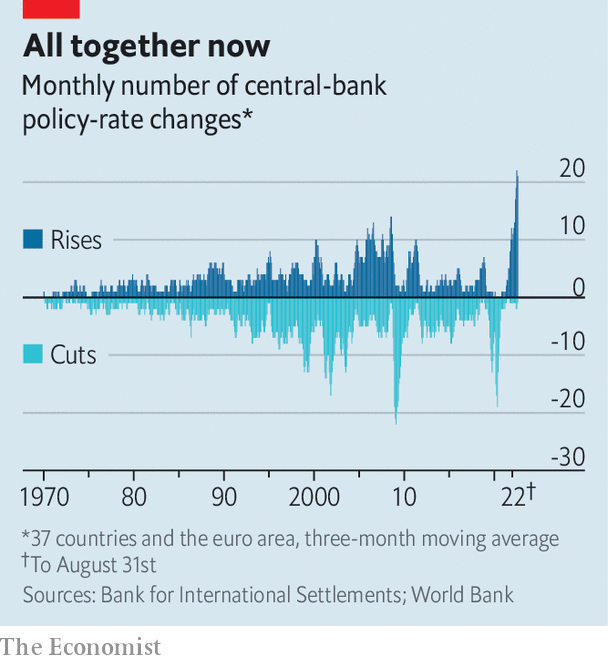

###### The great tightening

# Global rate rises are happening on an unprecedented scale 

##### Their cumulative impact may be greater than expected 

 

> Sep 29th 2022 

The great tightening began in the spring of 2021, when a handful of central banks in Latin America and central Europe began putting up interest rates to calm their wobbling currencies and rein in inflation. By the end of the year, a few rich countries, like Norway and South Korea, had joined in the action. Over the course of this year, nearly every major economy has jammed on the brakes. In the past five decades, policy has never tilted so overwhelmingly towards rate rises (see chart).

As the pace of tightening has increased, growing numbers of economists have warned that this rapid and synchronous, but largely unco-ordinated, policymaking has the makings of trouble. Maurice Obstfeld, a former chief economist at the IMF, recently argued that central banks’ failure to consider the global effects of their policies puts the world economy at risk of a “historic” slowdown. While any given rate rise may be justifiable, together they could have a greater effect than anticipated.

 


Rising inflation is a consequence of too much money chasing after a constrained supply of goods and services. Rate-raising central banks set out to slow growth by dampening spending, but in a globalised economy spending flows across borders. When one central bank tries to quash demand it affects consumption of foreign goods as well—in effect helping other central banks to manage their inflation problems. If such spillovers are not taken into account, the global economy will slow by more than central banks had individually aimed to achieve.

Financial flows work in parallel with this process. A rate rise in one country may attract money from investors elsewhere, causing the currency to strengthen. This means a reduction in import costs, which may help to cool domestic inflation. But other economies then face higher import bills, which exacerbates their inflation problems. Unco-ordinated policy tightening can become its own sort of currency war, in which each country works to shift the burden of inflation elsewhere, with the net result being too much tightening.

The world’s biggest co-ordination problem, however, may be less one of every-central-bank-for-itself and more one in which a single dominant central bank—America’s Federal Reserve—calls a tune which others must follow, like it or not. The dollar’s outsized sway in the global financial system grants it a powerful role in driving global financial cycles. A recent paper from Mr Obstfeld and Haonan Zhou of Princeton University notes that monetary tightening in America is strongly associated with an appreciating dollar and a deterioration in a number of global economic and financial measures. 

The Fed’s commitment to returning American inflation to 2% leaves it little room to accommodate other economies. It may welcome rate rises elsewhere as a helpful contribution to America’s inflation fight, even if countries begin falling like dominoes into recession. Indeed, the more spare capacity is created in other economies, and the greater the downward pressure that places on prices globally, the less unemployment may need to rise in America in order to achieve the Fed’s aims. 

The world has become much more financially integrated since 1971, when John Connally, then Treasury secretary, said to representatives of the world’s other large economies that “the dollar is our currency, but it’s your problem”. As interest rates across the world spiral upward in an unco-ordinated manner, the probability that any economy emerges from this experience unscathed sinks ever lower. ■


