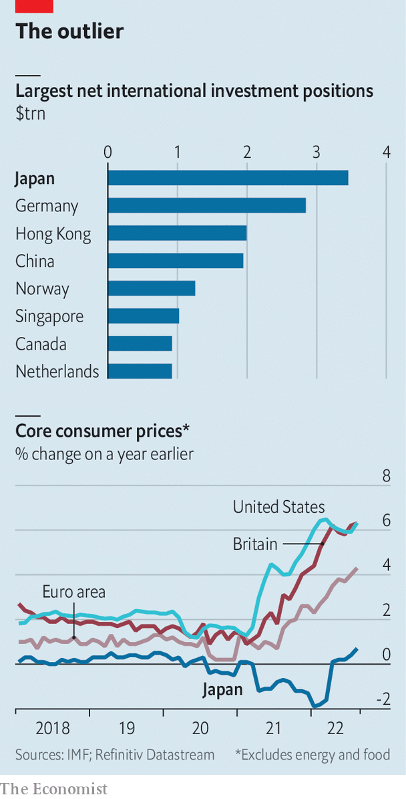

###### Last Man Standing

# Japan’s monetary policymakers are sticking to their guns 

##### The falling yen is not just their problem 

 

> Sep 29th 2022 

There have been few months in monetary history as consequential as this September. Countries everywhere have tightened the screws on borrowers to smother inflation. But there has been a notable holdout. The Bank of Japan (boj), the pioneer of modern zero-interest rate and bond-buying operations, is standing firm. 

The country has struggled with low inflation, and even deflation, for decades. Its monetary policy has been designed to make financing conditions for companies and households as easy as possible, in an effort to get them to spend. In 2016 the boj adopted a policy of yield-curve control, which caps 10-year government bond yields at around 0%. This becomes more difficult when the rest of the world is raising interest rates, since the growing spread leads to a weaker currency, as investors seek stronger returns elsewhere.

 


On September 22nd Kuroda Haruhiko, the boj’s governor, reiterated that the bank would hold rates down. This statement, familiar to BOJ-watchers, was followed by something much rarer. The value of the yen fell to its lowest in more than 20 years, leading the Japanese government to intervene in currency markets for the first time since the Asian financial crisis in 1998.

The BOJ’s refusal to budge and the government’s intervention in currency markets reflect stark differences between Japan and the rest of the rich world. In contrast to America and Europe, Japan’s economy has still not returned to pre-pandemic output. Japanese consumer prices rose by 2.8% year on year in August, marginally above the BOJ’s 2% target. But that figure may overstate the amount of underlying price pressure. Excluding fresh food and energy costs, prices were up just 1.6% year-on-year, against an average of 7.2% across the oecd club of mostly rich countries.

The BOJ has another reason to sit on its hands. Unlike most central banks, which focus on very short-term interest rates, Japan’s yield-curve control necessitates direct intervention in the market, through buying and selling long-dated bonds. It also relies on the widespread belief that the central bank will intervene to maintain the levels it is targeting, which stops traders from buying or selling Japanese government bonds outside the tight band the BOJ sets. Other central banks can simply retrace their steps and cut interest rates if required; once abandoned, yield-curve control would be difficult to resume. 

The fall in the currency makes imports more expensive in yen: the country’s import bill rose by 50% in August year on year. Kishida Fumio, the prime minister, has announced support including a 50,000 yen ($350) handout for poor families. Kataoka Goushi, an economist until recently on the BOJ policy board, reckons more co-ordination between monetary and fiscal policy will be needed to soften the impact of the weak yen and to reflate Japan’s economy. That could take the form of household tax cuts now, or business-investment incentives in the long run.

Outside Japan, there may be unexpected consequences to the weak yen. The country is the world’s largest foreign creditor. Its net international investment position—overseas assets held by Japanese owners, minus Japanese assets held by overseas owners—runs to $3.5trn, far north of China’s $1.9trn. This huge pile is the result of decades of high savings.

A weaker currency makes foreign assets worth more when measured in yen. But the gyrating currency also means volatility, making many owners nervous. And the gap in interest rates between Japan and elsewhere makes hedging overseas investments exorbitantly expensive. Perhaps as a result investors have sold 13trn yen in foreign securities so far this year, according to the finance ministry, the most since at least 2005. Thus the falling yen is not only an issue for Japan. ■


