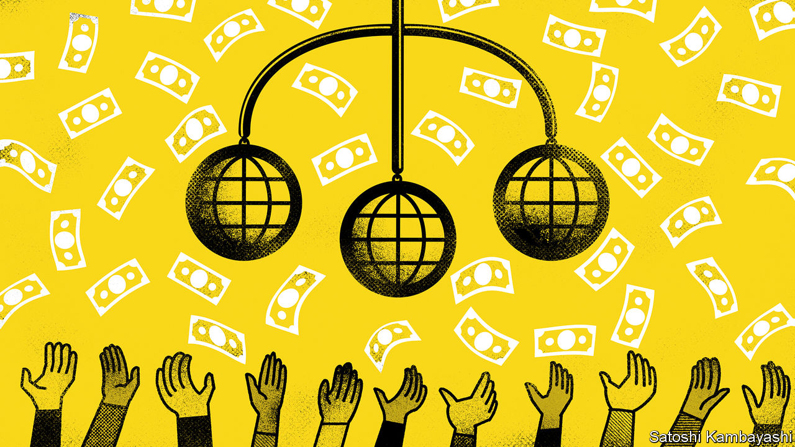
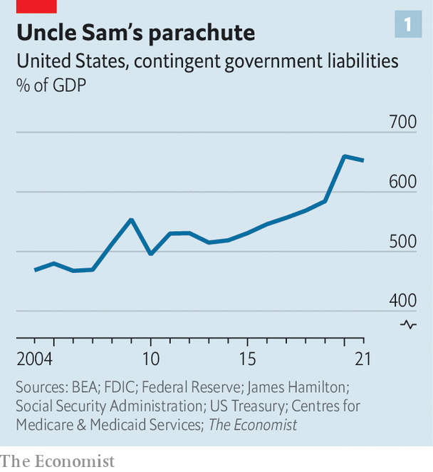
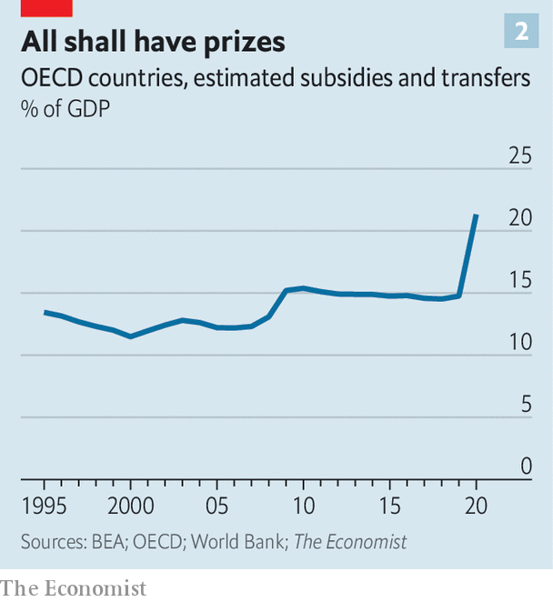
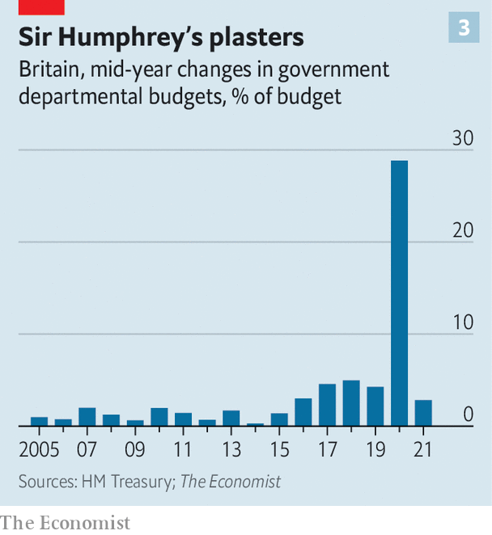

###### Saviour state

# The world enters a new era: Bail-outs for everyone! 

##### How governments came to underwrite the entire economy 

 

> Sep 25th 2022 

The winter of 1973-74 was grim, and in similar ways to today. In response to geopolitical strife energy prices went through the roof. Across Europe the price of natural gas more than doubled, and in places there were even bigger increases in heating oil. The price of crude oil more than tripled. This fed an inflationary surge across the rich world, cutting real incomes. There was no end in sight.

At the height of the crisis, Willy Brandt, West Germany’s chancellor, summed up the official response in many countries. “We’ll have to get dressed a little more warmly this winter,” he said, “and maybe the next two or three winters. But we aren’t going to starve.” His government, like others, focused on efforts to cut fuel consumption—by imposing speed limits, telling people not to drive on Sundays and asking factories to turn down furnaces. Sweden and the Netherlands introduced petrol rationing; Italy imposed a curfew in bars and restaurants. Few governments doled out money. In 1973 the real value of Britain’s benefits bill barely budged. 

Today’s governments have introduced some measures to cut consumption. But mainly they have turned on the fiscal taps. Britain has allocated funding worth 6.5% of gdp in the next year to shield households and firms from , more than it spent on its furlough scheme and support for the self-employed in 2020-21. Germany and France are offering handouts and subsidies worth about 3% of gdp. European governments are nationalising chunks of . America has spent, too, if on a smaller scale. State governors are doling out “gas cards” and suspending fuel taxes to help people refill. Imagine the reaction today if a country’s leader only followed Brandt’s approach, and told people to put on an extra layer.

The shift in energy policy hints at a more profound change in how governments govern. Politicians have long sought to provide safety nets or stimulus in bad times. But over the past 15 years, they have become far more willing to shore up vast swathes of the economy. When industries, companies or people get into trouble, fiscal help is never far away. Gains are privatised, but a growing share of losses or even potential losses are socialised. To appreciate this role for the state, discard much of the conventional wisdom, which says that in the “neoliberal” era governments have let free markets run riot. Instead, this is an era of “bail-outs for everyone”.

Three events have shaped the new era. First is the global financial crisis of 2007-09. In this period, America spent 3.5% of gdp on crisis-related bail-outs, including capital infusions for banks and mortgage lenders, according to Deborah Lucas of the Massachusetts Institute of Technology. The justification for the interventions was that doing nothing would have proved far costlier. If the banking system had collapsed, so would the rest of the economy. 

When covid-19 arrived, bail-outs moved from the financial economy to the real one. “Everybody said we bailed out the banks and we didn’t look after the people who really suffered,” said Boris Johnson, then Britain’s prime minister. This time would be different. During lockdowns governments handed out trillions of dollars of support, guaranteed vast amounts of corporate lending, and banned evictions and bankruptcies. Unlike in previous crises, rates of poverty, hunger and destitution did not rise and in some places fell. Across the rich world, disposable incomes rose. 

The third event is the  that has followed Russia’s war in Ukraine. The challenge facing Europe, where the consumer price of energy has already risen by 45% since last year, has convinced many politicians that once again there is no option but massive state intervention. Europe’s energy bills will rise by about €2trn relative to 2021, according to analysis by Goldman Sachs, a bank. Thanks to hastily patched together measures, governments will subsidise much of this. 

The cumulative effect of three once-in-a-generation crises, in quick succession, has been a change in the terms of political debate. Politicians have set new expectations of what the state can and should do. This is visible in the smaller bail-outs, guarantees and rescues that have mushroomed since the start of the 2010s. The Italian government, for instance, has set up schemes to deal with banks’ non-performing loans, in an attempt to get the private financial sector to lend again. The British government has offered banks vast guarantees to get them to offer bigger mortgages. The value of bank deposits insured by America’s government has risen by 40% in the past five years.

Recently things have gone into overdrive. In August President Joe Biden announced that he would spend hundreds of billions of dollars to bail out Americans holding . Around the same time, he expanded loan guarantees for clean energy. Australia and New Zealand have offered citizens cost-of-living payments to deal with high inflation. Poland has introduced a moratorium on mortgage debt. It is only a matter of time before the next intervention comes along. What if Intel, a tech firm crucial to Mr Biden’s domestic , begins to struggle? What if, in a year’s time, Europe’s energy prices remain sky-high? 

The true size of the bail-out state is hard to calculate, in part by design. Governments generally do not include so-called “contingent liabilities”, such as guaranteed loans and implicit backstops, in fiscal figures. This allows them to support the economy while keeping reported debt down. Conventional measures of America’s public debt do not, for instance, include the promises and obligations that the state has made to groups ranging from the financial industry to airports to pensioners. 

The truth starts to become clearer if you dig into government balance-sheets. It turns out, for instance, that British ministers have promised to help a bewildering number of projects. The British state is responsible for clearing up the Channel Tunnel if it falls into disuse. It has made commitments to support pension liabilities of some individual pension schemes if deficits need to be funded. It may cover reinsurers of commercial and industrial property in the event of a big terrorist attack. 

 


Adapting work by James Hamilton at the University of California, San Diego, we have attempted to calculate the total implicit liabilities of the American federal government—in effect, how much it has promised to pay if things go wrong, plus commitments for which it has not fully accounted. In addition to reported public debt, we add off-balance-sheet obligations, including guarantees on people’s bank deposits, health-care payouts and mortgage guarantees (for the first time ever, the federal government recently became the guarantor or source of funding for more than half of American mortgages). We find that the state is on the hook for liabilities worth more than six times the country’s gdp, and that these liabilities have in recent years grown much faster than the country’s output (see chart 1). 

Other data also point to a growing bail-out state. Rich-world government spending on subsidies and transfers, such as welfare benefits, has grown inexorably, as politicians help companies that are struggling and compensate households who they deem to have had a raw deal. In Britain this spending has not been so high since the data began in 1948. America is known as a place with a meagre welfare state—a perception that no longer fits reality. In 1979 the bottom fifth of American earners received means-tested transfers worth 32% of their pre-tax income, according to the Congressional Budget Office. By 2018 the figure was 68%. 

 


Governments are quicker to respond to emergencies, too. Evidence from Deutsche Bank shows that the size of financial-sector bail-outs has grown. We examined public-spending data from Britain, looking at whether actual spending by government departments came in higher or lower than originally budgeted. This gives a sense of how frequently, and how decisively, the government responds to emergencies. Mid-year bail-outs used to be rare—they no longer are (see chart 2). A recent paper by Dan Gabriel Anghel of the Bucharest University of Economic Studies, and colleagues, shows that governments’ contingent liabilities are crystallising into actual payouts more often than used to the case. In the 1990s European governments launched about two rescue operations a year. In 2019 they launched ten. 

 


No one likes to see a business go bust or someone fall into destitution. The fact that this happens less frequently is, on its own terms, welcome. Another benefit of the bail-out state is that people and businesses no longer need to spend quite as much on insurance, since they know the state will step in. In America total spending on insurance premiums peaked in the early 2000s at around 8% of gdp, but has now fallen to under 6%. This represents an enormous saving.

There are downsides, however, aside from the potentially monumental fiscal costs. As Friedrich Hayek, an economist, pointed out, while a given intervention—a bank bail-out, say—may be justifiable in its own right, lots of interventions together may strangle an economy. Capitalism produces innovations and higher incomes through the process of creative destruction. Things that do not work stop, and things that work better start. An economywide safety-net slows this down. 

For now, governments are unlikely to change course. So long as they are not directed at banks, bail-outs tend to be popular. And with the possible exception of Britain, investors seem not, as yet, to have fully digested the fiscal risks implicit in this new strategy. When the  hits, as it may well soon, expect another round of furlough schemes, additional benefits and stimulus cheques. When the next industry fails, expect a big rescue package. We are all bankers now. ■


