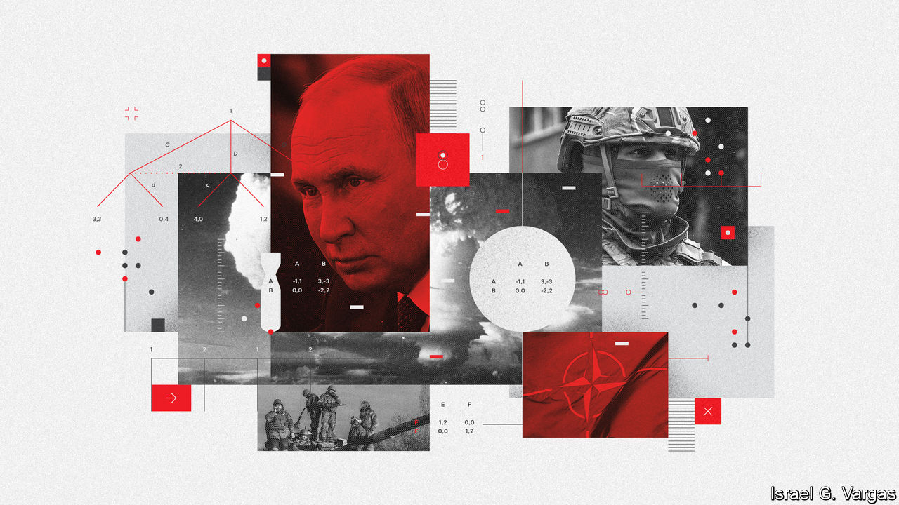
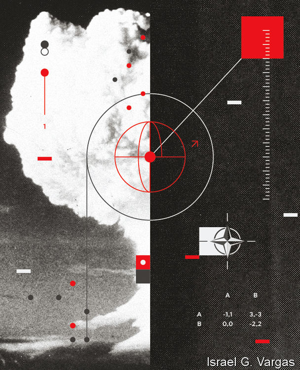

###### On the ladder

# Could the war in Ukraine go nuclear? 

##### Sixty years after the Cuban missile crisis, the world again worries about nuclear war 

 

> Sep 29th 2022 

Sixty years ago the world was staring at a nuclear cataclysm. The Cuban missile crisis began in October 1962 when America detected Soviet nuclear missiles in Cuba. It blockaded the island, and debated invading it. The Soviets yielded, removing their nukes; America secretly removed nuclear-tipped missiles of its own from Turkey. Annihilation was averted. 

Memories of those terrifying times are being revived by the war in Ukraine. Vladimir Putin, Russia’s president, has repeatedly warned that he could resort to nuclear weapons. On September 21st he said he would use “all weapons systems available” to defend the “territorial integrity” of Russia—by implication including all the Ukrainian land he is annexing through sham referendums. ”It’s not a bluff,” said Mr Putin. In response Jake Sullivan, America’s national security adviser, sternly warned Russia of “catastrophic consequences” if it used nuclear weapons. 

The world thus faces what may be the worst period of nuclear peril since Cuba, says Daryl Kimball of the Arms Control Association, an American lobby group. Russian commentators have drawn explicit parallels between the crises. Both were caused by insecurity provoked by a rival’s expansion “right to the doorstep of one’s own country: Cuba then, Ukraine now”, writes Dmitri Trenin, a Russian analyst, on the state-owned rt website. 

This time, though, things are different in several important ways. The Cuban crisis lasted 13 days. The war in Ukraine is more than 200 days old, and could last for hundreds more. In Cuba the nukes themselves were the crux of the matter. In Ukraine they are a shield to protect a Russian land-grab. And the nature of the threat has changed with Russia’s fortunes on the battlefield. At first, Western officials worried about nuclear escalation resulting from Russian success. If it took Ukraine, might it push further into the Baltic states, or strike at nato depots that were supplying weapons to Ukrainian forces? That could have led to a conventional war, which might have escalated into a nuclear one.

Now the worry is about Russian failures. Ukrainian troops have retaken thousands of square miles of territory; a mobilisation at home has pushed hundreds of thousands of Russians to protest or flee. In the 1960s neither John F. Kennedy nor Nikita Khrushchev, the American and Soviet leaders, wanted a nuclear war. Now, some worry that a flailing Mr Putin might be tempted to gamble that nuclear weapons could help reverse his misfortune. 

The Cuban missile crisis was largely about “strategic” nuclear weapons—the biggest sort, designed to wipe out enemy cities far from the battlefield. The question in Ukraine revolves mainly around the non-strategic, or “tactical” kind. These are of shorter range and lower explosive power. (Many are nevertheless more powerful than the atomic bombs used against Japan in the second world war). 

America and the Soviet Union once maintained huge arsenals of tactical warheads for use against each others’ armies on the plains of Europe. In the decades after the cold war, nato gave up all but around 200 of its stockpile, concluding that precision-guided conventional weapons could do the job more cheaply and with fewer complications. Russia’s armed forces held on to 2,000 or so. Nuclear weapons can make up for weaker conventional forces. “The power balance matters less than the willingness to use nukes,” says Francis Gavin, a historian at Johns Hopkins University. “That creates an incentive to be irresponsible.”

Experts see three main ways in which Russia might use a nuclear weapon: a “demonstration shot” that does not kill anyone; a strike on Ukraine; and an attack on nato. Russia might start on the “escalation ladder” by conducting nuclear tests, either underground or, more dramatically, in the atmosphere. This could be over the Black Sea or high above Ukraine itself, avoiding deaths but causing an electromagnetic pulse that would fry electrical equipment. But if Ukraine kept on fighting despite the demonstration, Russia would incur global opprobrium for no military gain.

Russian generals might prefer to nuke military objectives directly, not least because the Russian army is short of manpower and materiel. Targets could include Ukrainian airfields, logistics hubs and concentrations of artillery, says Ben Barry of the International Institute for Strategic Studies, a British think-tank. Yet Ukraine’s forces are mostly dispersed, and armies can be surprisingly resilient. One study examining a hypothetical war between India and Pakistan estimated that a five-kiloton bomb (about a third the size of the one dropped on Hiroshima) would knock out just 13 tanks if they were widely spread. Mr Barry reckons four tactical weapons would be needed to neutralise a Ukrainian brigade (roughly 3,000-5,000 soldiers) even if it was concentrated for an offensive. 

More destructively still, Russia might choose to attack a Ukrainian city to force a surrender. But this raises the possibility of a direct nato intervention and the destruction of Russia’s armies. A nuclear attack on nato would be a potentially suicidal proposition, given that three of its members—America, Britain and France—have nuclear weapons of their own. 

Tactics and strategy

Every option, in other words, comes with big downsides. “It is very hard to make nuclear threats work,” notes Eric Edelman, a former under-secretary for policy at the Pentagon. At times during the cold war—in the Korean war, for instance—America toyed with using nuclear weapons but decided against it as morally repugnant, militarily useless or dangerous. 

But responding to nuclear threats is hard, too. Deterrence rests on a great deal of ambiguity. American officials will not say publicly what they mean by “catastrophic consequences”, though it hints at the risk of a direct clash between Russia and America. But they claim to have been explicit in private warnings to the Kremlin, and have told journalists that the response is likely to be conventional, not nuclear. In doing so, complains Mr Edelman, “they are undermining the deterrent threat.”

America’s warnings are aimed at Russia, America’s allies and the American public. It must be seen to take the threat seriously but not be intimidated; it must respond in a way that is vague yet credible. Whatever happens with Russia will affect its contest with China, not least over Taiwan. Thus far, President Joe Biden has tried to balance two principles: help Ukraine defend itself, but avoid a third world war. If the Russians detonate nuclear weapons, he has said that the response will depend “on the extent of what they do”. 

One option would be to pile more economic pressure on Russia, perhaps through secondary sanctions on those buying its oil and gas, with the hope of turning Mr Putin into even more of an international pariah. America could push India and China to isolate Russia. Both have obliquely signalled disapproval of its conduct in the war. But India relies on Russia for weapons, and China sees it as a useful counter-balance to America.

Another option would be for the West to help Ukraine fight in a nuclear battlefield, by providing advice, protective gear and decontamination equipment. It could also supply more advanced arms—such as Western-made tanks, fighter jets and longer-ranged missiles—that have thus far been deemed too escalatory. At the other end of the scale, America, Britain or France could respond with a limited nuclear strike of their own. But that risks a wider nuclear war—and Russia has more tactical nukes than its Western rivals. 

The middle way—a conventional military response—is the likeliest. This might include deploying nato troops to Ukraine, or carrying out direct strikes on Russian targets. America could, for instance, destroy the ports, air bases, or mobile missile launchers used in any Russian nuclear attack. Ben Hodges, a retired general who once commanded American ground forces in Europe, suggests sinking Russia’s Black Sea fleet, or destroying its bases in Crimea. 

 


Mr Putin, though, could raise the ante. He might launch a counter-strike against comparable targets—American warships in the Mediterranean, say, or military facilities on nato soil. In other words, even a conventional response could easily bring about a direct nato-Russia conflict, with its attendant risk of nuclear war. 

All of which raises the question: would America really run such risks for the sake of Ukraine, which is not a formal military ally? Barack Obama, who as president refused to arm Ukraine, argued that Russia, in the end, cared more about Ukraine more than America did, saying “we have to be very clear about what our core interests are and what we are willing to go to war for.”

Those who favour standing by Ukraine offer two responses. The first is that the risks are less acute than they seem. Russia is in no position to fight a conventional war against America and its 29 nato allies; a nuclear war would risk the total destruction of both sides. The second riposte is that the risks are worth it. Allowing Russia to use nuclear blackmail to seize territory would encourage autocrats everywhere to do the same. “That would be a terrible world to live in. The cost of stopping it later is higher than stopping it at the outset,” argues Mr Edelman.

For now, to everyone’s great relief, deterrence is holding. Mr Putin has not used nuclear weapons, nor is nato fighting in Ukraine. America says it has seen no evidence of Russia readying its nuclear armaments for use. America and Russia are continuing to exchange information about their respective strategic arsenals.

For Max Hastings, author of “Abyss”, a new history of the Cuban crisis, the main lesson of 1962 also applies to 2022: “Be afraid.” What averted a cataclysm was Kennedy’s and Khruschev’s fear of nuclear war. America’s success was the product of Kennedy’s sober mixture of resolve and a willingness to compromise in private. That suggests the West should continue to help Ukraine defend itself while “recognising that somewhere along the line it will probably end up with a dirty deal” to end the war, argues Mr Hastings.

The trouble is that, at the moment, Mr Putin is raising the stakes, not seeking a deal. His annexation of Ukrainian territory and mobilisation of extra troops risks elevating a “special military operation”, which can be ended whenever he chooses, into a war for Russian soil, which he must win or lose. Unlike the collective Soviet leadership of 1962, which imposed some moderation, Mr Putin’s underlings seem powerless to restrain him. He has long equated his own rule with Russia’s existence. In 2018, he spoke in near-mystical terms about using nuclear weapons to defend Russia: “We, the victims of aggression, as martyrs, will go to heaven, while they will just die, because they will not even have time to repent.” Thus the world watches another nuclear crisis unfold: will Mr Putin cut his losses, fight on, or take the biggest risk of all? ■

