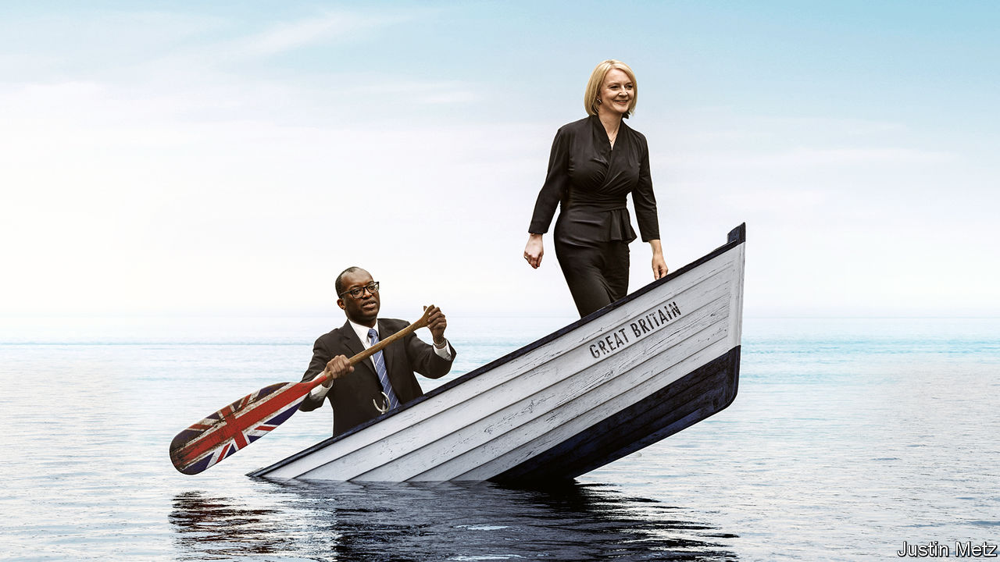

###### Britain in crisis

# How not to run a country 

##### Liz Truss’s new government may already be dead in the water 

 

> Sep 28th 2022 

It was meant to usher in an era of economic growth. Instead the 25-minute statement that , Britain’s new chancellor of the exchequer, gave on September 23rd kickstarted a crisis. By unveiling £45bn ($48bn) of unfunded tax cuts, alongside temporary measures to help with energy bills, Mr Kwarteng  in spectacular fashion. Most of the tax cuts and emergency spending had been signalled, but the vaunted supply-side reforms needed to pay for them were vague and the new government’s approach to the public finances was cavalier. Worse, the backdrop to Mr Kwarteng’s  was a slump in bond markets that raised borrowing costs for even the most creditworthy governments.

As investors took fright, gilt yields surged, prompting the Bank of England to say on September 28th that it was ready to buy unlimited quantities of long-dated bonds to restore order to financial markets. Earlier, the pound had crashed to its  against the dollar. Although sterling has since rebounded, markets still imply a 40% chance that it will reach parity with the dollar. Comparisons between Britain and emerging markets swirled; the IMF slammed Mr Kwarteng’s plan. After the worst start to a new administration in memory, people are already asking how long the new prime minister, Liz Truss, may last.

Yet another Conservative leadership contest would be ridiculous rather than ruthless. And Mr Kwarteng’s budget is unlikely to lead to a balance-of-payments crisis. Britain has a flexible exchange rate, it has minimal debt denominated in foreign currencies and its central bank is independent from the government. Even so, the economic and political damage from the past week is immense—and immensely frustrating. 

Ms Truss and Mr Kwarteng are right to want to boost Britain’s anaemic rate of growth. Some taxes, such as stamp duty, are ripe for change. The financial-services industry needs to be championed, not ignored. The chancellor has signalled important supply-side reforms: he wants to speed up infrastructure projects and housebuilding; a more liberal immigration regime is mooted. If the government acted in these areas, it could make a real difference. But incredibly, only three weeks into the Truss premiership, her  may already be damaged beyond repair. 

One reason for that is economic. The reaction to the budget means that it will hurt growth, not boost it. The weaker pound causes higher imported inflation, eroding real incomes. The Bank of England has resisted pressure for an emergency rate rise, but it has signalled unequivocally that a big increase will come in November. That will add to the government’s own interest payments and harm people with mortgages. 

What’s more, growth depends on a framework of policy stability, and this was a wholesale abandonment of long-standing Tory attachment to sound public finances. Huge tax cuts, the centrepiece of Mr Kwarteng’s budget, were never going to pay for themselves. Talk of Caracas-on-Thames is over the top, but instability deters the very investors that the government aims to attract. The fact that the budget dodged independent scrutiny from the Office for Budget Responsibility, a watchdog, was another signal of fiscal recklessness. 

A further reason to doubt Ms Truss’s ability to bring about growth is her government’s evident . Britain has been stuck in a 15-year productivity rut. Getting out of it requires not just boldness, but thoughtful policy. The mini-budget and Mr Kwarteng’s subsequent decision to dangle the prospect of even more cuts point to blind conviction of the flat-earther variety. The government’s refusal to face up to the need for more constructive relations with the European Union, Britain’s biggest trading partner, and insistence on a bonfire of eu laws by the end of 2023 fit into the same mould. 

Last, Mr Kwarteng has poisoned the politics of growth. Britons are lukewarm about a growing economy and wary of the sacrifices required to achieve it. In a poll for  from before the mini-budget, only 49% of voters agreed that growth does more good than harm. By 53% to 16%, they agreed that “the government should spend more on health care and pensions, even if that means spending less on infrastructure and science”. 

Insularity is pervasive. By a margin of 57% to 24%, respondents said they would favour giving priority to the views of local residents and protecting the countryside, even if that produced less housing. In research for Demos, a think-tank, a large chunk of the public said they would oppose a university or college opening in their town if “the town attracts more people from elsewhere”. The localism of MPs reinforces this insularity. The share of MPs born in the same region as the constituency they represent has risen from 45% to 52% in a decade; for new MPs it is 60%. 

Cutting taxes is the politically easy bit of a growth plan, in other words. But by needlessly cutting the top rate of tax on the highest earners and whacking homeowners with higher mortgage payments, the government has associated growth with unfairness in the public mind. That impression will strengthen as Ms Truss slashes public spending to regain market confidence. She has badly dented her capacity to convince her own party of genuinely growth-enhancing but unpopular measures, such as streamlined planning and more immigration. The risk is now that Tory MPs pocket the tax cuts and reject the reforms that might one day help pay for them. 

Lost for words

The government cannot afford fresh calamities. Mr Kwarteng is due to unveil new rules for fiscal sustainability in late November. He should move faster than that. Ms Truss should cancel the cuts to income tax, focus on investment incentives rather than the headline rate of corporation tax, and expand levies on energy producers to fund help with energy bills. The supply-side reforms due to be unveiled soon need to be watertight in their design and presentation. Even then it will be hard to escape the shadow of the past few days. In its first weeks the new government has shredded its own reputation, unleashed higher inflation, forced emergency action from the central bank, and made growth harder. Just imagine what it can do in a month or two. ■


