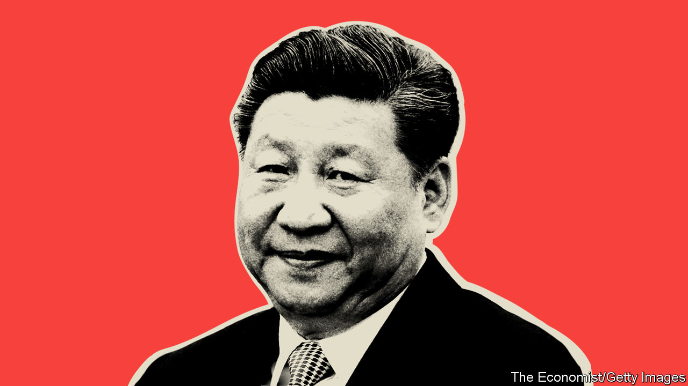

###### The Prince

# How to make sense of Xi Jinping, China’s enigmatic ruler 

##### His project to restore the Communist Party’s overbearing role has grim implications for China and the world 

 

> Sep 29th 2022 

Xi Jinping was 31 when he arrived in Iowa in 1985. A junior  official at the time, he was on a two-week tour to learn about animal feed. His hosts liked him and he liked them. The highlight of his trip was a two-night stay with families in the small town of Muscatine.  slept in a room decorated with posters from “Star Trek” and “Star Wars”. He tried popcorn for the first time. By all accounts, he loved Iowa.

Embroidered stories like this led many observers to be optimistic in 2012, when Mr Xi became China’s leader. His father was a revolutionary pioneer, who later backed economic opening and reform as a provincial boss. Mr Xi grew up as a “princeling”, a child of party royalty. Some guessed he would follow in his father’s pragmatic footsteps. But he has taken a different path.

Far from being a reformer, Mr Xi sees himself as a restorer—of the party and its central role in society, and of China and its . He has amassed more power and wielded it more ruthlessly than any Chinese leader since Mao Zedong. As his power has grown, so has . At the party’s five-yearly congress, starting on October 16th, Mr Xi will almost certainly be given another term as supreme leader, possibly setting him up as ruler for life. Understanding his origins and his beliefs has never been more important. 

That is the aim of our eight-part podcast series, “”, and of this week’s . In dozens of interviews, people who have studied Mr Xi up close and from afar explained to us what motivates him. The result is a portrait of an enigmatic man whose plans hold troubling implications for China and the world alike.

The heart of Mr Xi’s plan is to restore the Communist Party, which had faded from the lives of many people. He came of age in the Cultural Revolution, when Mao upended society by mobilising the Red Guards to attack intellectuals and officials deemed insufficiently loyal. Mr Xi’s father was tortured. His half-sister took her own life. Mr Xi was sent to live in a cave in the countryside for seven years to learn the virtues of hard work.

According to party mythology, the experience transformed Mr Xi from an entitled princeling into a man of the people. A source quoted in an American diplomatic cable saw it another way: Mr Xi survived “by becoming redder than red”. Rather than reject the party after Mao’s purges, he dedicated himself to restoring it. The party, to his mind, was the only institution able to prevent such chaos from recurring. So it made sense for its leaders to turn to him in 2012, when many thought the party had again lost its way. To save it, they believed, it needed discipline and a renewed sense of purpose.

China’s president has given it that in spades. His anti-corruption campaign set a new tone—and doubled as a purge of his rivals. He has since reinjected the party into all aspects of life. Party committees have been set up in private firms and reinvigorated at the neighbourhood level, where grassroots members help enforce his “zero-covid” policy. Mr Xi has created party bodies with new powers to oversee government ministries. As he says, “Government, the army, society and schools, east, west, south, north and centre—the party leads them all.”

Mr Xi wants to restore China, too. In 2018 a new revelation of the president’s philosophy laid out ten principles for diplomats to follow. Top of the list was maintaining the authority of the party. Second was “realising the rejuvenation of the Chinese nation”. Whereas Mao united the country and Deng Xiaoping helped it prosper, Mr Xi believes he will be the one to make it great again. He talks of a West that is in decline and of the world experiencing “great changes unseen in a century”. The phrase has roots in the late Qing era, when China was humiliated by foreign powers. Mr Xi has turned it on its head.

There is nothing odd about a big power wanting a big say in global affairs. But China’s regime sees today’s world order as a Western imposition, and wants to rewrite the rules. “The Chinese people will never allow any foreign forces to bully, oppress or enslave us,” he said last year, marking the centenary of the party’s founding. “Anyone who dares to try to do that will have their heads bashed bloody against the Great Wall of Steel forged from the flesh and blood of over 1.4bn Chinese people.”

That is music to the ears of nationalists, who revere Mr Xi and revile foreign critics. Many of them believe the West is racist and self-centred. Their hubris, paranoia and frustration are a combustible mix. In August, when America’s Speaker of the House of Representatives, Nancy Pelosi, visited Taiwan, nationalists called for her plane to be shot down. They believe America and a growing NATO alliance provoked Russia’s invasion of Ukraine, which Mr Xi tacitly backs as a challenge to the West. Today’s China reminds some Western diplomats of Japan in the 1920s and 1930s. 

The contest between China and the West is, above all, one between competing philosophies. Western governments believe success comes from letting people choose their own destiny. China’s rulers believe that individuals must sacrifice their liberties, privacy and dignity for the greater good—as defined by the party. Mr Xi espouses a maximalist version of this. Lately it has not been going well. Under the fuzzy banner of “common prosperity”, he has reasserted state control over the economy and hobbled some of China’s most successful firms. His plan to tame the property market lies in tatters and bad loans weigh perilously on the economy. Another pressing problem is his zero-covid policy. To keep most of China virus-free, officials impose  on huge areas with tiny outbreaks. At first that saved many lives, but it has now become yet another drag on output. Fed up with the rules, people have begun to flout them.

Restoration tragedy

When Mr Xi took over in 2012, China was changing fast. The middle class was growing, private firms were booming and citizens were connecting on social media. A different leader might have seen these as opportunities. Mr Xi saw only threats. At home he is assembling a high-tech apparatus of incentives and coercion designed to restore party control. Abroad, he is posing a challenge to the American-led order that the world should resist. ■


