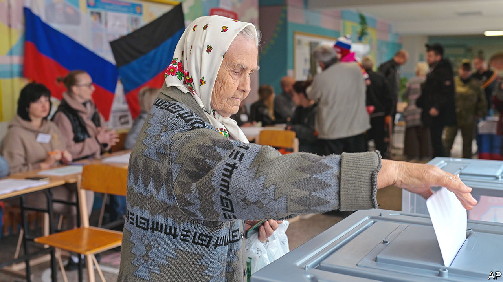

###### Baloney ballots

# Ignore Putin’s fake referendums and keep helping Ukraine 

##### Phoney polls conducted at gunpoint do not make Ukrainian land Russian 

 

> Sep 29th 2022 

When the result of a vote is announced as 99% for something, you can conclude that the ballot was rigged and the riggers want you to know it. So it was this week with the  that President Vladimir Putin’s men illegally organised in  provinces of Ukraine. Accosted on their doorsteps by men with guns, residents “agreed” that the invading power, Russia, should annex their land. To be fair, the 99% was recorded only in Donetsk, one half of the Donbas region. In Luhansk, the other bit, support was lukewarm: only 98%. And in Kherson and Zaporizhia provinces the vote was a nail-biter: Yes was in the high 80s or low 90s.

Mr Putin’s referendums, which took place over five days and ended on September 27th, were not designed to be believed, but to threaten. As  went to press on September 29th, they looked set to be followed by a speech from Mr Putin to the Russian parliament, and perhaps then a formal motion to incorporate a big slice of Ukraine into the Russian Federation, as happened to Crimea in 2014. 

If this transpires (predicting anything about Russia is tricky these days, especially over such a preposterous scheme), Mr Putin will try to claim that he has won a great victory. More outrageously, he may also claim that Ukrainian troops currently holding large parts of those four provinces are in fact occupiers, and that if they try to take back their land they will be invaders.

The logic is topsy-turvy and mendacious. But it would aim to suggest that if Western countries continue to arm Ukraine they will be abetting attacks on Russian soil. This is something the West has so far been careful to avoid. To Mr Putin and his advisers, annexing all this Ukrainian land may seem a clever way to deter the West and indeed Ukraine from further efforts to repel his invading army. It is essential that their ploy fails.

As we report in our International section, the danger of  seems higher today than at any time since the Cuban missile crisis 60 years ago this October. Mr Putin doubtless hopes that annexation will cause Ukraine’s supporters to fear that the risk has been cranked still higher, to a level where the West’s resolve will crack. 

In this nerve-racking situation, it is worth remembering that the land Mr Putin is about to annex is not part of Russia. Moreover, surrendering to nuclear blackmail will only invite more of it. The West made that mistake in 2014 by, in effect, acquiescing to Mr Putin’s theft of Crimea from Ukraine. As one of Mr Putin’s predecessors said: “If you encounter mush, you proceed.” 

If the risk of escalation is growing, it is not because of the charade of the referendums, but because Mr Putin is losing the war. He has always faced the problem that defeat would spell humiliation and possible overthrow. That is why he has repeatedly brandished the nuclear card since February. He could have gone nuclear before the referendum but, despite many setbacks, he has not. Equally, annexation would not oblige him to: it is better seen as a desperate attempt to signal that he means business.

What to do? America is right to have made plain that if Mr Putin fired a nuke, the consequences would be dire. Probably, they would involve nato directly using conventional weapons to destroy his bases and forces in Ukraine. The West should prevail upon China and India to make clear that they, too, would be against a nuclear strike. 

Ukraine, meanwhile, should press on. Mr Putin last week ordered a panicky mobilisation of 300,000 troops, causing unhappiness in Russia and the emigration of hundreds of thousands of young men who wish to avoid the draft.  and some 20 recruitment offices have been attacked. Russia is making no real gains. It may even have resorted to the weird tactic of blowing up its own gas pipelines in the hope that this would scare the West. Despite Mr Putin’s threats, the West should keep helping Ukrainians to defend themselves. ■


