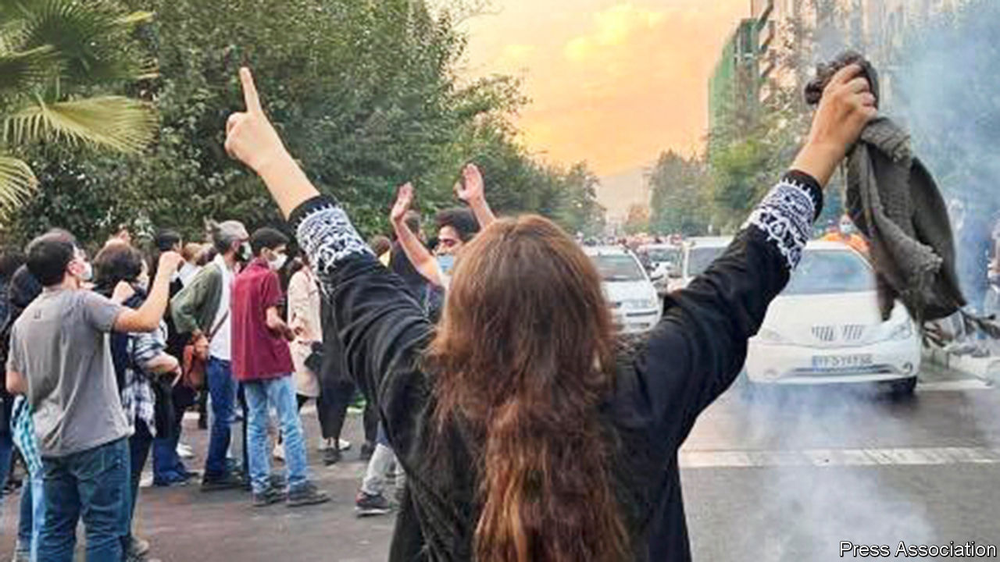

###### On shaky ground

# Iran’s tired regime is living on borrowed time 

##### A wave of protests portends more to come 

 

> Sep 29th 2022 

The most poetic scenes are sometimes the most powerful. A young woman dances in front of a bonfire, then tosses her headscarf into the flames. A lone old lady, her white hair uncovered, shuffles down the street waving her headscarf in tune to the words “Death to Khamenei!” Such  against Iran’s supreme leader and his regime, prompted nearly a fortnight ago by the murder of a young woman arrested by the “” for not covering all her hair, have spread to dozens of Iranian cities. They mark the most menacing threat to the ayatollahs’ dictatorial rule for many years.

Revolutions are often sparked by individual acts of courage. Witness the self-immolation of a vegetable-seller in Tunis that started the  that raced across the Arab world in 2011. Several times in the past dozen or so years Iranians have erupted against their regime, only for huge demonstrations to fizzle out under the lash of a well-practised system of repression. Might this time be different? 

It is impossible to predict, as Iran is closed to the world’s press. Anger is certainly more widespread than ever before. The unrest has drawn in young and old. It has encompassed Iranians from every corner of the country, including Kurds and other minorities. So far it is women who have shown the most exhilarating bravery. But if Iran’s men weigh in with equal valour, the removal of a vile system, though still unlikely in the short run, may no longer be inconceivable. 

The dominant part played by women in the protests is new. Another difference is that the demands are more drastic. Young people, connected to their contemporaries elsewhere on social media, are chafing more furiously than ever under the rule of grey-bearded clerics. Since 2012 income per head has stagnated, leaving legions of Iran’s 85m-plus people destitute. Inflation has soared. The environment has palpably suffered. Rivers have run dry. Farmland is parched. For many Iranians the only path to a decent life is emigration.

And the regime is more rotten than ever. It is keen to blame Iran’s ills on foreigners. For sure, American-led sanctions have deepened the economic distress, but the chief perpetrator of the people’s poverty is the regime itself. Under its corrupt theocracy swathes of the economy are controlled by military men and ayatollahs whose policies, even at the best of times, seem designed to scare off foreign investors. Hardliners dominate Iran’s parliament, and most relatively reform-minded politicians have been barred from running in elections. 

Moreover, after decades of aggressive foreign policy, Iran is isolated. It backs militias in Iraq and Lebanon and brutal leaders in Syria and Yemen. It menaces the Gulf states. And it persists with nuclear plans that terrify Israel and unnerve the region. Recent efforts to revive the un-backed deal that curbed Iran’s nuclear programme look doomed. While protests continue, President Joe Biden would be unwise to re-engage with the regime or risk seeming to offer the ayatollahs a lifeline. 

To be candid, there is little the West can do to encourage the rebellion, especially at a time of turmoil elsewhere in the world. Sanctions have weakened the regime, but have plainly failed to bring it down. Enough of Iran’s oil leaks into countries that care nothing for human rights, particularly China, which has long been a buttress of Iran’s economy. The most vital help that Western governments can give to Iran’s brave resisters is to ensure that sanctions do not bar them from access to internet services or to tools such as vpns that help them evade censorship and surveillance. 

It will be up to Iranians to get rid of their rotten regime. So far the protests have been spontaneous and disorganised. No potential leader has emerged. More than a decade after the opposition Green Movement was suppressed, its champions remain muzzled. Real change may yet come from within the ranks of disgruntled clerics, though that scenario has often failed to materialise. This latest revolt may eventually fade, as previous ones did. But one day Iranians will cast off not just their veils but also their joyless overlords. It cannot come too soon. ■

