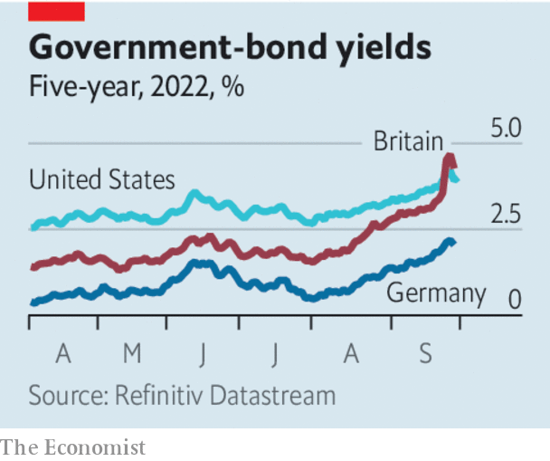

###### The rate shock

# Markets are reeling from higher rates. The world economy is next 

##### If the Fed tightens until something breaks, the first cracking sounds could be in Europe 

 

> Sep 29th 2022 

The world’s financial markets are going through their most painful adjustment since the global financial crisis. Adapting to the prospect of higher American interest rates, the ten-year Treasury yield briefly hit 4% this week, its highest level since 2010. Global stockmarkets have sold off sharply, and bond portfolios have lost an astonishing 21% this year. 

The dollar is crushing all comers. The greenback is up by 5.5% since mid-August on a trade-weighted basis, partly because the Fed is raising rates but also because investors are backing away from risk. Across Asia, governments are intervening to resist the depreciation of their currencies. In Europe Britain has poured the fuel of reckless fiscal policy on the fire, causing it to . And as bond yields surge, the euro zone’s indebted economies are looking their most fragile since the sovereign-debt crisis a decade ago.

 


The primary cause of the market chaos is the . Because the Fed has lost the first three or four rounds since prices began to surge in 2021, it is now swinging harder. The central bank expects to raise the federal funds rate to nearly 4.5% by the end of the year and higher still in 2023. The outlook for rates is rippling through America’s financial system. The cost of 30-year mortgages is nearly 7%. Junk-bond yields are already over 9%, which has caused the issuance of new debt to dry up. Bankers who underwrote leveraged buy-outs when yields were lower are suddenly finding themselves hundreds of millions of dollars . Pension funds which gorged on opaque private assets in pursuit of higher returns when rates were lower must now tot up their losses as risky investments slump in value. 

Yet it is outside America where the financial effects of the Fed’s monetary tightening have been most severe. The surging dollar is painful for energy importers that were already grappling with higher costs. China has responded by making it harder to short the yuan, which in the offshore market hit a record low against the greenback on September 28th. India, Thailand and Singapore have  to support their currencies. Excluding China, emerging-market currency reserves have fallen by over $200bn in the past year, according to JPMorgan Chase, a bank—the fastest fall in two decades.

Advanced economies can usually withstand dollar strength. Today, if anything, they are showing greater signs of immediate stress. Some of the worst-performing currencies in 2022 are from the rich world. Sweden raised rates by a full percentage point on September 20th and still saw its currency fall against the dollar. In Britain surging yields on government debt have failed to attract much foreign capital. The Bank of Korea is lending currency reserves to the national pension fund so that it buys fewer dollars in the open market. In Japan the government has intervened to buy yen for the first time this century, despite the apparently ironclad determination of the central bank to keep interest rates low.

Part of the explanation for the pressure on advanced-economy currencies is that many central banks have hitherto failed to keep pace with the Fed’s tightening—but with good reason, because their economies are weaker. The energy crisis is about to plunge Europe into recession. South Korea and Japan are suffering the knock-on effects of an economic slowdown in China, brought about by its housing crisis and zero-covid policy.

A strong dollar, in effect, exports America’s domestic inflation problem to weaker economies. They can support their currencies by raising rates in line with the Fed, but only at the cost of even lower growth. Britain has the worst of both worlds. Markets now expect the Bank of England to set the highest rates of any big rich economy next year but sterling has slumped all the same. If the bank follows through with rate rises, the housing market could collapse.

Even America’s economy, which has been resilient in the face of headwinds this year, is unlikely to keep growing through an interest-rate shock as severe as the one it now faces. House prices are falling,  and FedEx and Ford, two economic bellwethers, have issued profit warnings. It is only a matter of time before the unemployment rate starts rising. A slowing economy is ultimately necessary to restore price stability—it would be madness for the Fed to tolerate annual inflation of 8.3%, much of which is home-grown. But higher rates will damage the real economy and cause suffering. The world’s financial markets are just waking up to that, too. ■

