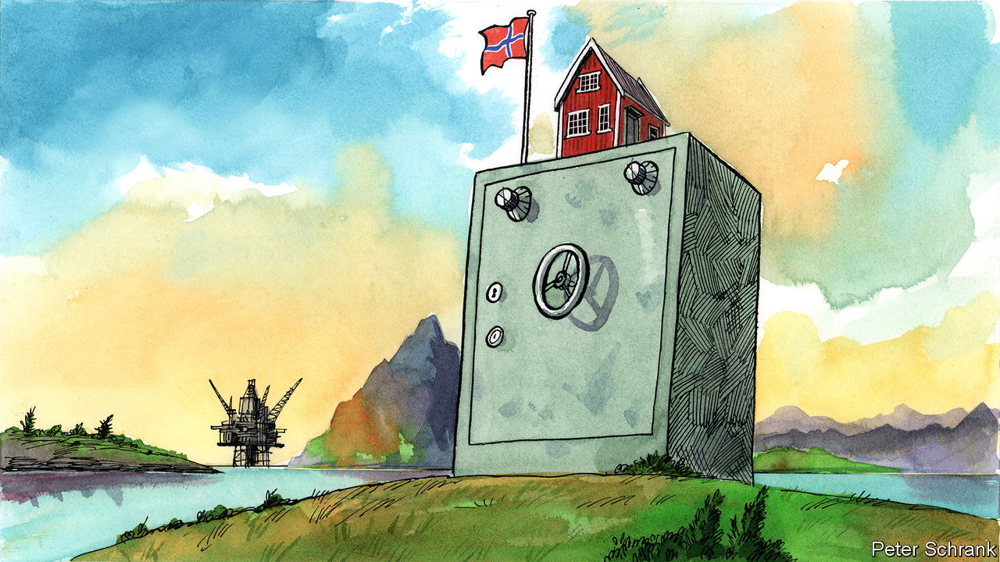

###### On the British monarchy, clean energy, Norway, Vladimir Putin, New York

# Letters to the editor 

##### A selection of correspondence 

 

> Sep 29th 2022 

For king and country

There is another crucial benefit of a constitutional monarchy not mentioned in your leader on King Charles III (“”, September 17th). The armed forces swear allegiance to a monarch, not a president or a prime minister. For most members of the armed forces this oath of allegiance is an important commitment, and serves to ensure that the government of the day cannot easily usurp the constitution by means of force.

A good example of this protection was the attempted Spanish coup d’état in February 1981. In a televised address King Juan Carlos I denounced the coup, calling for the rule of law and the democratic government to continue. It was that royal address which fatally undermined the insurrection. Even Britain could be vulnerable either to a coup or, more plausibly, a government seeking to distort Britain’s unwritten constitution to its advantage. The fact that legislation requires royal assent, and that any military enforcement of such plans relies on the armed forces’ loyalty to the monarch, gives us a degree of civil protection not open to the citizens of countries such as Brazil or Turkey.

david scott


As with so many other millions of Americans, I viewed the funeral for Queen Elizabeth II in absolute awe of the sheer majesty of the event. More moving for me was the immense gravity of the occasion, observed by the throngs of mourners who lined both sides of the funeral procession like an endless, silent honour guard. We Americans, as one people, have no national leader in whom to entrust the best of who we are. Franklin Roosevelt comes to mind. But Abraham Lincoln may have been the last president whose stature is truly globally recognised. It is in his honour that we raised a temple to enshrine our enduring gratitude. 

As a testament to her selfless and constant devotion to fulfilling the duties as head of state, the queen deserves no less. I’m reminded of the Royal Albert Hall and the Victoria and Albert Museum. Can anyone doubt that Elizabeth II stands on equal footing with those illustrious luminaries in British history?

steven pokorny


The queen did indeed bow her head at the world war memorial in Dublin in 2011, as A.N. Wilson observed in his piece on the art of the queen’s communication (By Invitation, September 17th). But what was more remarkable was the queen’s visit to the Garden of Remembrance, where she bowed her head to those who fought for Irish freedom. That was an even more extraordinary and deliberate piece of body-language communication, all things considered. 

michael mcloughlin


Similar to such newbie global entertainment influencers as Hollywood, Amazon Prime, Netflix, YouTube, and so on, the British monarchy is a unique national treasure in more ways than one. In 2017 Brand Finance estimated that the royal family cost £292m ($376m) a year, while generating a “gross uplift” of £1.8bn to the economy. Its intangible value, the economic benefits that the monarchy was expected to generate between 2018 and 2022, was £42bn.

ramsay wood


 


I personally experienced Queen Elizabeth’s lovely sense of humour when she visited New Zealand in the early 1980s (, September 17th). I was a member of New Zealand’s Parliament and all of us and our spouses were lined up to meet her. The queen asked my wife, whom I’d met on a passenger ship when I was its third mate, how we go to know each other. “He was a sailor”, she replied. The queen put her hand on my wife’s arm, and quick as a wink said, “You poor thing, I married one of those.“ 

Michael Cox


 


Comparative disadvantage

“” (September 17th) referred to the spending that the United States plans to invest in infrastructure as “vast”. This is undoubtedly true. However, it is worth considering the relative figures. Although clean-energy technologies in America are expected to benefit from more than $50bn-worth of spending, China alone accounted for 30% of the global clean-energy investment in 2021 ($380bn according to the International Energy Agency). And although the CHIPS Act, signed recently by Joe Biden, is expected to provide $52bn for semiconductor research and development, TSMC, a Taiwanese chip manufacturer, expects to spend almost twice that to boost its capacity. “Everything is bigger in Texas” may no longer be big enough.

m.j. faherty


 


In defence of Norway

The charge that Norway is “profiteering” from the war in Ukraine is a new low (, September 10th). Although it is not a member of the European Union, Norway follows the bloc’s rules and edicts puritanically. It always preferred long-term energy-supply contracts to stabilise prices, but had to accept the EU’s own market-based rules. Now that those self-same rules have suddenly seen gas prices soar, Europeans have the gall to point fingers at Norway.

We seem to forget that the energy crisis had already started before Russia’s invasion of Ukraine. After the invasion, Norway responded admirably to the EU’s calls for more energy, nearly pumping its own hydro-resources dry and sending Germany vast quantities of gas to replenish its stocks for the coming winter. How churlish, then, to suggest now that Norway’s gains after observing European regulations are indecent and embarrassing. 

Nor is it clear why Norway, which has managed its own energy resources so prudently, should subsidise greener-than-thou countries like Germany, which is closing its own nuclear- and gas-production facilities. As for European solidarity, and despite pleading by America and Poland, Germany shunned Norwegian gas in its headlong pursuit of cheaper gas from Russia’s Nord Stream 2 pipeline. 

According to ’s own estimates, BASF’s flagship factory alone uses half as much gas as the whole of Denmark (“”, July 16th). So, it’s not in the least bit obvious why Norway should now also subsidise Germany’s consumers, or, indeed, its gas-guzzling industry. Rather than advising Norway to accede to further EU demands for relief, EU countries should stop sniping and biting the all-too-willing hand of Norway when disaster befalls them.

Dale Doré


Azerbaijan and Armenia

Although I do not share the way the recent border clashes between Armenia and Azerbaijan were presented in “” (September 24th), I welcome the emphasis placed on the importance of a comprehensive peace agreement between the two countries. The fundamental question facing the region at this moment is whether we stick with a vicious circle of violence and revengeful ideals or seize the historic opportunity to rebuild the region on the basis of neighbourly relations, mutual economic dividends and a prosperous future. 

In an increasingly volatile world, it is in everyone’s interest that we close one of the saddest chapters in the recent history of our region and open a new chapter in bilateral relations between Armenia and Azerbaijan on the basis of fundamental principles, including territorial integrity and respect for sovereignty and independence. 

Azerbaijan has made its position crystal clear that it is ready to build a peaceful future for the region in co-operation with all our neighbours including Armenia. Armenia, however, shows a lack of consistency when it comes to taking forward the normalisation process aimed at reaching a final peace agreement. The sustained peace can only be achieved through a final peace deal, without which security situation will continue to remain volatile. Only a satisfactory solution to the post-conflict challenges such as mining data, data about the missing persons and unblocking transportation routes will help build a degree of trust leading to sustained peace. 

Elin Suleymanov

Ambassador of Azerbaijan


 


Cracking up

You asserted that Vladimir Putin “is suffering the first cracks in his carefully cultivated aura of invincibility” (“”, September 17th). Unfortunately, I suspect that reports of Mr Putin’s weakness are greatly exaggerated.  published a cover story, “”, more than ten years ago (December 10th 2011).

patrick gourley


 


Not a pleasant swim

’s excellent article on the recovering health of New York’s waterways following an environmentally destructive history, describes “bubbles as big as basketballs” surging from the bottom sludge (September 3rd). He also noted the continual mixing of human sewage with stormwater run-off. 

However, this is a great advance from the historically oblivious policy of dumping raw sewage into New York’s water. As a youth in the 1950s, swimming in Jamaica Bay, one had to be alert to the sudden presence of “Coney Island whitefish”, floating used condoms that meant the nearby sewer pipe had opened.

Jim Burke


