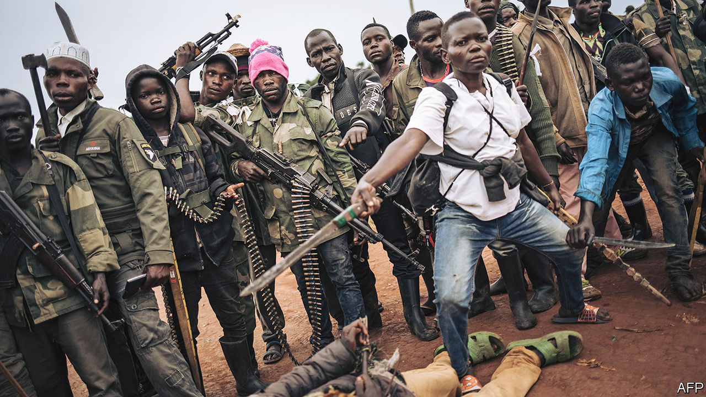
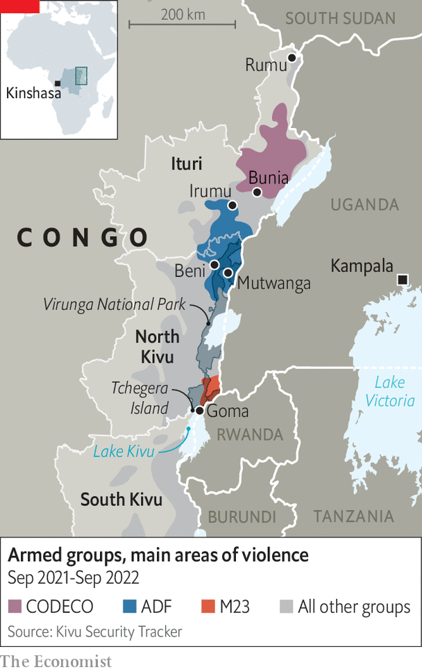

###### Dispatch from a forgotten war

# Congo says martial law has brought calm. Yet violence is rising 

##### A Potemkin tour of eastern Congo fails to conceal the scale of bloodshed 

 

> Sep 29th 2022 

Eastern Congo has been on fire, on and off, for three decades. Last year Congo’s president, Félix Tshisekedi, declared a “state of siege” in two especially violent provinces, North Kivu and Ituri. That meant imposing martial law and dispatching generals to replace politicians. The soldiers claim to have restored a measure of peace. “Before we got here, there was almost total insecurity,” says General Johnny Luboya N’Kashama, the governor of Ituri. “People were walking freely in the streets with the heads of their victims.” Now, he suggests, things are much better. 

To persuade your correspondent that this is true, the Congolese army offers him a guided tour. A convoy of soldiers sporting guns and sunglasses drives him from Bunia, Ituri’s capital, to Irumu, a small town 60km away (see map). At one point the convoy is stalled by a lorry partially submerged in the muddy road. Soldiers dig an alternative route. “The Congolese military—they’re strong,” says their colonel, referring to his soldiers’ spade work. To reward himself, at the next village, he grabs a cold bottle of Heineken beer.

 


At Irumu, Colonel Heineken boasts that he and his men are keeping the town safe from a plundering militia. No one contradicts him to his face. But conversations with locals out of the soldiers’ sight hint at a more nuanced story. The town itself is indeed less perilous than it was, but the surrounding area, they confide, is exceptionally violent. It is “too risky” to walk around, says Makizala Germain, a carpenter. A neighbour says that women, in particular, feel vulnerable out of town: “They’re subject to mass rape.” Under a tent for people who have fled from other parts of Ituri, Rachel Biwaga, who is heavily pregnant, explains that she cannot return to her nearby village, which was attacked two months ago. “It’s not a good situation and we’re becoming poorer people because of it.” 

That is putting it mildly. Kivu Security Tracker, a conflict monitor, recorded more attacks by armed groups in 2021 than at any time since it began monitoring the Kivus in 2017 (it started counting in Ituri in 2021). And in the 12 months since the government declared the state of siege, there were twice as many victims of attacks as in the preceding year. This year more than 2,000 people are known to have been slaughtered with bullets or machetes in these provinces. Many more die of disease or hunger because of the strife. Over the same period 1.3m Congolese have been forced to flee their homes, swelling the number of internal refugees to 5.5m. That total is more than in any country except Syria. 

Congolese do not think martial law has made them safer. A poll in April and May by Ebuteli, a local research group, found that 30% of people nationwide felt the emergency laws had improved security (versus 47% a year ago). Feelings in the two provinces under siege were especially negative. 

Congo matters. Its war may be far more confusing than the good-versus-evil struggle in Ukraine. But tens of millions of people are made wretched by it. And the Great Lakes region, a densely populated, politically precarious and resource-rich area of more than 100m people at the heart of Africa, cannot prosper until Congo is stable. 

To call eastern Congo complex is like calling the Congo river a stream. It hosts dozens of overlapping conflicts, involving perhaps 120 militias. To oversimplify: the killing is driven mainly by the failure of the state. For decades bigwigs in Kinshasa, the capital, have paid more attention to amassing great wealth than to building a functioning government and an army that does not pillage and rape. Armed groups, some backed by neighbouring countries, exploit the vacuum in eastern Congo to rob its residents and loot its natural wealth. 

The bloodshed has deep historical roots. In the 1990s the genocide in Rwanda spread ripples of violence that the Congolese state, under its ailing dictator, Mobutu Sese Seko, was unable to resist. Rwandan-backed rebels toppled him in 1997. Between 1998 and 2003 eight other African countries and multiple militias fought over Congo’s carcass. Millions died, most of them from easily preventable diseases and starvation. That war ended, but true peace has since proved elusive in the three worst-affected provinces: South Kivu, North Kivu and Ituri, which border Congo’s most meddlesome neighbours, Rwanda and Uganda. 

Like slaughter for chocolate

It is hard for journalists to report from the east because some of the groups that ravage the area are unwelcoming, to say the least. Mutwanga, a village in the foothills of the Rwenzori mountains, near the border with Uganda, is a stronghold of the Allied Democratic Forces (adf), a jihadist group that has killed more people in Congo in the past five years than any other militia. In 2021 America designated it an affiliate of Islamic State. But the adf, like less notorious groups, is also enmeshed in the local and cross-border economy. 

“We’re living with the danger that any time we can be killed,” says Kakule Livingstone Janvier, who lives close to Mutwanga. The day before your correspondent visited, the adf had killed five people in a nearby village, and abducted women and children. Two months before, Mr Janvier lost family members in another raid. Jean de Dieu-Kasereka, a pastor, was attacked twice in 2020 by the adf; in one incident his wife’s throat was slit. Part of the jihadists’ motivation was to steal cacao, which is used to make chocolate. “The adf, when they attack, take everything,” he says. 

Congo is one of the fastest-growing cacao producers in the world. The expanding crop attracts bandits. The cacao is smuggled out, falsely labelled as a product of Uganda and then exported, often ending up as chocolate in the West. 

The violence “represents the efforts of the armed militias to displace the rule of law, to displace government authority and to take over the economy,” says Emmanuel de Merode, the director of Virunga National Park. Some 5m people live within a day’s walk of the park, which spans 7,800 square km (two and a half times the size of Yosemite). He reckons the park’s agricultural products are worth $170m per year—enough to keep armed groups in business.

Neither the Congolese army nor the UN’s peacekeeping force, known as monusco, has quelled the adf. Last year Ugandan troops became the latest to try: Congo allowed their deployment after the adf was blamed for bombings in Kampala, Uganda’s capital. Some analysts say that Yoweri Museveni, Uganda’s leader, is keener to secure economic links with the region than to fight the adf. 

“The only solution is to change the economic situation,” says Mr de Merode. “The armed groups won’t negotiate with the government unless it’s in their financial [interest] to do so.” Virunga is trying to improve the lot of locals and create livelihoods for men who might otherwise take up arms. At a cacao-processing centre, for example, they can ferment beans; on-site chocolatiers turn them into delicious bars.

In Ituri, gold is the resource that people fight over. Roughly 90% of Congo’s bullion is smuggled out of the country and much of this is mined in the province. “It’s about gold,” says Norirabo, a militia leader sporting two necklaces—one with a cross and the other with a gun pendant. His militia controls five artisanal mines and often fights to hold on to them, he says. 

To his credit, General Luboya, the brass hat brought from Kinshasa to run Ituri, agrees. “When you look closer at the problem it is about access to natural resources,” he says. The army has recently suspended some missions because it is too hard to separate militiamen from the people they live among and extort money from. “Our role is not to scare our citizens, but rather to protect them.”

The governor is holding talks with several armed groups, which may have contributed to a recent ebbing of violence in parts of Ituri. This means sitting down with those accused of horrendous atrocities, such as the Co-operative for the Development of Congo, known as codeco (pictured on previous page). It sounds like a charity, but is in fact a murderous militia with cult-like rituals that originated among farmers of Lendu ethnicity. 

Since 2020 attacks by codeco have increased. Many include rape, beheadings and dismemberments. A report by the UN in 2020 documented hundreds of killings, including a case in which a man trying to stop the rape of his wife watched as his eight-year-old son was decapitated. This year a group of ngos called codeco’s attacks part of an “ongoing genocide” against people of Hema ethnicity. Only the adf has killed more people since 2020.

Dieudonné Safari Diba, a Lendu leader involved in the peace talks accompanied by a colleague in trainers with the words “war” on them, says that codeco was formed for “self-defence” against the Hema and the army. “We are not gbecause genocide is a state crime,” he insists. “The population was regularly the victim of harassment—that’s how the insurrection and disobedience against the government started.” The group would need money before it lays down its guns, he says: “codeco is a poor armed group because they are not gold-mining.”

Yet “demobilisation normally follows a peace deal,” says Jason Stearns of the Congo Research Group (crg) based at New York University. General Luboya hopes to entice militia leaders to make peace by suggesting the prospect of political careers. But the Congolese government has given few details about its plan. Without one, donors like the World Bank will not pay for soldiers to leave the bush. Politicians in Kinshasa seem loth to repeat previous efforts to absorb rebel fighters into the army. But few alternative incentives are on offer, notes Mr Stearns. 

 The crisis affects the wider region. In addition to the Ugandan troops fighting the adf, the Congolese government lets Burundi’s army attack rebels camped across its border. Rwanda’s president, Paul Kagame, is angered by the involvement of both, but has for many years sent his own troops into Congo. “Our current doctrine is to go and fight the fire at its origin,” he said. He is probably worried that Uganda, in particular, will consolidate economic links with Congo at Rwanda’s expense. 

Besides adf and codeco, a third big, deadly group has recently resurfaced. m23 had lain dormant since 2013, when regional powers including South Africa and international ones including America put pressure on Rwanda to stop backing it. Yet since November m23 has killed civilians, attacked army bases and captured towns. In June it seemed poised to march on Goma, the main city in the east. 

Congo’s government says Rwanda is once again backing m23. In August a leaked un report said it had “solid evidence” that Rwandan troops were supplying and fighting alongside it. The militia is unusual among Congo’s armed groups for acting more like a regular army: it uses heavy weaponry and seems less caught up in trafficking. Rwanda denies any link, while arguing that Congo’s army harbours a Hutu militia that was involved in the Rwandan genocide in 1994. The crg calls this equivalence “factually fallacious”. 

Tchegera, an idyllic island on Lake Kivu where gentle waves lap black sand, offers a glimpse of how Congo could become richer if it were peaceful. It is the only part of Virunga that is currently safe enough for tourists to visit. This year the park hoped to generate $12.5m in revenues. “Then m23 arrived,” sighs Patient Namegabe, the camp manager. Lodges have been ransacked. Last November a ranger was killed, probably by m23, in an area close to Congo’s endangered mountain gorillas. In total, more than 200 rangers have been killed in the line of duty over the years. 

The fighting between m23 and the Congolese army has meant that there is a “battlefront that keeps moving forwards and backwards over our park,” adds Mr de Merode. “The whole of society is on edge.” In August m23 fired artillery shells at a hydroelectric station being built under the aegis of Virunga. It is the largest power project in eastern Congo. Such infrastructure will be vital if the economy is ever to develop; Mr de Merode estimates that every power station built by Virunga creates hundreds of new small businesses. 

The return of M23 has other knock-on effects. Troops from Ituri have been sent southward to fight it, adding to the vacuum in the north. It has also increased tension between Congo and its punchiest neighbour. “Rwanda’s involvement and responsibility is no longer debatable,” said Mr Tshisekedi in a speech to the UN on September 20th, calling m23 a terrorist group. 

Congo’s president hopes that other states in the region will help. In April, shortly after Congo joined the East African Community (eac), a regional trading bloc, Mr Tshisekedi agreed to the formation of a multinational force to fight Congo’s rebels. Its size, role and effectiveness remain uncertain. Though a Kenyan commander is notionally in charge, the force appears to be putting an eac label on existing deployments, such as Uganda’s and Burundi’s. Rwanda has not been invited to take part. William Ruto, Kenya’s new president, may be less enthusiastic about getting involved in Congolese issues than his predecessor. 

Foreigners have always struggled to make Congo safer. monusco, the un peacekeeping force, is increasingly unpopular. In recent months Congolese have protested violently against it. In part this reflects the mission’s own failings. But it is also an expression of a broader anger about insecurity and the venality and feebleness of the Congolese state. 

The FARDC, as Congo’s own army is known, has killed more people than any armed group save the adf and codeco. Not only is it an incompetent fighting outfit, it is also lawless. Some commanders work with militias to skim off money from smuggling. Congo’s government has long resisted reforming the army, whose principal skill, critics grumble, is theft.

Its officers may also rather enjoy being in charge in the areas under martial law. Rachel Taruayo Adroma, who was a civilian official in Irumu before military rule, says she has not been paid since its introduction. She worries that “a small group within the system” is getting used to power and the opportunities for graft that it affords. “It’s only those who profit from [martial law] that want it to continue.” Ominously the Congolese coat of arms used at official events in Ituri now proclaims  —“state of siege”—as though the country’s army is there to stay. ■

