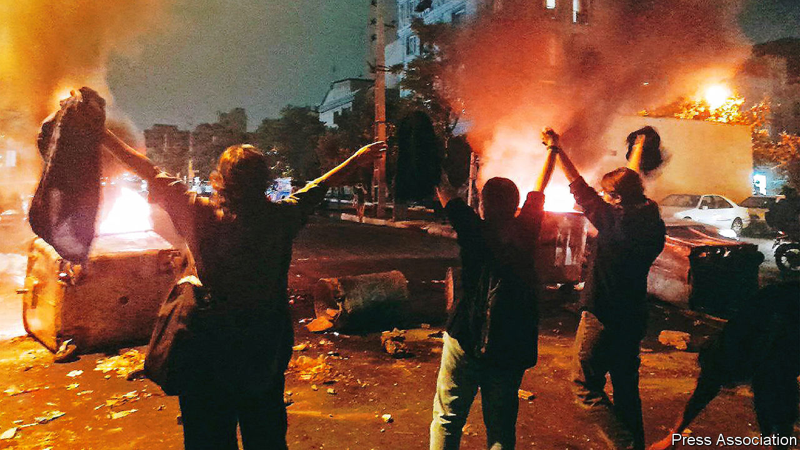

###### Women lead the way

# Iran’s ruling ayatollahs are hanging on 

##### But if protests endure, the regime may yet wobble 

 

> Sep 29th 2022 

The female protesters who are burning their headscarves all across Iran liken themselves to gazelles crossing a river infested with crocodiles. Riot police may pick off many of them, they admit, but the herd will reach salvation. They will bait the regime and its security forces by dancing, baring their hair and torching the ubiquitous posters of the reigning ayatollahs and generals. Many of the demonstrators have been shot, beaten and carted away. But after nearly a fortnight of protests the defiance persists. Disturbances have spread across every province in the country. They have been the biggest for years. A post circulating on social media declares: “From now on, Iran will be known for its women, not for its carpets, its saffron or its cats.”

Yet the crocodiles may still win. As the death toll approaches a hundred, the gazelles lack leadership, a communications network and a coherent plan. So far the constituencies that could swing the outcome—merchants, reformist politicians and clerics, and the army—have kept silent. Calls for a general strike have been largely ignored. Shops are still open. Few Iranians can afford not to work. Many fear the chaos that overran neighbouring Iraq. 

If the revolt endures, however, then the mood could change. Until recently the ayatollahs had a kind of contract with the people. As long as Iranians kept out of politics, the ruling clergy would keep out of people’s private lives and generally avoid badgering them about their attire. 

But Ebrahim Raisi, a conservative cleric who became president last year, has sought to reinvigorate the old cultural revolution. Accused by Amnesty International of overseeing the execution of thousands of dissidents back in the 1980s, he has stepped up patrols by the so-called morality police, posted watchful clerics and vigilantes in banks and factories, and hauled away women for “re-education” because of their dress. He has passed a hijab-and-chastity decree that bans women without veils from posting pictures on social media. The murder in mid-September of Mahsa Amini, a 22-year-old Kurd, was an upshot of his campaign. She was arrested in Tehran, the capital, for her “improper veil”, then beaten to death. It was this outrage that sparked the current revolt.

Mr Raisi’s election last year angered an already disgruntled people. It was patently manipulated to exclude would-be reformers. Turnout was derisory. The relative flexibility of the ruling clergy, born of jostling between reformers and hardliners, was ended. Hardliners, led by the new president, took control of every branch of government including the parliament, the presidency, the media and the intelligence services. Amid growing rumours of ill health, the ageing Supreme Leader, Ayatollah Ali Khamenei, seems bent on purging doubters from the ranks. That includes the more worldly and experienced experts, especially in economic matters.

Discontent has been fed by the weak economy. Agriculture is struggling. Youth unemployment and malnutrition have soared. The middle class has largely spent what wealth it inherited. The authorities rely for imports on the Mafia-like networks in the Islamic Revolutionary Guard Corps.

The regime accuses the protesters of being Western stooges. At the same time it hopes that Joe Biden’s administration, seeking to revive the nuclear deal signed in 2015 but junked by Donald Trump in 2018, will turn a blind eye to any crackdown. Instead, America has waived sanctions that make it harder for the protesters to use the internet. This would “enable the Iranians to better communicate among themselves and also with the rest of the world,” says Anthony Blinken, the secretary of state.

Still, the regime is well equipped for repression. Its ranks are filled with hardened veterans of war in Syria and Iraq, many of them expert in cracking down at home. Special tribunals have been reintroduced. Warehouses as well as prisons are filling up with detainees, including dissident journalists. “They have a playbook of a graduated crackdown that always turns out in the same way,” says Sanam Vakil, an Iranian analyst in London.

The authorities are cunning, too. Days after Elon Musk offered Iranians uncensored broadband access through his Starlink satellite system, advertisements appeared in Iran promoting Internet Starlink, fake software that tempted subscribers to upload personal details. Without a coherent counter-plan, the protesters may have to retreat. The regime has regained control of several towns in the north. Daylight confrontations in the main squares of big cities, including Tehran, have dwindled into gaggles in alleyways after dark.

All the same, many expect disturbances to resume. A number of well-known figures have come off the fence, including Faezeh Hashemi, an outspoken daughter of Ayatollah Akbar Hashemi Rafsanjani, an architect of the revolution of 1979. A string of actresses, film directors and athletes have voiced support. The national football team covered their shirts in black in sympathy before a match. A brace of grand ayatollahs, the top rank of clergy, have called for the women to be heeded. Some members of the Committee for the Promotion of Virtue and Prevention of Vice have urged the morality police to lay off. 

The authorities can pick off individuals, such as Ms Hashemi. So far they have confined soldiers to barracks and locked up their weapons. But they cannot arrest all the people all the time. If the protests can endure, the regime may yet wobble. ■

