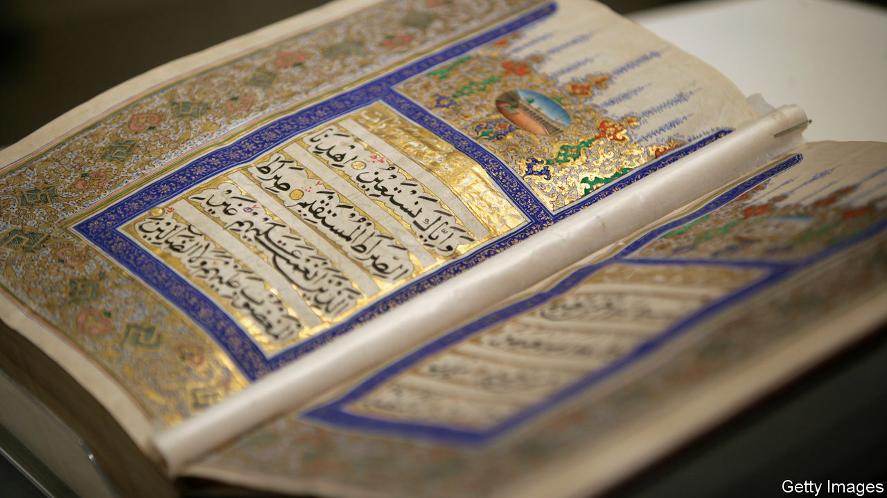

###### Tongue in retreat

# Losing the language of the Koran 

##### Arabic is being swamped by English 

 

> Sep 29th 2022 

It might have been a party just for Westerners. Young men snogged in the corridor. Girls downed tumblers of wine. The real shock, though, was the hubbub of voices. Though this was a gathering of young Emiratis, almost everyone was chatting in English. Nowadays it is becoming the dominant tongue of the Gulf.

On paper Arabic is one of the world’s most successful languages. Over 400m people speak it. But Arabs speak a plethora of dialects. Poor education in Arabic is eroding its purity, as English spreads. Many primary-school children chatter in a hybrid of English and Arabic. “Within a century it may be a dead language,” laments a British former diplomat who is expert in Arabic. 

The language’s decline reflects recent history. Civil wars have forced millions out of education. Baghdad and Damascus, once citadels of Arab nationalism and culture, have been ravaged by violence. “Language reflects how powerful you are,” says Ebtesam al-Ketbi, an Emirati scholar. “The Chinese, Japanese and Koreans have all kept their languages. We haven’t.” “People running our countries often don’t speak good Arabic any more,” laments a Bahraini.

English is the gravest threat. In 2017 the Arab Youth Survey, taken by a pollster in Dubai, found that Gulf Arabs already use it more than Arabic. Saudi Arabia has become the most recent Gulf state to teach schoolchildren English from the bottom class up. A large minority of Gulf citizens’ children go to private schools where English is the main language of tuition. Ms Kebti says “no one can stop” the spread of English. A World Bank study reported last year that even by the time they are in their fourth year at school, many Arab children struggle to write a coherent sentence in Arabic. 

The fragmentation of Arabic is a feature of Arab disunity. An array of dialects with their different vocabularies, syntax and accents has infiltrated such bastions of standard Arabic as parliaments, television shows and publishing houses. To bolster circulation, publishers are printing more books in dialect. In 2019 Nadia Kamel won a top literary prize in Egypt for a novel in dialect. Television news channels still broadcast in standard Arabic, so many Arabs prefer to get their news from social media, often in dialects written in Latin characters. Disney now dubs its films in Egyptian dialect. Expressions of love are said to sound stilted in the official lingo. 

Champions of Arabic are trying to fight back. Arabic will, of course, remain the language of the Koran. “We think Arabic is more living than Latin because of its presence in the media, sermons and speeches,” says Hossam Abouzahr, founder of The Living Arabic Project, an online platform that strives to revive the language. “Latin survived in the churches for centuries despite having no native speakers,” he notes hopefully.

