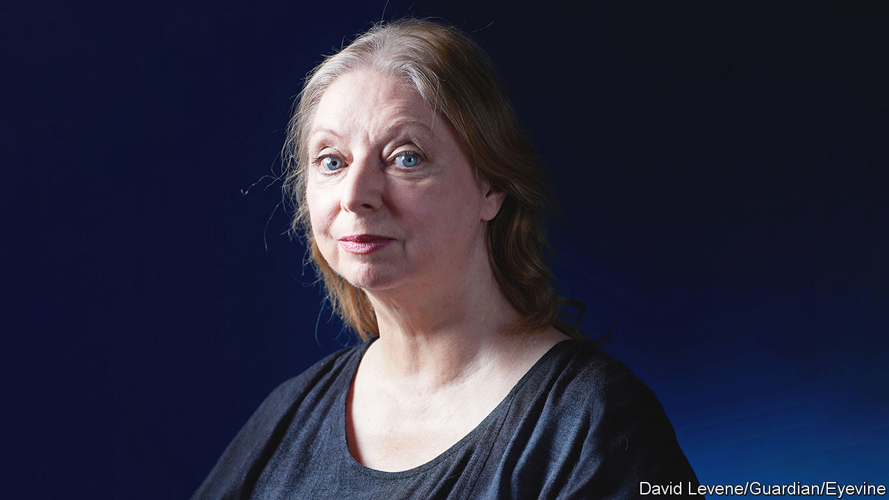

###### The ghosts within

# Hilary Mantel saw things that others couldn’t 

##### The prizewinning author of the “Wolf Hall” trilogy died on September 22nd, aged 70 

 

> Sep 29th 2022 

“So now get up.”

As she wrote those words, Hilary Mantel lay sprawled on the cobbles of 16th-century Putney. Her father’s boot was in her face; through blood, she saw that its stitching was unravelling. Her hair rested in her own vomit. Yet she had also arrived just where she needed to be, in the place she had been aiming at for 30 years. She was behind the eyes of Thomas Cromwell, chief minister to Henry VIII, the man whose porcine bully-boy look had fascinated her from schooldays. Now she could write the enormous book that had been gestating in her. 

The first part was called “Wolf Hall”. The volumes that followed were “Bring up the Bodies” and “The Mirror and the Light”. Together, they covered almost 2,000 pages and sold in millions. The first and second won the Booker prize. From a niche author, well-reviewed but not much bought, she emerged into the literary dazzle as a celebrity, with a look of permanent delight and surprise. 

Cromwell had been the most pushy of the many ghosts who haunted her. They had surrounded her from childhood, the creatures others wouldn’t see, or said were not there. The sense of oppression lurking in tangled bracken. A flicker on the staircase, a shape against the curtains. The insolent, formless shift of air that sent her running in traumatised, at seven, from the family garden. Ghosts that hung beside jackets, or lay like curls of stripped wallpaper on the floors of derelict houses. 

Her left eye was the seer, the peeled one. With this she looked on other people, “winding their fabric back onto the bolt and pricing them by the yard”. On her daily walks to convent school she “did” the weather, pinning it down until she had a perfect paragraph. Through that eye, the world was acute and strange. Sunlight lay “pale as the flesh of a lemon”. The air was “clotted, jaundiced”. Her dreams persisted like “the dim leaf-mould interiors of a copse”. The river watched her back, “with its grey blink”. The nuns too were grey, as if kept under stones.

Truth was her talisman, and it was often squalid. To find it was like “sifting through landfill”. But words could nail things exactly. Reading her favourite books, “Jane Eyre” and “Kidnapped”, she was less absorbed in the story than in thinking, “How is this done?” Relentlessly, she studied the power of words: the deathly hiss of “marzipan”, the hammer-force of “liar”. She kept in reserve, for a good moment, “horripilation” and “persiflage”. Their eerie magic never faded.

In particular she was haunted by children that would never be born: the children expected of all women or wanted by most men, especially kings; those lost by miscarriage, and the child she imagined she and her husband Gerald would soon have, after their youthful marriage. She was to be called Catriona. The unborn had a way of insisting. But instead of Catriona, books came, half-formed fetal creatures that brought the lost and dead into being. They lived not only in her but in stacks of notebooks and journals; even after the Cromwell trilogy she could still go to her cupboard, she said, and pull half a dozen books out.

She also wrote herself into being. Catriona was never born because her ghost-mother was almost permanently ill. “Little Miss Neverwell”, one doctor called her. There were migraines and measles, unexplained fevers; then, as a young woman, chronic and disabling pain. She diagnosed this at last as severe endometriosis caused by wandering, scarring cells. Her insides were rearranged by hands pushing into the obscure cavities of her body, a body no longer her own but “a thing done to”. She had been thin and frail; now, given steroids, she ballooned into something solid, set, grotesque to herself. Though she had hoped to be a barrister, it was impossible to work unless she was on her own, in control. That meant writing books for a living.

Slowly, then, they appeared. Eighteen years elapsed between her first researches into the French revolution and the publication of “A Place of Greater Safety”, her massive revolutionary novel. Few wanted such a thing. She drilled her way into the cultural establishment by writing contemporary novels instead, but slightly regretted it. Literary fashions and London sets left her cold; she was always an outsider in that world. She went on ferreting out truth in her dogged, disturbing way, putting her darkest finds into “Beyond Black”, a tale of a psychic in London’s suburbia communing with the dead. 

But the call of history was stronger. She needed facts to steer by, however inconvenient or incoherent. Round those facts, she could bend the fiction flexibly; but truth was not optional. She did not want to make things up. If she did not know precisely how Cromwell would have dried a fresh document, by sprinkling sand, she could not go on. She was responsible for this man, who was real, even if dead. For years she inhabited his thoughts, wading each day slowly into them, until by early evening she would find herself working manically, like a fiend. She wrote his death, in several drafts, when she had not yet finished “Wolf Hall”: choosing the bloodiest account of his end, three strokes of the axe, so that she could follow his consciousness to the last. The time to write that scene announced itself when she suddenly began to cry at the checkout in Sainsbury’s: a premonition. 

Cromwell made her. It was a late flowering but a glorious one, her triangular form shimmering through literary festivals, then stage and screen, in blue and silver and immense black capes lined with silk. She became queen of pebbly Budleigh Salterton in Devon, where she had always wanted to live. Fame was gleeful, because she had laboured so hard, against such odds, to earn it. Like Cromwell from the smithy in Putney, the curious working-class child from northerly Glossop had made good, despite the miseries and knocks of getting there. That was all the spur someone of his, or her, intense ambition needed: the terse, ghost command, “So now get up.” ■

