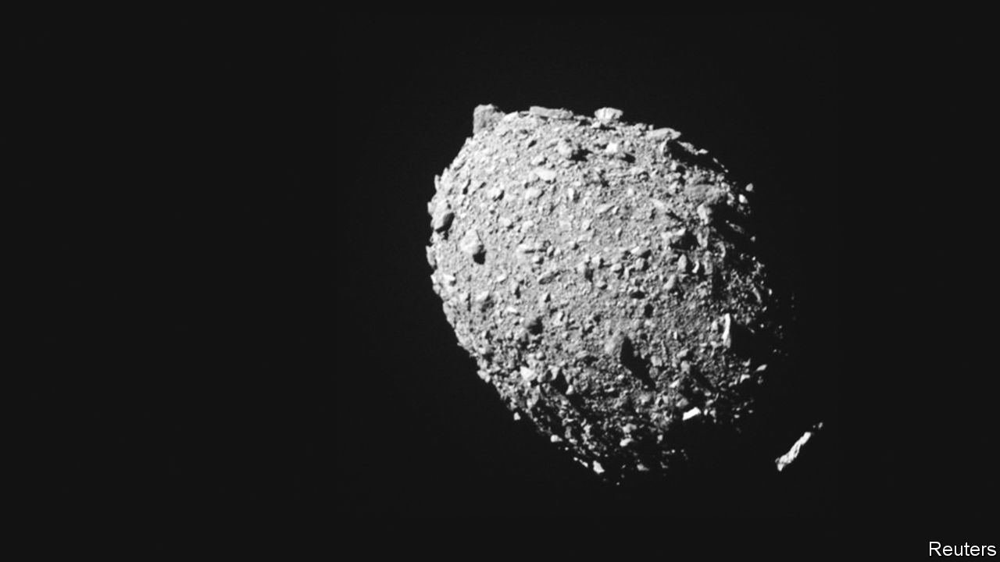
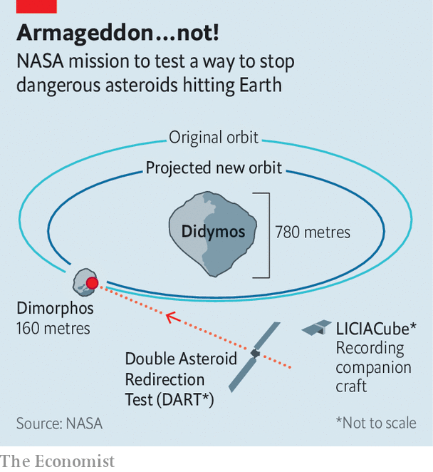

###### Defending Earth

# A suicide mission to an asteroid tests a way of defending Earth 

##### Detected early enough, a threatening space rock might be safely deflected 

 

> Sep 27th 2022 

The idea that Earth is threatened from outer space sounds, on first encounter, like science fiction. Potentially hostile aliens either do not exist or, if they do, are too far away to matter. But space rocks are real—and some, at least, are too close for comfort. It is less than a decade since residents of Chebarkul, a city in Chelyabinsk oblast, Russia, witnessed the explosion in the atmosphere of a meteorite reckoned to have been a mere 20 metres across. Though no one was killed in this incident, about 1,500 people were seriously injured, mostly by flying window glass. 

If Earth were hit by something a bit bigger than the Chelyabinsk bolide, the damage could be immense. And there are a lot of candidates out there. The NEO Observations Programme, a project intended to locate and track so-called Near Earth Objects that are 140 metres across or bigger—of which there are reckoned to be about 25,000—is less than halfway to its goal of cataloguing 90% of them. So far, no immediate threat has been discovered. But if one were to be, would there be anything people could do about it?

 


To test one possible answer to that question—hitting an incoming bolide with a suitably massive object and thus altering its trajectory—Nasa, America’s space agency, has orchestrated a cosmic collision. It has crashed DART (), a probe weighing 600kg, into Dimorphos, a small asteroid (see photo) in orbit around a larger one, Didymos. 

The impact, which occurred at 2314 Universal Time (otherwise known as GMT) on September 26th and was recorded by DART’s companion craft, LICIACube, is intended to speed up Dimorphos’s orbit by about ten minutes (see chart). This is an amount equivalent to the sort of course correction which might need to be applied to something that was in danger of colliding with Earth. Whether this speeding up has actually been achieved will now be determined using observations from ground-based telescopes. 


Organising such a collision is not easy. Newtonian mechanics allow you to coast without too much trouble from Earth to the Didymos system, but hitting the target requires active guidance. Given the current distance between Earth and Didymos (some 11m kilometres), such guidance needed to be fully automatic. This automation was provided by a software package that interpreted images from the probe’s camera and used them to tweak the propulsion system in order to score a bullseye (see above).

That bullseye achieved, astronomers will now pore over the pictures taken by LICIACube of the plume of dust and rock created, to understand better what Dimorphos is made from. This will, in turn, affect how they interpret any change in Dimorphos’s orbit. And, in the event that the NEO Observations Programme does find something worrying, that will help plan the mission sent to deal with it. ■

DART weighed 600kg, not tonnes as we initially wrote.

