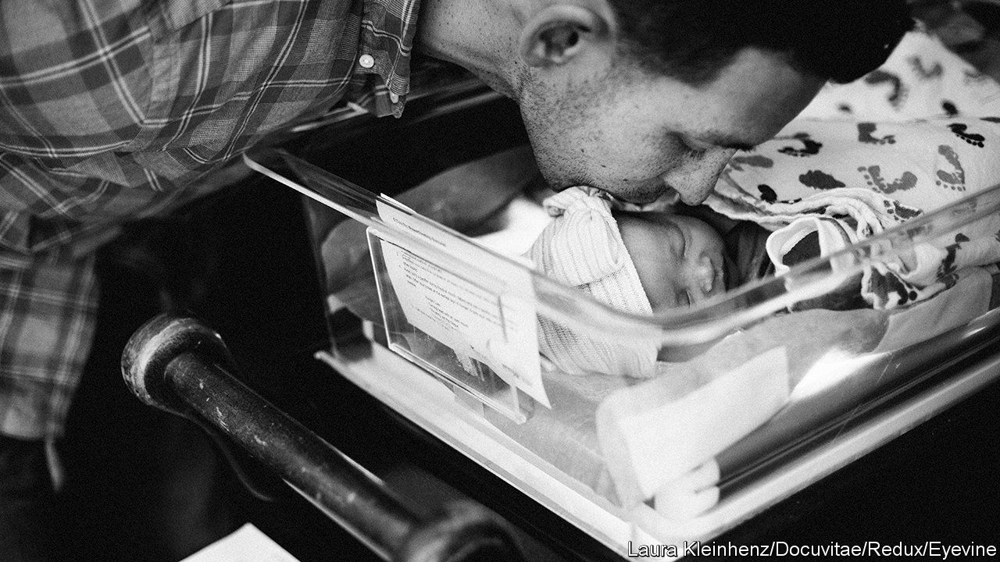

###### Dad brain

# Becoming a father shrinks your cerebrum 

##### That may help form parental attachments 

 

> Sep 28th 2022 

It is hardly surprising that pregnancy and childbirth, nine months of enormous changes to a woman’s body, also change her brain. And they do, by causing certain parts of it to shrink. Fathers, it might be thought, would be unaffected. But no. There is evidence that their brains shrink, too. A paper just published in  by Magdalena Martínez-García of the Gregorio Marañón Health Research Institute in Madrid, and her colleagues, divulges the details. 

Dr Martínez-García’s study followed a group of 40 expectant fathers, 20 from Spain and 20 from America, and also, as a control, 17 Spanish men who did not have a baby on the way. To measure changes to their brains the volunteers underwent two magnetic-resonance imaging (MRI) scans roughly a year apart. In the case of the new fathers, one of these scans was before, and the other after, the birth of the child.

The researchers used the scans to compare the volume and thickness of the cerebral cortex, the part of the brain responsible,  many , for things like sensory perception, language and cognition, with that of the sub-cortex, a disparate collection of structures such as the hippocampus (involved in long-term memory formation) and the amygdala (which regulates fear). They confirmed that there is a small but consistent decrease in the volume of the cortices of new fathers after the birth of their child. 

This shrinkage is not, however, evenly distributed. The biggest reductions are in the area at the back of the cortex where information from the retina is processed and interpreted, and in the “default-mode” network, a piece of neural circuitry distributed between three different cortical areas, which is associated with daydreaming, mind-wandering and thinking about the self and others. 

This pattern partly mimics changes found in the brains of first-time mothers. For example, a study published in  in 2017 by some of the same researchers found that areas of the default-mode networks of their brains also shrink. The differences in first-time fathers’ brains are less pronounced than those in mothers, and also more variable—and are, presumably, caused in a different way. But different physiological means can still arrive at the same evolutionary end.

The mamas and the papas

That end is presumably being a better parent. The authors of this earlier paper also gave the new mothers a questionnaire asking how they felt about spending time with their offspring, whether they thought they understood their babies’ signals, and whether they felt any resentment towards them. They found that postpartum changes in brain volume predicted both how attached a mother felt to her child and the absence or otherwise of hostility to it.

Examination of the Spanish fathers in Dr Martínez-García’s latest study, by measuring their brain activity while they looked at pictures of both their own baby and other infants, found a similar effect. It showed that those with the largest reductions in brain volume had the strongest MRI responses to images of their own child compared with images of others. 

Determining exactly how these pro-parental neural changes come about in men is way beyond the current skill of neuroscience. But it is intriguing to observe that, at least in the case of , a rare example of a mammal in which fathers as well as mothers nurture offspring, similar postpartum parental attitudes seem to be getting wired into both sexes. ■


