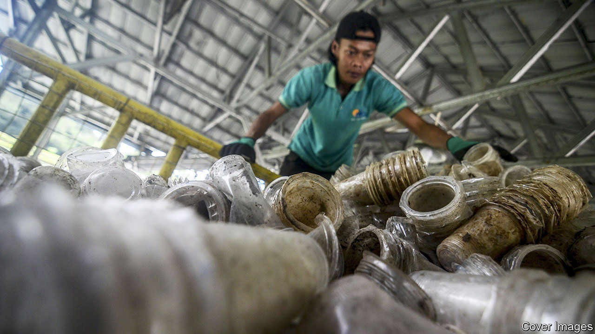

###### Recycling

# How to turn waste polyethylene into something useful 

##### Break it up into propylene, and make new plastic out of it 

 

> Sep 29th 2022 

Creating plastics by linking small molecules, known as monomers, together to make large ones, known as polymers, was one of the triumphs of 20th-century chemistry—and no polymer was more triumphant than polyethylene. Even today, more than 80 years after its first industrial production, polyethylene and its cousin polypropylene together constitute more than a third of the plastics produced each year. 

But their well-known success is also a well-known problem. The resilience that makes them useful makes them hard to get rid of, too. Dumped, they will hang around for ever. And though they can be melted and recycled, the different grades they come in (broadly speaking a consequence of how many monomers the polymers of a particular grade are composed of), and their tendency to be combined in artefacts with other things, mean that the recycled versions of these plastics are rarely as good as new. 

Better, then, to take the whole things apart and start again. And that is exactly what Richard Conk of the University of California, Berkeley, and his colleagues propose to do. For, as they describe this week in , they have devised a way of breaking polyethylene up, not into its original ethylene units, but into propylene, which, from a repolymerisation point of view, is just as good.

Ethylene (CH) and propylene (CH) both possess what is called a double bond between two of their carbon atoms. It is this that allows them to polymerise. A polymer forms when (under the influence of heat, pressure and a catalyst) these double bonds partially open. That creates what are known as free valences, which allow the molecule to react with other things. If the other things are similar molecules with similar free valences, the result is a dimer, which can then go on to form a trimer, a tetramer and so on. The ultimate result is a long polymer chain with no double bonds in it.

Mr Conk and his compadres have worked out how to reverse this in a way they hope might be industrialised. The trick is first to pepper a polyethylene molecule with double bonds by removing hydrogen atoms from pairs of adjacent carbon atoms using appropriate catalysts. Other catalysts then cut the polymer next to these new bonds and shuffle them, in a process called isomerisation, one link up the new, shortened chains. A dash of ethylene added to the mix and a further catalyst cut each shortened chain again, just beyond its itinerant double bond, to release, presto! a molecule of propylene. Then repeat until the polymer is disassembled. 


