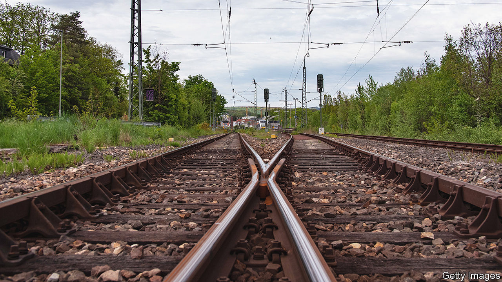

###### Trainspotting

# Keeping trains apart is crucial to safety 

##### A new way of doing so uses magnetic signals in the tracks themselves 

 

> Sep 28th 2022 

Stopping railway trains colliding requires knowing where they are. In olden days this was done by the handing over between driver and signalman of a token showing that a block of track was occupied. Now, automatic devices detect and report a train’s passage. But the principle is the same. Lines in a railway network are divided into blocks, and only one train at a time is allowed in a block.

Rationing space this way can, though, lead to inefficiency. More precise information of each train’s whereabouts would permit trains to travel closer together without compromising safety, and therefore allow more services to be run. But what might seem the obvious approach to doing this—to employ the satellite-based global positioning system (gps) or one of its equivalents—is not actually suitable. gps is unavailable in tunnels. And where several sets of tracks run in parallel (for example, at junctions) satellite-based systems can have difficulty distinguishing which track a train is on, with potentially catastrophic consequences. But Martin Lauer of the Karlsruhe Institute of Technology, in Germany, thinks he has an alternative. 

His invention, dubbed the Magnetic Railway Onboard Sensor (MAROS) and unveiled on September 20th at the InnoTrans trade fair in Berlin, uses information encoded in the very rails a train is running on, in the form of something called their magnetic permeability. Employing this, that train’s position on the network can be determined exactly.

MAROS works by lowering a pair of detector coils over each rail and passing alternating currents through them. These currents are influenced by the magnetic properties of nearby metal objects. The production of rails for railways takes care to make them uniformly strong and smooth, but their magnetic permeability is not among the specifications. That means a train carrying a MAROS detector picks up random fluctuations from the rails beneath.

Being random, the resulting pattern of permeability is probably unique to a given stretch of the network. For a 200-metre section, Dr Lauer calculates, there is about one chance in a trillion that it is duplicated anywhere on the 2.3bn kilometres of track currently laid around the world.

To get the system working on a particular route, a test train rides it a few times to map out the fluctuations in the rails. After that, trains running the route would continually compare the permeability measurements from the detectors with those on the map, and then report their position to the network traffic controller. 

Local changes in magnetic permeability caused by wear and tear or lightning strikes would show up during routine usage and, once confirmed, could be added to the map. Moreover, because MAROS detector-coils come in pairs, the different times that each pass the same pattern in the track can be used to calculate a train’s speed and acceleration more accurately than the alternative of measuring the rotation of its wheels, because metal wheels on metal rails frequently slip.

Dr Lauer’s commercial partner, a firm called ITK Engineering, has been testing the system on scheduled train services plying a 130km route in Austria and reckons it will be ready for market in 2025. Dr Lauer himself estimates that using MAROS could increase the capacity of a busy rail network by 20-30%. It would also cost less than the existing system of sensors and beacons. ■


