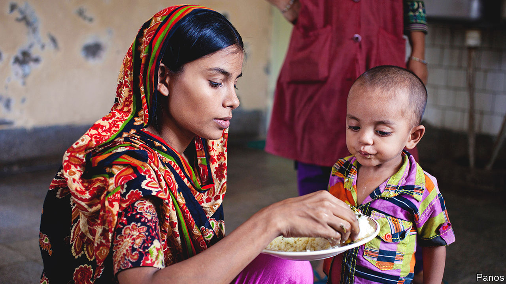
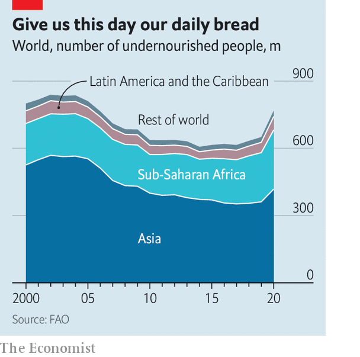

###### Malnourishment

# Malnutrition can be treated by encouraging the right gut bacteria 

##### A specially devised diet made from cheap ingredients works well 

 

> Sep 28th 2022 

The best treatment for childhood malnutrition might seem obvious: more, and more nutritious, food. And the standard approach is indeed just that. Over the years, formulae for ready-to-use supplementary food (RUSF)—bars and packets of paste intended for moderate cases and made from rice, lentils, sugar, soya oil and milk powder—and similar therapeutic food (RUTF), a nut-based treatment for more severe instances, have been developed. These work. But Tahmeed Ahmed, executive director of the awkwardly named icddr,b, a research institute in Dhaka, Bangladesh, and his team think they have come up with something better. 

In collaboration with Jeffrey Gordon and his colleagues at Washington University in St Louis, Missouri, Dr Ahmed’s team have produced a new mixture for the treatment of malnutrition. Besides providing nutrients, this formulation also enhances gut health. That brings benefits to the malnourished which the conventional approach does not. Now, the World Health Organisation (WHO) is testing the result, dubbed MDCF-2, in Bangladesh, India, Mali, Pakistan and Tanzania. 

The bugs in the system

Until recently, little attention was paid to the role in digestion played by the trillions of microbes, known collectively as the microbiota or microbiome, which live in the human gut. That changed in 2013 when Dr Gordon compared the gut floras of pairs of twin children in Malawi. He did so assuming that, since they are born together and raised in the same households, twins’ nutritional histories will be identical. 

He nevertheless came across a number of cases in which one twin of a pair had a form of malnutrition called kwashiorkor while the other remained healthy. And when this happened, he also found that their microbiomes differed in systematic ways. On top of this he discovered that when the bugs in question were transplanted into laboratory mice which had been raised in a germ-free environment, those animals receiving transplants from a twin with kwashiorkor went on to develop the murine equivalent of that illness. 

It thus looked likely that, while the underlying cause of kwashiorkor is unquestionably an insufficiency of nutrients, undernourished individuals who might otherwise remain free of its symptoms (a bloated belly, loss of muscle mass, stunted growth and brittle hair) may be tipped over the edge by an unbalanced microbiome.

In 2014, in a follow up to this work, Dr Ahmed, Dr Gordon and their respective teams compared the gut microbiomes of healthy children living in the slums of Dhaka with those of children being treated for forms of severe acute malnutrition such as kwashiorkor. They demonstrated that eating more calories and protein made no difference to the children’s microbiomes. They also showed how infant microbiomes mature, and that malnourished children lack bacteria needed to digest food properly and to produce certain vitamins. By the age of three, a healthy child has a fully developed microbiome. A three-year-old with severe acute malnutrition, by contrast, has a microbiome similar to that of a healthy one-and-a-half-year-old. 

Microbiomes are easily unbalanced. Following Caesarean births, for example, babies are not exposed to bacteria from their mothers in the way that they are during vaginal births. Such transfers help determine the early microbial population of a child’s gut—and a third of Bangladeshi children are born by Caesarean section, compared with around a quarter in rich Western countries. 

Oral antibiotics, too, can damage gut microbiomes, by killing useful bacteria along with those that cause disease. In Bangladesh, where drugs are often used to compensate for poor sanitation, antibiotics can be bought in pharmacies and markets without a prescription. Doctors hand them out liberally, too. 

No bar to success

Rebalancing microbiomes once they have been unbalanced is hard. However, research by Dr Ahmed and Dr Gordon, published in 2019, found that it is possible to do so by careful management of children’s diets. By examining the diets of kids in the slums of Mirpur, a suburb of Dhaka, and correlating what individual children ate with the mix of bacteria in their microbiomes, the two researchers and their teams devised 14 distinct experimental diets which they thought might promote the growth of desirable gut bacteria. They then fed them to mice and piglets that had first been inoculated with bacteria from the children in question. 

These tests led them to three “microbiota-directed complementary food” diets, which they called MDCF-1, -2 and -3, that seemed to encourage the animals’ microbiomes to mature. They then tested this successful trio for a month on groups of malnourished children, while feeding a fourth group RUSF as a control. MDCF-2, made from bananas, chickpeas, peanuts and soya, came out top. At the end of the test the microbiomes of children in the other three groups looked like those of untreated children with malnutrition, whereas those of children fed MDCF-2 had microbiomes close to that of a healthy child.

This, Dr Ahmed speculates, might explain why children fed conventional supplementary food such as RUSF often relapse into malnutrition when they return to their original diets. A follow-up study he published last year supports this hypothesis. Malnourished toddlers from Mirpur’s slums fed MDCF-2 twice a day for three months grew plumper and faster than a comparable group fed RUSF, even though MDCF-2 has 20% less calories. Their “weight-for-length” score—a standard measure of infant growth—also increased more rapidly. 

 


Moreover, children eating MDCF-2 continued making gains relative to the others after the intervention ended. Their microbiomes became more developed, with 21 types of bacteria associated with growth and the production of vitamins becoming more abundant. And their levels of 70 blood-plasma proteins known to be markers of nutritional status improved as well. 

The next step is to try this elsewhere. And that is what the WHO is now attempting to do. To make the new five-country trial realistic, those running programmes within it are required to build from the ground up. Each country’s team has to find locally the exact equipment used in Bangladesh, and to source ingredients locally, too—a challenge that led Karim Manji of Muhimbili University of Health and Allied Sciences in Dar es Salaam, a veteran of the field of child nutrition who is in charge of the Tanzania trial, to think when he first read the list, “Oh my God, are we even geared up to manufacture this?” 

But Dr Manji has quickly recovered his savoir faire. It is “entirely unique”, he says, referring to the trial, and could transform the world’s response to malnutrition. Currently, UNICEF, the UN agency responsible for tackling childhood undernourishment, relies on RUTF, a factory-made product of which it buys around 80% of the world’s output. If, as this research hopes to prove, a home-brewed alternative that nourishes the gut microbiome does a better job of helping children thrive, UNICEF and others involved in the malnutrition business may want to change tack. 

Switching from focusing on nutritional value to gut health is complex, however. Importing and distributing ready-packaged bars is simpler (if more expensive) than making stuff locally from scratch. And MDCF-2 may not prove a one-size-fits-all solution. It may be necessary to tailor the mix to account for regional variations in what constitutes a healthy microbiome.

Diets and tastes also vary, as Dr Manji has already discovered. Ishita Mostafa, another researcher at icddr,b, says MDCF-2, which comes as a sticky brown paste, “tastes sweet like halwa” (halwa being a popular dessert in Bangladesh). She adds that “babies love it”, and, therefore, mothers do too. But the same might not be true in, say, Mali. Aware of this risk, Dr Ahmed and his colleagues have started testing substitutes, such as sweet potatoes for bananas, to see if the impact on the microbiome remains the same. But finding ingredients that have similar effects involves complicated laboratory testing. Aid programmes would need to do this over and over again. 

Further research may make things smoother, says Dr Ahmed. He and his colleagues are still investigating what, exactly, it is that makes MDCF-2 work so well. That will help the search for substitute ingredients. They also hope to apply MDCF-2 to maternal malnutrition. This affects children because undernourished women (especially those undernourished during pregnancy) give birth to undernourished babies. For many malnourished children in the future, then, Dr Ahmed’s work could make all the difference. ■


