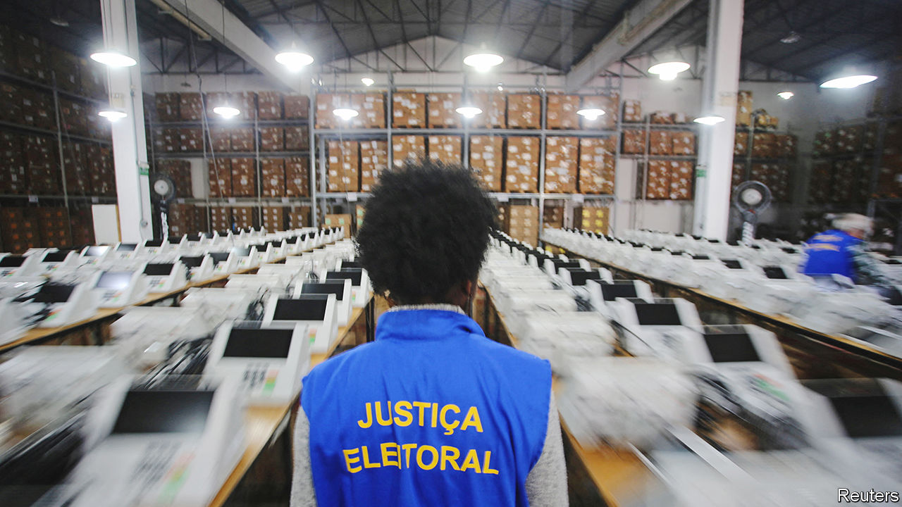
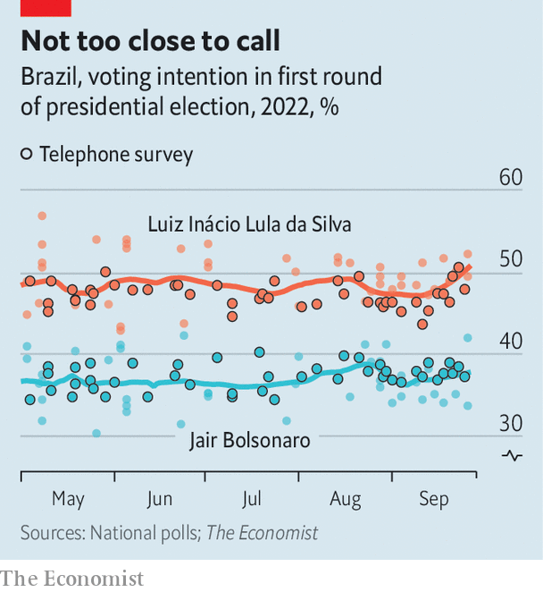

###### Populist v psephologists

# Are Brazil’s pollsters right about the presidential election? 

##### All expect President Jair Bolsonaro to lose, but they differ about the size of his defeat 

 

> Sep 29th 2022 

Just after 8am on September 27th, five days before the first round of a presidential election, a worker from Brazil’s most prominent polling firm, Datafolha, stops pedestrians at a five-way intersection in São Paulo to ask whom they plan to vote for. He selects his subjects—an old man in a baseball cap, a young woman with a nose piercing—according to age and sex quotas that reflect the electorate. He asks them to point to their candidate’s name on a chart (circular, to lessen bias), and records their answers on a tablet.

Over the next few days 440 Datafolha workers in 332 municipalities planned to speak to some 6,800 voters. Within hours of the final interviews, the results would be announced on a nightly news programme watched by a third of Brazilian households. 

Although in-person polls have long been considered the best way to gauge voting intentions in a vast and unequal country, changes in society and polling are putting that belief to the test. Increased access to mobile phones (now in 95% of households) and the internet (90%) have brought in new pollsters and techniques. The pandemic speeded up these trends. As a result, 974 polls have been registered at the electoral court in this election season, twice as many as during the previous presidential race, in 2018. The share of in-person surveys has dropped from 70% to 60%. 

 


Nearly all polls show Brazil’s right-wing populist president, Jair Bolsonaro, trailing his rival, leftist former president Luiz Inácio Lula da Silva, by at least six percentage points (see our  online). Mr Bolsonaro says that any result other than his re-election would be “fraud”. He denounces major pollsters like Datafolha and Ipec, which show Lula with such a big lead (14 and 17 percentage points, respectively) that he could win in the first round.

The wide divergence in the polls has led to debates about methodology that echo those that have taken place in the United States and elsewhere. Stakes are high. If Lula’s victory is even as big as Datafolha suggests, Mr Bolsonaro’s bogus claims of fraud will convince fewer people. 

Datafolha, which conducts surveys on the streets, and Ipec, a descendant of Ibope, which goes door to door, have correctly predicted every presidential race since 1989. An analysis by Jota, a news site, found no big difference in accuracy between face-to-face and telephone polls in 2018. But the latter are considered a “subspecies”, says Daniel Marcelino, an analyst at Jota. That is because they may undercount poor voters, who have fewer phones. 

Face-to-face polls may have the opposite problem. Wealthier Brazilians, who increasingly live in gated communities and work from home, may be underrepresented. The belief that in-person polls in the right places provide a near-perfect data set, and thus need no weighting after the data are collected, has also been called into question by the wide range of estimates of how many voters are poor. Whereas Ipec finds that 55% of voters report having a household income less than twice the minimum wage (2,424 reais, or $450, a month), Ideia, a telephone poll, weights its sample using the official estimate of 39%. Lula, who does well among the poor, performs best in face-to-face polls; telephone polls show Mr Bolsonaro doing less badly. 

Most firms admit that they could do a better job of estimating how many people will not vote. Voting is obligatory in Brazil, but fines are low and abstention can be as high as 20%. While pollsters know that non-voters tend to be poorer and less educated, which could hurt Lula, they have yet to make use of “likely-voter models”, which give low-voting groups less weight, says Felipe Nunes, boss of Quaest, a six-year-old firm that conducts in-person polls. Most simply ask questions in the final week of the campaign to weed out people who are likely to abstain.

There is less consensus about whether Brazil has a “shy-voter” problem, in which voters either don’t tell pollsters the truth or don’t talk to them at all. Raphael Nishimura of the University of Michigan thinks that Bolsonaro supporters who don’t trust polls might be loth to take part. 

But shy voters may also be fearful Lula supporters: three have been murdered by Mr Bolsonaro’s backers. “The more society gets polarised, the more human-interaction effects become an issue,” says Andrei Roman of Atlas Intelligence, a firm that conducts online polls. Its latest shows Lula ahead by seven percentage points. 

Bolsonaro supporters point out that in 2018 Datafolha’s poll on the eve of the election showed that he would get 40% of the vote, whereas in fact he received 46%. Some experts also consider this the result of polling errors. Luciana Chong, the head of Datafolha, says the snapshot was accurate at the time. “A lot can happen from Saturday to Sunday,” she says. Mr Bolsonaro gained last-minute votes from Brazilians who were undecided and from supporters of other candidates who voted tactically to beat Mr Bolsonaro’s leftist rival.

This year is different. A record proportion of voters say they have made up their minds. Even so, Lula’s campaign is seeking to convince backers of Ciro Gomes and Simone Tebet, candidates with around 5% apiece, to vote tactically to give Lula victory in the first round. That would be a win for established pollsters, too. ■

