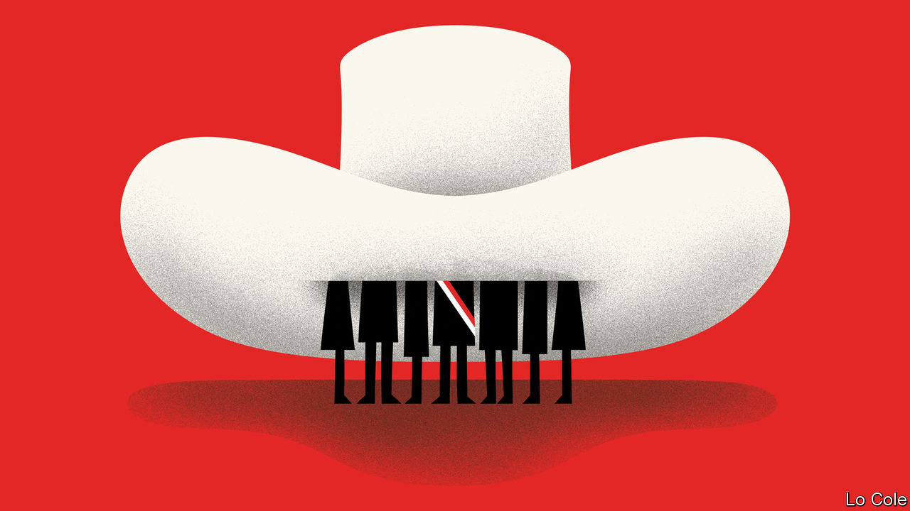

###### Bello

# Peru has an incompetent president and a discredited Congress 

##### Its instability is surprisingly stable 

 

> Sep 29th 2022 

Political volatility is part of the image of Latin America, even if it often doesn’t correspond to reality. But the term hardly does justice to the government of Pedro Castillo in Peru. In just 14 months in office Mr Castillo has managed to get through 72 ministers. The latest, appointed on September 23rd, was his fourth defence minister this year. Five of his appointees were censured by Congress. Many others were palpably unqualified, or involved in scandals ranging from claims of corruption to wife-beating. Most worryingly, some were sacked by the president seemingly because they tried to do their jobs. That applies to a couple of interior ministers.

Mr Castillo is an accidental president with no political experience and, it is clear, no aptitude for the job. He got it because many Peruvians could not bring themselves to vote for his opponent, Keiko Fujimori, a conservative accused of corruption (which she denies). A rural schoolteacher and union activist who ran for a far-left party, he claimed to represent poor Peruvians. In office, he has achieved almost nothing. The core of his government is his extended family and associates from his home province of Chota in northern Peru. The prosecutor’s office has opened six investigations into Mr Castillo and his family, three concerning public contracts. He denies wrongdoing. A daughter is in custody and a nephew is on the run.

The sickness in Peru’s body politic goes well beyond the presidency. Congress, whose 130 members represent some 16 parties or groups, has seen two failed attempts to impeach the president, who retains the support of a blocking minority. More than 40 belong to nominally left-wing parties. Some conservatives are happy to have a weak government which shares their interest in dismantling regulation of private universities and informal transport companies, or in opposing feminism. Many of the legislators fear that removing Mr Castillo would trigger a public demand for a fresh general election. They are following their immediate interests, says Alberto Vergara, a political scientist. “Some want to keep a salary they would never earn elsewhere, some to extract bribes, or to place people in ministries.” Another impeachment bid is now under way. Edward Málaga, an independent legislator who drew up the motion, reckons he has around 80 of the 87 votes he needs. “The aim is that the president doesn’t inflict further damage on the country,” he says. But many doubt that he will succeed. 

Local elections on October 2nd are unlikely to improve things. They ought to be important: mayors and regional governors control two-thirds of public investment. With political parties barely relevant, most victors will be independent local figures. More than 600 have been involved in criminal-court cases. No wonder that Ipsos, a pollster, in a survey published three weeks before the election found that four out of five people hadn’t decided whom to vote for. 

Even by contemporary Latin American standards the degradation of Peruvian politics is extreme. Alberto Fujimori, Keiko’s father, who ruled as an autocrat in the 1990s, set out to weaken political parties. Society has become less organised in a country where more than 70% of workers toil in the informal economy and less than 5% are in unions. Recent rule changes that bar re-election to Congress or local government have made it harder to pursue a political career. “Now there’s not just a lack of parties but of politicians,” says Mr Vergara.

Mr Castillo’s presidency intensifies a pattern of volatility. There have been four presidents and two Congresses in the previous five years. In the past this kind of political deadlock would have provoked the army to step in. Those days seem to have gone in Latin America. One candidate to fill the vacuum is Antauro Humala, a former army officer with fascist views. He was released in August after 17 years in jail for leading an uprising that killed six people. He appeals to those resentful of the domination of the country by Lima, the capital (as did Mr Castillo). But he may struggle to find broader support.

Peru’s instability is surprisingly stable. Some analysts are starting to think that, improbably, Mr Castillo may see out his five-year term. But uncertainty is cutting investment and economic growth. Erratic government is undermining the effectiveness of administration. Mr Málaga is right that the president is damaging the country. The problem is that removing him won’t necessarily end the damage or the volatility.■


