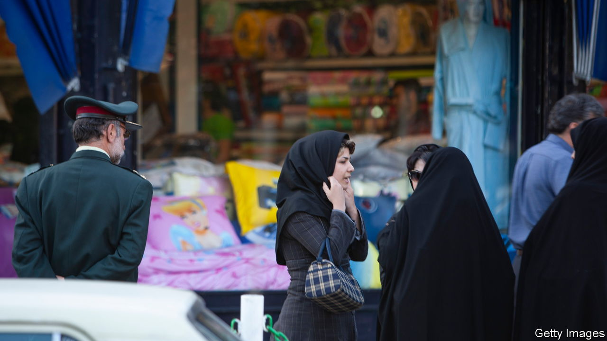

###### The Economist explains

# Who are Iran’s hated morality police? 

##### The Koran says nothing about men in uniform enforcing dress codes 

 

> Sep 26th 2022 

ON SEPTEMBER 16TH Mahsa Amini, a 22-year-old Iranian woman, died after being beaten by the country’s morality police. Protests which  in the days after her death have  By Sunday at least 41 people had died. The Islamic Republic has  on dress, behaviour and mixing between the sexes in public. Women’s freedom is particularly curtailed, as Ms Amini’s case shows: her offence was reportedly wearing a loose hijab. The morality police are the government’s enforcers. Who are they, and do they reflect Islamic teaching?

The Quran enjoins Muslims to “command right and forbid wrong”, a personal duty known as . But there were no morality police in early Islam. From the time of the Prophet Muhammad public morals were instead overseen by a  or market inspector, appointed by the government to prevent fraud and protect travelling traders. (One of the earliest appointees selected by Muhammad in Medina was a woman.) Over the centuries, they took on greater responsibility for moral standards, including women’s dress. There are some records of issuing spot fines and even carrying out whippings, but they did not have the same reach as the modern police force.

As traditional Islamic legal systems were disrupted by shifting kingdoms and, in some cases, colonisation by Western countries, by the early 20th century  had disappeared in most places. But in Saudi Arabia, morality policing gained new prominence under the influence of Wahhabism, a puritanical movement within Sunni Islam, which emerged there in the mid-18th century and became the dominant religious ideology in the kingdom. The first modern morality police force, a committee for commanding right and forbidding wrong, was formed in 1926. Officers prevented mingling between the sexes and ensured that citizens attended regular prayer. By 2012 a third of countries in North Africa and the Middle East had some form of religious police. There are also forces elsewhere, including Malaysia and Aceh, a province of Indonesia. Their powers vary, but many promote a narrow view of Islam: police in northern Nigeria have forcibly shaved the heads of men in the street and banned female mannequins.

In Iran morality policing arrived later, after the revolution of 1979. Ayatollah Khomeini, the Shia cleric who then came to power, sought to rein in the behaviour of citizens after a period of secularism. The country’s current morality force, the Guidance Patrols, was established in 2005 and contains many thousands of officers, of whom a minority are female. Some young men complete mandatory military service in its ranks. In the year to March 2014 the morality police reported almost 3m women for not wearing their  properly.

With the death of Ms Amini, Iran’s morality police have incurred the wrath of the country’s citizens. The zeal of morality enforcers elsewhere has also had serious consequences. In 2002, 15 Saudi girls were burned to death at their school, after morality police prevented them from escaping a fire because they were not wearing , loose robes worn for modesty. That, along with the deaths of several young Saudis in high-speed car chases with the religious force, prompted calls for change. In 2016, the kingdom’s religious police were stripped of their powers of arrest. Now, they can only “politely” rebuke those who step out of line. As protests in Iran continue, their morality police may face a similar test. But the republic’s government has shown little appetite for reform.■

More from 


