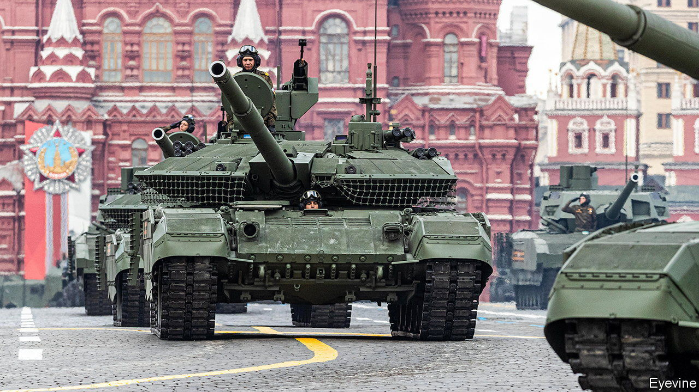

###### The Economist explains

# Why the capture of a Russian T-90M tank matters 

##### The top-of-the-range model is loaded with the latest tech. Western armies can learn from it 

 

> Sep 26th 2022 

UKRAINE’S RAPID offensive in Kharkiv, in the country’s north-east, brought many prizes. Swathes of territory have been  and Ukraine’s army captured around a brigade’s worth of military equipment from the fleeing Russians. One of the greatest surprises uncovered was a single T-90M . It is one of at least 380 Russian tanks seized since the war began, yet it is uniquely useful. What is the T-90M tank, and why does it matter?

Seizing a weapon can provide valuable insight into the state of an enemy’s military technology. That makes countries protective of their weapons in war. American efforts to inspect the T-72 throughout the Cold War backfired on several occasions, until a rogue Romanian arms dealer sold one to American agents in 1987, supposedly as scrap metal. The deal was later uncovered and made public by the KGB. The prized T-72 had been in service for 14 years before America finally had a chance to inspect it, by which time it had already been superseded. By contrast, the T-90M has been in service for just two years.

The T90M—also known as Proryv-3, meaning “breakthrough”—is Russia’s best active tank. It is an upgrade of the earlier T-90 model which was introduced in the early 1990s. Both models, of which the army has several hundred, are far superior to the Soviet tanks still widely used by both Russia and Ukraine. T-90Ms were not deployed during the initial invasion. Some analysts suspected that they were being reserved for a possible war with NATO—until they appeared a couple of months into the war.

The tank has several levels of defence. The outermost is a “stealth cape” called Nakidka, an unknown material that Russia claims can absorb both heat and radio signals. This coating theoretically cloaks the T-90M from NATO’s airborne radars, which track Russian vehicles at long range. It also hinders the use of guided  which rely on thermal imaging to lock onto their target. On top of that, the tank has an Afghanit active protection system, which fires projectiles to intercept attacks at short range. Any attacks that reach the T90-M tank must also penetrate its explosive reactive armour, used by many models of Russian tanks, which can disrupt the detonation of anti-tank missiles. Finally there is the tank’s physical armour, a closely guarded secret.

The T-90M is not invulnerable: . But capturing one is far more useful. Being able to disassemble and analyse a top-of-the-range Russian tank will make it easier to defeat more T90-Ms in future. As well as its high-tech defences, the captured tank has the latest Russian offensive weaponry, including a computerised fire-control system and a gun capable of firing guided projectiles. The captured T-90M specimen will give military analysts a chance to assess Russia’s claims about these capabilities. And as the war in Ukraine grinds on, the intelligence bonanza will continue. The West has already gained access to a variety of Russian radar, intelligence gathering and command vehicles with their valuable secrets. Fleeing Russian soldiers ought to be more careful about what they leave behind.■

More from 


