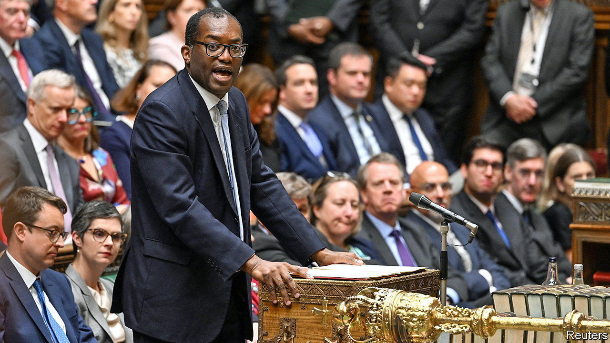
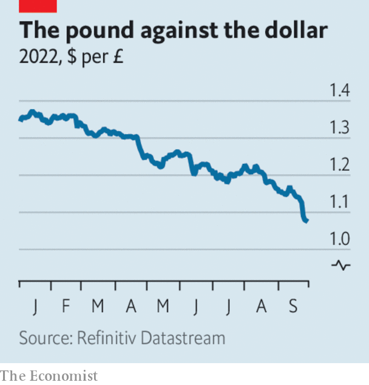

###### The world this week

# Business 

#####  

 

> Sep 29th 2022 

Markets took fright at the British government’s announcement of . The cuts, laid out by Kwasi Kwarteng, the new chancellor of the exchequer, include reductions to payroll taxes, income taxes and stamp duty. Investors were perturbed by the amount of borrowing required to pay for the cuts, the biggest for half a century. Mr Kwarteng had disregarded common practice by not asking the Office for Budget Responsibility, an independent watchdog, for its assessment. The Treasury tried to reassure markets by announcing that he would unveil a medium-term fiscal plan, but not until November 23rd.

An omnishambles

 


“The markets will react as they will,” said Mr Kwarteng after producing his tax cuts. The was hammered, dropping briefly to its lowest level on record against the dollar. It also fell sharply against other currencies. The cost of British soared; the yield on ten-year bonds rose to 4.3%, up by one percentage point over a week. Banks withdrew hundreds of mortgage products because of the uncertainty. Citing a “material risk” to Britain’s financial stability, the Bank of England intervened. It said it would buy long-term government bonds for 13 days on whatever scale is necessary “to restore orderly market conditions”.

The rout in British gilts was the most dramatic element of a wider sell-off in . Yields have been rising as the Federal Reserve talks tough on inflation. The yield on the US ten-year Treasury bond touched 4% before falling back.  also had a rollercoaster week. The S&amp;P 500 fell to its lowest level in nearly two years and the Dow Jones Industrial Average entered bear territory when it reached 20% below its peak in January. 

The  urged Britain to re-evaluate the tax cuts. It said it was monitoring the situation and was “engaged with the authorities”, statements it would normally make when a developing economy faces a sudden crisis. The fund said it would not recommend introducing a “large and untargeted” fiscal package, “given elevated inflation pressures”.

Sterling is not the only  to have tumbled against the dollar this year. The euro and the yen have also fallen. The Chinese yuan dropped this week to a near 14-year low, threatening to break its trading range around the dollar, despite interventions by China’s central bank. The Indian rupee sank to a new low. 

The World Bank forecast that  will expand by just 2.8% this year, in part because of the country’s stringent covid lockdowns. The bank projected that average growth in the rest of East and South-East Asia would outpace that of China for the first time. 

 in America rose by 15.8% in July, year on year, according to the S&amp;P CoreLogic Case-Shiller Index. In June prices rose by 18.1%. The decline of 2.3 percentage points in the growth rate was the largest ever for the index. With interest rates on the rise, mortgage finance has become more expensive, which could see home prices continue to cool.

Electric milestones

America’s Department of Transportation approved plans to develop  in all 50 states, and build a network of charging points covering 75,000 miles (120,700km) of highway across the country. Meanwhile Hertz struck a deal with BP’s EV charging business to build a network of stations for its rental cars. Hertz is aiming for 25% of its fleet to be electric by the end of 2024. 

 made its stockmarket debut on the Frankfurt exchange. Volkswagen priced the stock at €82.50 ($79.80) a share, the top end of the price range it had laid out. The IPO is the biggest in Europe for a decade, making Porsche one of the largest carmakers worldwide by market value. 

A pre-trial hearing was held on  decision to withdraw his takeover offer for . The hearing deliberated over which documents will be allowed as evidence. Twitter’s lawyers said Mr Musk had not provided them with any research backing his claim that the platform hosts more fake and spam user accounts than it acknowledges, which is the thrust of Mr Musk’s case for ditching the deal. The trial starts on October 17th.

 announced that Alan Jope will retire as chief executive at the end of 2023. Mr Jope’s tenure saw much upheaval at the consumer-goods giant, which ended its Anglo-Dutch dual structure and based its single headquarters in London. Earlier this year it abandoned plans to buy GlaxoSmithKline’s consumer health-care business. Mr Jope believes that brands “without a purpose” have no future at Unilever. The company’s purpose-driven approach was lambasted in January by Terry Smith, an investor, who said that ”repeating corporate gobbledegook is not a solution” to improving performance. 

