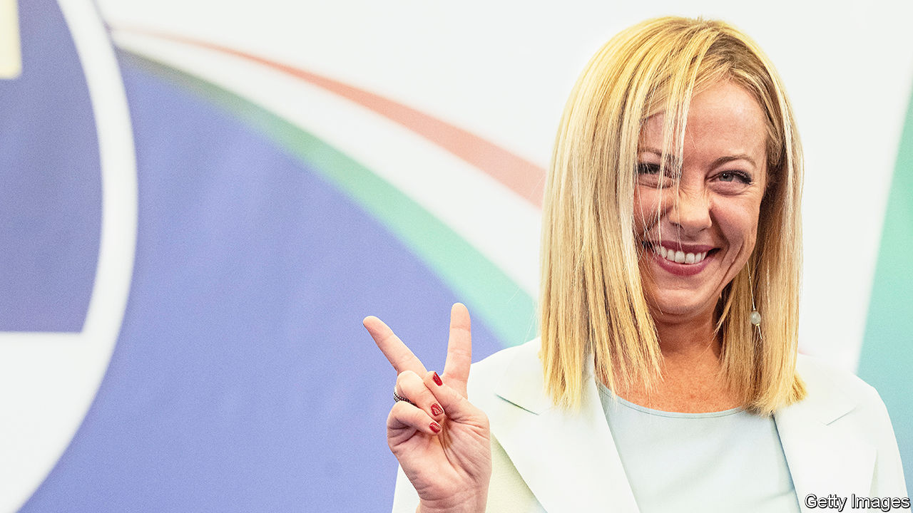
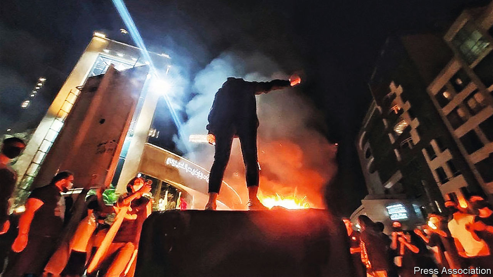

###### The world this week

# Politics 

#####  

 

> Sep 29th 2022 

 nationalist right triumphed at a general election. An alliance of three parties headed by Giorgia Meloni’s Brothers of Italy won a solid majority in both houses of parliament. Ms Meloni is all but certain to become Italy’s first female prime minister. Though her party has neo-fascist roots, she has tried to present a reassuring face to voters. She promises not to ban abortion or gay civil partnerships, and to stick broadly with Italy’s economic reform plans as agreed with the European Commission in Brussels. The markets seemed relaxed about her victory. 

Russia staged sham referendums in four partly occupied provinces of . Residents were asked, sometimes at gunpoint, whether they wanted their land to be annexed by Russia. The Kremlin’s local puppets announced that nearly everyone voted Yes. Formally annexing the provinces means Vladimir Putin can then claim that Ukrainian troops defending their own country are on “Russian” soil. Ukraine dismissed Mr Putin’s theatrics and vowed to keep fighting. Ukrainian forces were reportedly close to surrounding the occupied town of Lyman, a supply hub.

Russian men desperate not be sent to fight and die in Ukraine fled from . Hundreds of thousands have left so far. The Kremlin has not yet banned the exodus, but security officers were posted at some border crossings to serve call-up papers to fugitives. Protests against the draft erupted all over Russia, fuelled by revelations that new recruits were being asked to bring their own supplies. At least 20 recruiting centres were attacked. 

Explosions caused leaks from two underwater  linking Russia and Germany, Nord Stream 1 and 2. The supply of Russian gas to Europe was unaffected, since Mr Putin had already halted deliveries via Nord Stream 1 and Nord Stream 2 had never won permission to operate. Russian media blamed sabotage by America or Ukraine. Others suspect the Kremlin was behind it, perhaps in the hope of frightening Europeans into reducing their support for Ukraine.

 held a state funeral for , a former prime minister who was assassinated by a lone gunman in July. The funeral divided Japan. Though Abe was a giant on the world stage, he was not universally liked at home. Many Japanese were angry at the cost of the funeral, and at links between the ruling Liberal Democratic Party, to which Abe belonged, and the Unification Church, a religious group that some describe as a cult, to which his killer attributed his anger. 

 replaced its finance minister as inflation soared, driven by fuel and energy prices and a weak currency. The new man, Ishaq Dar, has held the job three times before. He promised to control prices and cut interest rates. 

Storm watch

 bore down on western Florida. More than 2m households lost power as surges of water caused flooding. Ian had earlier hit Cuba, knocking out electricity across the entire island. It came a week after Hurricane Fiona crossed the Caribbean. In Puerto Rico an estimated 244,000 people are still without power. Fiona’s remnants battered Canada’s Atlantic provinces and eastern Quebec, causing widespread damage. 

The IMF predicted that  economy would grow by 57.8% this year. The discovery of oil in 2015 has enriched the small South American country, which borders Venezuela. The IMF thinks that oil production will double this year. 

Days before voting starts, polls indicated that Luiz Inácio Lula da Silva, a leftist former president, will win  presidential election. Some  suggest he could defeat the incumbent, Jair Bolsonaro, a right-wing populist, in the first round on October 2nd. 

 


Protests continued in dozens of towns across , following the death in police custody of Mahsa Amini, a young woman accused by morality police of being improperly dressed. Women sick of pious strictures joined men fed up with being ruled by corrupt theocrats. The authorities said at least 41 people had died; human-rights groups said the true figure was at least twice as high. Ebrahim Raisi, the ultra-conservative president, said that Ms Ahmini’s death was “tragic”, but indicated that he would not tolerate further unrest. 

King Salman of , mindful of his frail health at the age of 86, appointed his son, Crown Prince Muhammad, already the country’s de facto ruler, to be prime minister, a post previously held by the monarch. He also made another son, Prince Khaled, minister of defence. 

The International Criminal Court in The Hague started hearing a case against Mahamat Said Abdel Kani, who is accused of war crimes and crimes against humanity in the . Mr Kani, who pleaded not guilty, is alleged to have been a leader of the Seleka, a mainly Muslim militant group that toppled the government and seized power in 2013.

 stopped the transit of fuel shipments to, apart from those going to a UN peacekeeping mission. The fuel embargo adds pressure on Mali, which is growing increasingly isolated in the region since its government was overthrown by army officers in two coups. The junta has angered its neighbours by steadfastly refusing to hand power to civilians and, more recently, by detaining soldiers from Ivory Coast who were supporting the UN mission. 

The American Senate broke an impasse to approve a bill that will temporarily  and keep it running past the end of the fiscal year. Trying to avoid a government shutdown has become an annual game of brinkmanship between Democrats and Republicans. 

A separation of powers

Mitch McConnell, the Republicans’ leader in the Senate, endorsed a bill that would change the rules for counting  in Congress after a presidential election. The bill aims to prevent events like the protests of January 6th 2021, when supporters of Donald Trump stormed the Capitol. It would clarify that the vice-president’s role in the count is ceremonial, a response to Mr Trump’s demand that Mike Pence overturn the voters’ wishes. 

 ended its covid-19 quarantine policy for arriving international travellers, which had been in place for two and a half years. Testing and monitoring measures still apply. The city’s business leaders want other restrictions lifted, too. Some fear that Hong Kong, Asia’s main financial centre, will be eclipsed by Singapore. 

