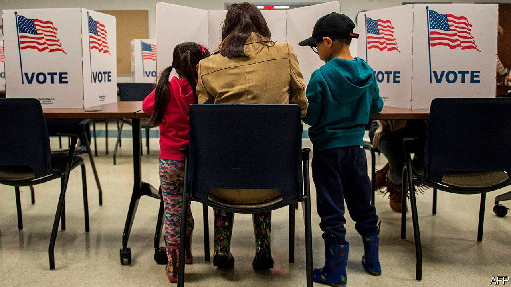
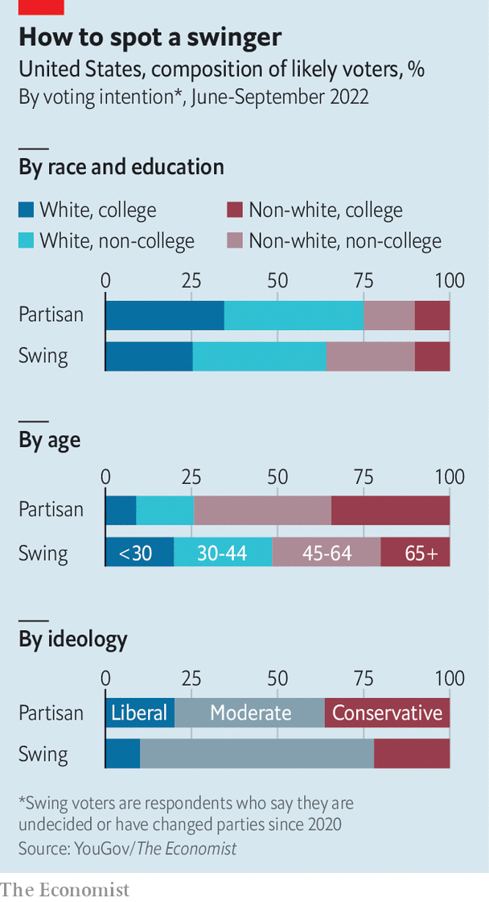

###### Midterm maths

# How to spot a swing voter 

##### The average swing voter this year is a young Hispanic male without a college education 

 

> Sep 29th 2022 


To win an election in America, a candidate must get at least one more vote than their opponent (unless they are running for president). Parties have therefore focused on two groups when debating electoral strategy: base and swing voters. Coveted archetypes of the latter group have included the “soccer moms” of the 1990s and 2000s and suburbanites through most of the 2010s. With political polarisation rising ever higher, readers may be forgiven for assuming that swing voters are a dying breed. In reality, they have been kept relevant by tight elections in which a small number of them can decide the outcome.

According to a schema developed by V.O. Key Jr, a venerable American political scientist, in “The Responsible Electorate”, a 1966 book published posthumously on his behalf, voters can be divided into three groups. There are so-called “stand-patters” (partisans who vote for the same side year after year), “switchers” and new voters. According to Mr Key, switchers made up one-eighth to one-fifth of voters in the years between 1940 and 1960. 

 


Today switchers number in the single digits. ’s analysis of polls, conducted on our behalf by YouGov, puts them at 3%. On top of that, 83% of voters who currently say they are “definitely” or “probably” going to vote in November are standing pat. Some 8% are new voters who did not take part in the 2020 election and the remaining 7% are undecided. 

For a group that makes up just one in every 30 voters—and still only one in every ten if you include the uncertain ones, too—much fuss is made over swing voters. That is fair: as vote-intentions calcify, who is really left to persuade? Yet parties may be surprised by the characteristics of swing voters this year.

According to our polling, the party-switchers are a new breed of young, diverse Americans. Nearly 14% are Hispanics and 18% are African-American. They are less likely to be college-educated than the stand-patters, they are more male and more urban. Half are under 45. 

But perhaps most striking is their moderation: two-thirds describe themselves as moderates, according to our polling. The average swing voter this year is a young Hispanic male without a college education who lives in a city and who considers himself to be a moderate.

But what does he care about? Nearly 30% say they care about the economy and inflation above all else, the same as for partisans, making this the top issue. The biggest difference is over abortion; it is the top issue of 9% of partisans but just 4% of vote-switchers. Carlos Odio of Equis Labs, a Latino-focused polling firm, says Latino voters think the Democratic Party does not talk about the economy as much as Republicans do, and they feel the party may not value “hard work”. The Republican Party has not won them over yet, though. The Senate rides on which way they swing. ■

