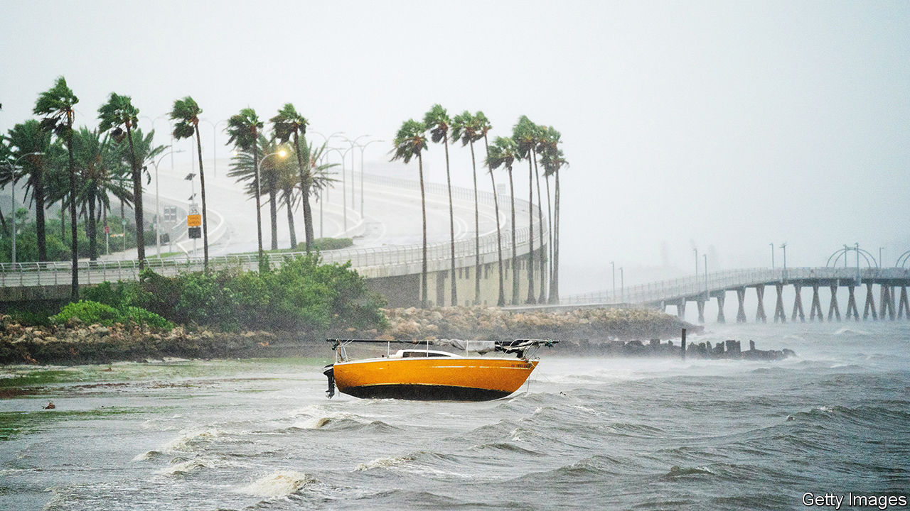

###### Unnatural disaster

# Hurricane Ian pummels Florida 

##### The Sunshine State has seen 40% of America’s hurricanes and a huge population boom 

 

> Sep 29th 2022 

“The sea was walking the earth with a heavy heel.” That is how Zora Neale Hurston described the  and accompanying storm surge that devastated central Florida in 1928, in her novel “Their Eyes were Watching God”. On September 28th, a heavy, deadly heel returned to trample  once again. After ravaging Cuba and causing the island nation to lose power, Hurricane Ian made landfall on Florida’s west coast with relentless rain and winds approaching 150 mph (240 kph), just a few miles-per-hour shy of putting it into the most severe type of “category-five” designation. It was later downgraded to “category-two”.

Some areas, including Port Charlotte and Punta Gorda, south of Tampa, were told to expect tsunami-scale storm surges reaching as high as 18 feet, nearly the height of a two-story building. It is too early to tally the devastation, but it will be vast. As this article was published, more than 2m Floridians had no power. Eric Silagy, the boss of Florida Power &amp; Light, the state’s largest grid operator, warned that the hurricane would unleash “life-changing” effects and predicted whole parts of the grid may have to be rebuilt, which could take weeks. In the end, Ian is likely to be remembered as one of the most expensive natural disasters on record.

As the storm pushed north, the governors of Georgia, South Carolina, North Carolina and Virginia also declared states of emergency, but Florida will accrue the most damage. It has experienced around 40% of hurricanes in America, more than any other state. Florida’s geography makes it uniquely vulnerable. As a peninsula that extends south into the warm waters of the Gulf of Mexico, Florida claims the most coastline of any state besides Alaska. Around three-quarters of the state’s 22m residents live in coastal areas, which are exposed to hurricanes and rising sea levels. , because they produce a double-whammy of water: long-lasting rainfall and a storm surge.

The only peace the violent storm brought was a temporary reprieve from political fighting ahead of . In advance of Ian’s landfall, President Joe Biden spoke with Florida’s Republican governor, Ron DeSantis, who frequently spars with the White House, and pledged to offer federal resources to help manage the damage. Mr DeSantis, who is rumoured to be eyeing a run for president in 2024 and is seeking re-election as governor in November, has so far used Ian to show his “management side and not just his political side”, says Susan MacManus of the University of South Florida. The stakes of navigating Ian’s aftermath well are especially high for Mr DeSantis. The smooth handling of hurricanes boosted the popularity and profile of two of his predecessors, Jeb Bush and Rick Scott, according to Ms MacManus.

In addition to the clean-up, Mr DeSantis will have to contend with Floridians’ unease about their already dysfunctional and expensive property-insurance market. Even before Ian, lawsuits and fraud had been pushing home-insurance costs up. Florida has among the highest prices of any state. Over the past two years the average premium increase for Florida’s homeowners rose by 25% compared with 4% nationally. In May Mr DeSantis signed a bill aimed at shoring up property insurance in the state, but that was not nearly enough to address the immediate crisis, warns Mark Friedlander of the Insurance Information Institute, a research outfit.

There is also a broader risk to Florida’s economy. The development, sale and leasing of real estate generates around a fifth of the Sunshine State’s GDP. It is fuelled by. Between 2010 and 2020 Florida’s population grew by nearly 15%, double the national rate. Mr DeSantis has heralded the population boom as a validation of his governing strategy and the state’s ascendance. Home prices have risen steeply: from January 2020 through August 2022, the average home value in Florida rose by more than 62%, compared with a national average of 42%, according to Zillow, a real-estate firm.

Home values are likely to decline in the aftermath of Ian. That could, in theory, stimulate demand. But more likely, it will halt in-migration, at least in the short term. This will carry an economic toll. For people who had been considering moving to the Fort Myers area and elsewhere that Ian has now ravaged, “I would think this would give you pause about whether this is something you want to go through,” says Teri Johnston, the mayor of Key West, which was spared from the worst of the hurricane this time around. The heady real-estate boom that Florida enjoyed in the 1920s ended abruptly when two hurricanes walloped the state, plunging it into an economic depression. When this storm clears, Mr DeSantis may find that he has to grapple with an economic one. ■


