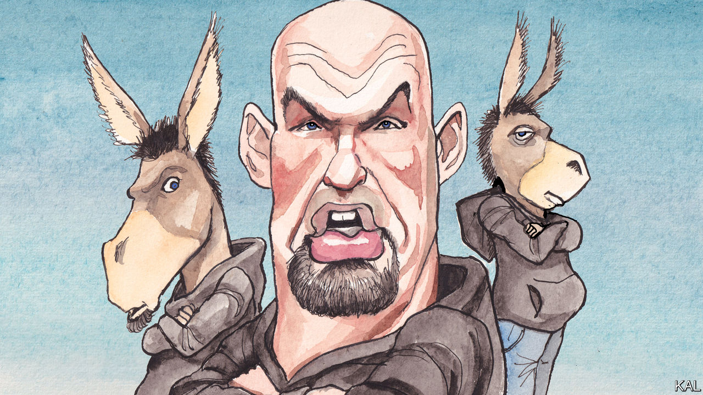

###### Lexington

# John Fetterman is a canny politician 

##### And there’s nothing wrong with that. His campaign holds some lessons for the Democratic party 

 

> Sep 29th 2022 


JAMES CARVILLE, who made his bones in Pennsylvania politics before helping elect Bill Clinton president, said that between the Philadelphia and Pittsburgh suburbs the state “is Alabama without the blacks.” The push-and-pull between the multi-ethnic liberal cities and the white conservative hinterland tends to result in statewide politicians who are centrist and conventional, even a bit dull. The term-limited Democratic governor, Tom Wolf, is bearded and reasonable, like a 1980s sitcom dad. The retiring senator, Pat Toomey, was one of just seven Republicans who voted to convict Donald Trump after his impeachment for inciting the January 6th attack on the Capitol. The state’s other senator, Bob Casey, is one of the few pro-life Democrats left. They seem like nice guys.

This year’s crop of statewide candidates is odd. Yes, Josh Shapiro, the Democratic gubernatorial candidate and current attorney-general, is a centrist. But the Republican candidates for senator and governor are Trumpist deviations. Doug Mastriano, running for governor, was at the attack on the Capitol and tried to overturn Pennsylvania’s election results in 2020. Mehmet Oz, the senate candidate, is a doctor who made his fortune hawking pseudoscience on tv. Then there is Mr Oz’s opponent, John Fetterman, Pennsylvania’s lieutenant-governor. 

At least superficially, Mr Fetterman defies all political convention. Well over two metres tall, bald and goateed, he sports a hoodie and baggy shorts regardless of weather or occasion. At rallies he extends his long arms, taking the crowd in a virtual hug and revealing the tattoos lining his forearms: on the left, “15104,” the postcode for Braddock, a rough steel town in western Pennsylvania; on the right, nine dates, each representing a Braddock resident’s violent death during his 13 years as mayor there.

Somehow Mr Fetterman has managed to encompass Pennsylvania’s diverse communities within his political embrace. In the primary he easily dispatched a congressman, Conor Lamb, who offered the tidy barbering and tidier centrism that make up the tried-and-tested formula for winning in Pennsylvania. Mr Fetterman proved more appealing to Democrats in the state’s suburbs and cities, and in its Alabama, too. Black or white, centrist or progressive, Democrats saw something in his eccentric biography and appearance that inspired their hopes and earned their trust.

Mr Fetterman may not be all things to all people, but he does offer something for everyone. He is a gun owner who supports gun-control legislation, an environmentalist who does not oppose fracking. Progressives are happy he backed Bernie Sanders for president in 2016. Yet during the primary Mr Fetterman ran away from the label “progressive” and he was hard to distinguish, in policy terms, from Mr Lamb. Even some of his seemingly progressive positions, such as legalising marijuana and reforming the criminal-justice system, enjoy broad support, not just among Democrats but also among Republicans.

What Mr Fetterman presents that has seemed most widely appealing has been a middle finger to the political establishment. It was no accident that he had far fewer endorsements from elected officials than Mr Lamb. Indeed, Mr Fetterman seems to have gone out of his way not to ingratiate himself with other politicians. Nancy Patton Mills, the former chair of the state Democratic party, says he is “aloof” and “an introvert.” Others are not so kind. Danielle Friel Otten, a Democratic state representative, says she is “indifferent to him personally,” and that when she meets “people who say, ‘He’s such a good man,’ I ask, ‘Have you met him?’”

Mr Fetterman’s fashion choices and his antic, mischievous presence on Twitter signal the same rejection of politics. It takes nothing away from his success at presenting himself as an outsider to note that it must require careful calculation. It cannot be easy for a Harvard man, one who was supported by his wealthy family well into his 40s, to consistently project such working-class authenticity. Poor Mr Oz, with his yen for crudités, has been unable to fake it. He is the perfect foil for Mr Fetterman.

Mr Fetterman is a canny, ambitious politician. He turned the lieutenant governor’s role, historically a sinecure in Pennsylvania, into a launching pad, visiting every county during his 2018 campaign and then doing so again in office. He was also astute enough to recognise that he had a clearer path to winning office as a senator than as governor during this election cycle: Mr Lamb, for all his establishment support, was a weaker opponent than Mr Shapiro, who had already won statewide.

Shtick shift

There is nothing wrong with any of that. Politicians need to be good at politics, and authenticity can be both shtick and, as in Mr Fetterman’s case, authentic; there is no doubting his commitment to the people of Braddock. But Mr Fetterman’s appeal in defying politics-as-usual faces two big challenges, one immediate and one longer term. The first is that he suffered a stroke in May, and although he returned to the campaign trail in August he appears infrequently and does not take questions. He has agreed to just one debate, in October, and has insisted on accommodations for what his campaign says are lingering auditory-processing problems. Mr Fetterman may well be on the way to a full recovery. But if his impairment is more serious than his campaign has said, he will seem like the slipperiest sort of politician. 

The longer-term challenge is that appearing to buck the establishment and to offer a new kind of politics can get you only so far. Then you actually have to do something. Politicians of both parties can indeed learn from Mr Fetterman’s success, not about fashion but about the public’s impatience for change, a message it has tried to send election after election. No doubt people would enjoy seeing the likes of Chuck Schumer and Mitch McConnell swan about in shorts and hoodies. But what they would really like is to see them make the country safer and more prosperous. ■


