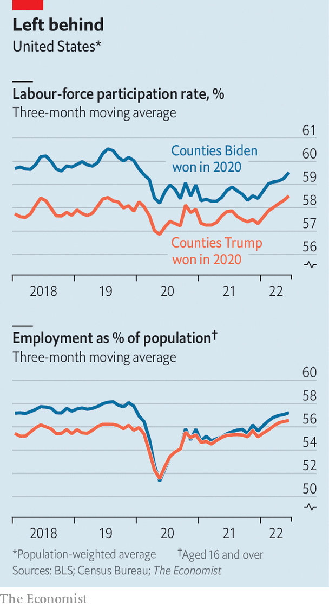

###### America’s labour market

# Trump counties are recovering faster than Biden counties 

##### The story about left behind America needs some updating 

 

> Sep 29th 2022 

Despite winning just 17% of counties in the 2020 presidential contest, President Joe Biden captured most of America’s economy. The counties he won were far more economically vibrant than those he lost, accounting for 68% of job growth between 2016 and 2019, according to the Economic Innovation Group (eig), a research outfit. The Brookings Institution, a think-tank, reckoned that nearly three-quarters of national gdp was generated in Biden counties before the pandemic hit.

When covid-19 arrived, that employment disparity disappeared. Both sets of counties saw steep employment drops, but those that Mr Biden won were hit harder. In May 2020 employment levels were 11% lower in Biden counties than they had been in January, while Trump counties fell by 9%. Biden counties’ employment to population ratio, a measure of the share of people over the age of 16 working, fell below that of Trump counties (see chart). By June 2022 on average Trump counties had not only bounced back, but had surpassed their pre-pandemic employment and labour-force participation rates. Biden counties are not yet close to a full recovery.

 


What accounts for this difference? Demography, industry composition, local policies and attitudes towards covid all played a part. Biden counties were far more likely to be urban, where retaining a job often required using public transportation or huddling with colleagues. They also had a larger concentration of service work—dry cleaners and baristas were more likely to be out of a job during lockdowns.

eig found that the retail and hospitality sectors bounced back faster in rural areas and small cities, which Mr Trump won. High rates of remote work among highly educated Biden county residents hit in-person consumption, stunting local economies and slowing job growth. The exodus from big cities hurt too.

Republicans tend to judge the economy unfavourably when Democrats are in office and vice versa—attitudes flip when administrations change over. But for all the blame Republicans have pinned on Mr Biden for today’s food and petrol prices, the familiar story about left-behind America needs an update.■

